# OpenOn Application Sequence Diagrams

This document provides detailed sequence diagrams for every user action in the OpenOn application. These diagrams show the complete flow from user interaction to database operations, including all internal method calls, JWT handling, and state management.

**Target Audience**: These diagrams are designed to be understandable by both technical and non-technical stakeholders, providing a complete picture of how the application works.

---

## Table of Contents

1. [User Authentication Flows](#user-authentication-flows)
   - [User Signup](#1-user-signup)
   - [User Login](#2-user-login)
   - [Username Availability Check](#3-username-availability-check)
   - [Get Current User Info](#4-get-current-user-info)

2. [Capsule Management Flows](#capsule-management-flows)
   - [Create Capsule (Draft)](#5-create-capsule-draft)
   - [Seal Capsule](#6-seal-capsule)
   - [List Capsules (Inbox/Outbox)](#7-list-capsules-inboxoutbox)
   - [Open Capsule](#8-open-capsule)
   - [Update Capsule](#9-update-capsule)
   - [Delete Capsule](#10-delete-capsule)

3. [Recipient Management Flows](#recipient-management-flows)
   - [Search Users for Recipients](#11-search-users-for-recipients)
   - [Add Recipient](#12-add-recipient)
   - [List Recipients](#13-list-recipients)
   - [Delete Recipient](#14-delete-recipient)

4. [Draft Management Flows](#draft-management-flows)
   - [Create Draft](#15-create-draft)
   - [List Drafts](#16-list-drafts)
   - [Update Draft](#17-update-draft)
   - [Delete Draft](#18-delete-draft)

5. [Background Processes](#background-processes)
   - [Capsule State Automation](#19-capsule-state-automation)

---

## User Authentication Flows

### 1. User Signup

**Description**: A new user creates an account by providing email, username, first name, last name, and password.

```mermaid
sequenceDiagram
    participant User
    participant SignupScreen as Signup Screen<br/>(Flutter)
    participant Validation as Validation Utils<br/>(Flutter)
    participant ApiAuthRepo as ApiAuthRepository<br/>(Flutter)
    participant ApiClient as ApiClient<br/>(Flutter)
    participant TokenStorage as TokenStorage<br/>(Flutter)
    participant AuthAPI as /auth/signup<br/>(FastAPI)
    participant Security as Security Utils<br/>(Python)
    participant UserRepo as UserRepository<br/>(Python)
    participant DB as Database<br/>(SQLite/PostgreSQL)

    User->>SignupScreen: Enter email, username, first_name,<br/>last_name, password, confirm_password
    SignupScreen->>SignupScreen: Validate form fields<br/>(_formKey.currentState.validate())
    
    alt Password mismatch
        SignupScreen->>User: Show "Passwords do not match"
    end
    
    User->>SignupScreen: Click "Sign Up" button
    SignupScreen->>Validation: validateEmail(email)
    Validation-->>SignupScreen: true/false
    SignupScreen->>Validation: validatePassword(password)
    Validation-->>SignupScreen: true/false
    SignupScreen->>Validation: validateName(firstName)
    Validation-->>SignupScreen: true/false
    SignupScreen->>Validation: validateName(lastName)
    Validation-->>SignupScreen: true/false
    
    alt Validation fails
        SignupScreen->>User: Show validation errors
    else Validation passes
        SignupScreen->>ApiAuthRepo: signUp(email, username,<br/>firstName, lastName, password)
        ApiAuthRepo->>Validation: sanitizeEmail(email)
        Validation-->>ApiAuthRepo: sanitized_email
        ApiAuthRepo->>Validation: validateEmail(sanitized_email)
        Validation-->>ApiAuthRepo: true/false
        ApiAuthRepo->>Validation: validatePassword(password)
        Validation-->>ApiAuthRepo: true/false
        ApiAuthRepo->>Validation: validateName(firstName)
        Validation-->>ApiAuthRepo: true/false
        ApiAuthRepo->>Validation: validateName(lastName)
        Validation-->>ApiAuthRepo: true/false
        
        ApiAuthRepo->>ApiClient: post(ApiConfig.authSignup,<br/>{email, username, first_name,<br/>last_name, password})
        ApiClient->>ApiClient: Build request URL<br/>(baseUrl + endpoint)
        ApiClient->>ApiClient: Set headers<br/>(Content-Type: application/json)
        ApiClient->>ApiClient: Convert body to JSON
        ApiClient->>AuthAPI: HTTP POST /auth/signup<br/>(with JSON body)
        
        AuthAPI->>AuthAPI: Receive UserCreate schema<br/>(Pydantic validation)
        AuthAPI->>AuthAPI: Validate schema fields<br/>(email, username, first_name,<br/>last_name, password)
        
        alt Validation fails
            AuthAPI-->>ApiClient: HTTP 422 (Validation Error)
            ApiClient-->>ApiAuthRepo: ValidationException
            ApiAuthRepo-->>SignupScreen: Error message
            SignupScreen->>User: Show error
        else Validation passes
            AuthAPI->>AuthAPI: sanitize_text(email.lower().strip())
            AuthAPI->>AuthAPI: sanitize_text(username.strip())
            AuthAPI->>AuthAPI: sanitize_text(first_name.strip())
            AuthAPI->>AuthAPI: sanitize_text(last_name.strip())
            AuthAPI->>AuthAPI: validate_email(email)
            AuthAPI->>AuthAPI: validate_username(username)
            AuthAPI->>AuthAPI: validate_password(password)
            
            AuthAPI->>UserRepo: username_exists(username)
            UserRepo->>DB: SELECT * FROM users<br/>WHERE username = ?
            DB-->>UserRepo: user or None
            UserRepo-->>AuthAPI: exists (true/false)
            
            alt Username exists
                AuthAPI-->>ApiClient: HTTP 400<br/>("Username already taken")
                ApiClient-->>ApiAuthRepo: ValidationException
                ApiAuthRepo-->>SignupScreen: Error message
                SignupScreen->>User: Show "Username already taken"
            else Username available
                AuthAPI->>UserRepo: email_exists(email)
                UserRepo->>DB: SELECT * FROM users<br/>WHERE email = ?
                DB-->>UserRepo: user or None
                UserRepo-->>AuthAPI: exists (true/false)
                
                alt Email exists
                    AuthAPI-->>ApiClient: HTTP 400<br/>("Email already registered")
                    ApiClient-->>ApiAuthRepo: ValidationException
                    ApiAuthRepo-->>SignupScreen: Error message
                    SignupScreen->>User: Show "Email already registered"
                else Email available
                    AuthAPI->>AuthAPI: full_name = f"{first_name} {last_name}"
                    AuthAPI->>Security: get_password_hash(password)
                    Security->>Security: password.encode('utf-8')
                    Security->>Security: Truncate to 72 bytes if needed<br/>(BCrypt limit)
                    Security->>Security: bcrypt.gensalt(rounds=12)
                    Security->>Security: bcrypt.hashpw(password_bytes, salt)
                    Security-->>AuthAPI: hashed_password (string)
                    
                    AuthAPI->>UserRepo: create(email, username,<br/>first_name, last_name,<br/>full_name, hashed_password)
                    UserRepo->>DB: INSERT INTO users<br/>(id, email, username, hashed_password,<br/>full_name, is_active, created_at)<br/>VALUES (?, ?, ?, ?, ?, ?, ?)
                    DB-->>UserRepo: user_id
                    UserRepo->>DB: SELECT * FROM users<br/>WHERE id = ?
                    DB-->>UserRepo: User object
                    UserRepo-->>AuthAPI: User model
                    
                    AuthAPI->>Security: create_access_token({sub: user_id,<br/>username: username})
                    Security->>Security: datetime.now(timezone.utc)
                    Security->>Security: expire = now + 30 minutes
                    Security->>Security: jwt.encode({sub, username, exp, type: "access"},<br/>secret_key, algorithm="HS256")
                    Security-->>AuthAPI: access_token (JWT string)
                    
                    AuthAPI->>Security: create_refresh_token({sub: user_id,<br/>username: username})
                    Security->>Security: datetime.now(timezone.utc)
                    Security->>Security: expire = now + 7 days
                    Security->>Security: jwt.encode({sub, username, exp, type: "refresh"},<br/>secret_key, algorithm="HS256")
                    Security-->>AuthAPI: refresh_token (JWT string)
                    
                    AuthAPI->>AuthAPI: UserResponse.from_user_model(user)
                    AuthAPI->>AuthAPI: Parse full_name into first_name, last_name
                    AuthAPI-->>ApiClient: HTTP 201<br/>{access_token, refresh_token, token_type: "bearer"}
                    
                    ApiClient->>ApiClient: Parse JSON response
                    ApiClient-->>ApiAuthRepo: {access_token, refresh_token}
                    ApiAuthRepo->>TokenStorage: saveTokens(access_token, refresh_token)
                    TokenStorage->>TokenStorage: SharedPreferences.getInstance()
                    TokenStorage->>TokenStorage: prefs.setString('access_token', access_token)
                    TokenStorage->>TokenStorage: prefs.setString('refresh_token', refresh_token)
                    TokenStorage-->>ApiAuthRepo: Success
                    
                    ApiAuthRepo->>ApiClient: get(ApiConfig.authMe, includeAuth: true)
                    ApiClient->>TokenStorage: getAccessToken()
                    TokenStorage->>TokenStorage: SharedPreferences.getInstance()
                    TokenStorage->>TokenStorage: prefs.getString('access_token')
                    TokenStorage-->>ApiClient: access_token
                    ApiClient->>ApiClient: Set Authorization header<br/>("Bearer " + access_token)
                    ApiClient->>AuthAPI: HTTP GET /auth/me<br/>(with Authorization header)
                    
                    AuthAPI->>AuthAPI: get_current_user dependency<br/>(extract token from header)
                    AuthAPI->>Security: decode_token(token)
                    Security->>Security: jwt.decode(token, secret_key,<br/>algorithms=["HS256"])
                    Security-->>AuthAPI: payload {sub, username, exp, type}
                    AuthAPI->>Security: verify_token_type(payload, "access")
                    Security-->>AuthAPI: true/false
                    AuthAPI->>UserRepo: get_by_id(user_id)
                    UserRepo->>DB: SELECT * FROM users<br/>WHERE id = ?
                    DB-->>UserRepo: User object
                    UserRepo-->>AuthAPI: User model
                    AuthAPI->>AuthAPI: UserResponse.from_user_model(user)
                    AuthAPI-->>ApiClient: HTTP 200<br/>{id, email, username, first_name,<br/>last_name, full_name, is_active, created_at}
                    
                    ApiClient-->>ApiAuthRepo: User data
                    ApiAuthRepo->>ApiAuthRepo: Convert to User model<br/>(name = first_name + " " + last_name)
                    ApiAuthRepo-->>SignupScreen: User object
                    SignupScreen->>SignupScreen: Navigate to home screen<br/>(context.go('/home'))
                    SignupScreen->>User: Show success & redirect
                end
            end
        end
    end
```

---

### 2. User Login

**Description**: An existing user logs in with username/email and password.

```mermaid
sequenceDiagram
    participant User
    participant LoginScreen as Login Screen<br/>(Flutter)
    participant ApiAuthRepo as ApiAuthRepository<br/>(Flutter)
    participant ApiClient as ApiClient<br/>(Flutter)
    participant TokenStorage as TokenStorage<br/>(Flutter)
    participant AuthAPI as /auth/login<br/>(FastAPI)
    participant Security as Security Utils<br/>(Python)
    participant UserRepo as UserRepository<br/>(Python)
    participant DB as Database

    User->>LoginScreen: Enter username/email and password
    User->>LoginScreen: Click "Log In" button
    LoginScreen->>LoginScreen: Validate form<br/>(_formKey.currentState.validate())
    
    alt Validation fails
        LoginScreen->>User: Show validation errors
    else Validation passes
        LoginScreen->>ApiAuthRepo: login(username, password)
        ApiAuthRepo->>ApiClient: post(ApiConfig.authLogin,<br/>{username, password})
        ApiClient->>ApiClient: Build request URL
        ApiClient->>ApiClient: Set headers<br/>(Content-Type: application/json)
        ApiClient->>ApiClient: Convert body to JSON
        ApiClient->>AuthAPI: HTTP POST /auth/login<br/>(with JSON body)
        
        AuthAPI->>AuthAPI: Receive UserLogin schema<br/>(Pydantic validation)
        AuthAPI->>UserRepo: get_by_username(username)
        UserRepo->>DB: SELECT * FROM users<br/>WHERE username = ?
        DB-->>UserRepo: user or None
        
        alt User not found by username
            UserRepo->>UserRepo: get_by_email(username)<br/>(try email instead)
            UserRepo->>DB: SELECT * FROM users<br/>WHERE email = ?
            DB-->>UserRepo: user or None
        end
        
        UserRepo-->>AuthAPI: User model or None
        
        alt User not found
            AuthAPI-->>ApiClient: HTTP 401<br/>("Incorrect username or password")
            ApiClient-->>ApiAuthRepo: AuthenticationException
            ApiAuthRepo-->>LoginScreen: Error message
            LoginScreen->>User: Show "Incorrect credentials"
        else User found
            AuthAPI->>Security: verify_password(password,<br/>user.hashed_password)
            Security->>Security: password.encode('utf-8')
            Security->>Security: Truncate to 72 bytes if needed
            Security->>Security: bcrypt.checkpw(password_bytes,<br/>hashed_password.encode('utf-8'))
            Security-->>AuthAPI: true/false
            
            alt Password incorrect
                AuthAPI-->>ApiClient: HTTP 401<br/>("Incorrect username or password")
                ApiClient-->>ApiAuthRepo: AuthenticationException
                ApiAuthRepo-->>LoginScreen: Error message
                LoginScreen->>User: Show "Incorrect credentials"
            else Password correct
                alt User inactive
                    AuthAPI-->>ApiClient: HTTP 403<br/>("User account is inactive")
                    ApiClient-->>ApiAuthRepo: AuthenticationException
                    ApiAuthRepo-->>LoginScreen: Error message
                    LoginScreen->>User: Show "Account inactive"
                else User active
                    AuthAPI->>Security: create_access_token({sub: user_id,<br/>username: username})
                    Security->>Security: jwt.encode({sub, username, exp, type: "access"},<br/>secret_key, algorithm="HS256")
                    Security-->>AuthAPI: access_token
                    
                    AuthAPI->>Security: create_refresh_token({sub: user_id,<br/>username: username})
                    Security->>Security: jwt.encode({sub, username, exp, type: "refresh"},<br/>secret_key, algorithm="HS256")
                    Security-->>AuthAPI: refresh_token
                    
                    AuthAPI-->>ApiClient: HTTP 200<br/>{access_token, refresh_token, token_type: "bearer"}
                    
                    ApiClient-->>ApiAuthRepo: {access_token, refresh_token}
                    ApiAuthRepo->>TokenStorage: saveTokens(access_token, refresh_token)
                    TokenStorage->>TokenStorage: Save to SharedPreferences
                    TokenStorage-->>ApiAuthRepo: Success
                    
                    ApiAuthRepo->>ApiClient: get(ApiConfig.authMe, includeAuth: true)
                    ApiClient->>TokenStorage: getAccessToken()
                    TokenStorage-->>ApiClient: access_token
                    ApiClient->>ApiClient: Set Authorization header
                    ApiClient->>AuthAPI: HTTP GET /auth/me
                    
                    AuthAPI->>AuthAPI: get_current_user dependency
                    AuthAPI->>Security: decode_token(token)
                    Security-->>AuthAPI: payload
                    AuthAPI->>Security: verify_token_type(payload, "access")
                    Security-->>AuthAPI: true
                    AuthAPI->>UserRepo: get_by_id(user_id)
                    UserRepo->>DB: SELECT * FROM users WHERE id = ?
                    DB-->>UserRepo: User object
                    UserRepo-->>AuthAPI: User model
                    AuthAPI->>AuthAPI: UserResponse.from_user_model(user)
                    AuthAPI-->>ApiClient: HTTP 200<br/>(User data)
                    
                    ApiClient-->>ApiAuthRepo: User data
                    ApiAuthRepo->>ApiAuthRepo: Convert to User model
                    ApiAuthRepo-->>LoginScreen: User object
                    LoginScreen->>LoginScreen: Navigate to home screen<br/>(context.go('/home'))
                    LoginScreen->>User: Show success & redirect
                end
            end
        end
    end
```

---

### 3. Username Availability Check

**Description**: Real-time username availability check during signup.

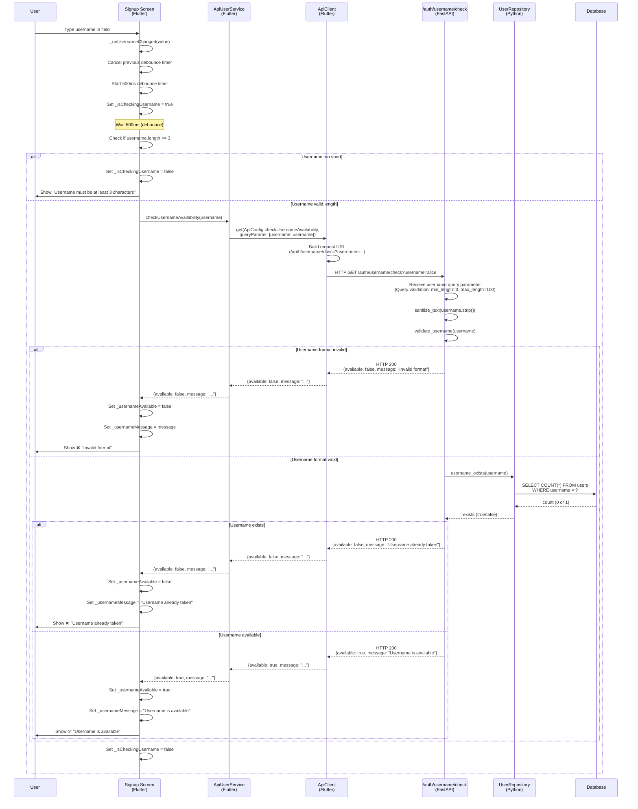
```mermaid
sequenceDiagram
    participant User
    participant SignupScreen as Signup Screen<br/>(Flutter)
    participant ApiUserService as ApiUserService<br/>(Flutter)
    participant ApiClient as ApiClient<br/>(Flutter)
    participant AuthAPI as /auth/username/check<br/>(FastAPI)
    participant UserRepo as UserRepository<br/>(Python)
    participant DB as Database

    User->>SignupScreen: Type username in field
    SignupScreen->>SignupScreen: _onUsernameChanged(value)
    SignupScreen->>SignupScreen: Cancel previous debounce timer
    SignupScreen->>SignupScreen: Start 500ms debounce timer
    SignupScreen->>SignupScreen: Set _isCheckingUsername = true
    
    Note over SignupScreen: Wait 500ms (debounce)
    
    SignupScreen->>SignupScreen: Check if username.length >= 3
    
    alt Username too short
        SignupScreen->>SignupScreen: Set _isCheckingUsername = false
        SignupScreen->>User: Show "Username must be at least 3 characters"
    else Username valid length
        SignupScreen->>ApiUserService: checkUsernameAvailability(username)
        ApiUserService->>ApiClient: get(ApiConfig.checkUsernameAvailability,<br/>queryParams: {username: username})
        ApiClient->>ApiClient: Build request URL<br/>(/auth/username/check?username=...)
        ApiClient->>AuthAPI: HTTP GET /auth/username/check?username=alice
        
        AuthAPI->>AuthAPI: Receive username query parameter<br/>(Query validation: min_length=3, max_length=100)
        AuthAPI->>AuthAPI: sanitize_text(username.strip())
        AuthAPI->>AuthAPI: validate_username(username)
        
        alt Username format invalid
            AuthAPI-->>ApiClient: HTTP 200<br/>{available: false, message: "Invalid format"}
            ApiClient-->>ApiUserService: {available: false, message: "..."}
            ApiUserService-->>SignupScreen: {available: false, message: "..."}
            SignupScreen->>SignupScreen: Set _usernameAvailable = false
            SignupScreen->>SignupScreen: Set _usernameMessage = message
            SignupScreen->>User: Show ❌ "Invalid format"
        else Username format valid
            AuthAPI->>UserRepo: username_exists(username)
            UserRepo->>DB: SELECT COUNT(*) FROM users<br/>WHERE username = ?
            DB-->>UserRepo: count (0 or 1)
            UserRepo-->>AuthAPI: exists (true/false)
            
            alt Username exists
                AuthAPI-->>ApiClient: HTTP 200<br/>{available: false, message: "Username already taken"}
                ApiClient-->>ApiUserService: {available: false, message: "..."}
                ApiUserService-->>SignupScreen: {available: false, message: "..."}
                SignupScreen->>SignupScreen: Set _usernameAvailable = false
                SignupScreen->>SignupScreen: Set _usernameMessage = "Username already taken"
                SignupScreen->>User: Show ❌ "Username already taken"
            else Username available
                AuthAPI-->>ApiClient: HTTP 200<br/>{available: true, message: "Username is available"}
                ApiClient-->>ApiUserService: {available: true, message: "..."}
                ApiUserService-->>SignupScreen: {available: true, message: "..."}
                SignupScreen->>SignupScreen: Set _usernameAvailable = true
                SignupScreen->>SignupScreen: Set _usernameMessage = "Username is available"
                SignupScreen->>User: Show ✅ "Username is available"
            end
        end
        
        SignupScreen->>SignupScreen: Set _isCheckingUsername = false
    end
```

---

### 4. Get Current User Info

**Description**: Fetch current authenticated user information.

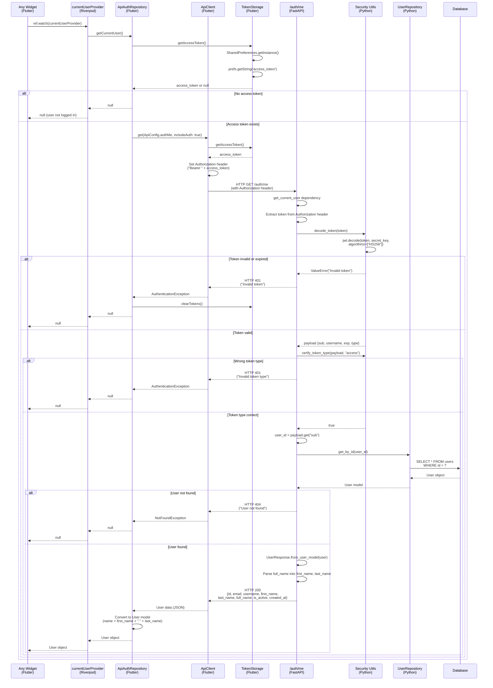
```mermaid
sequenceDiagram
    participant Widget as Any Widget<br/>(Flutter)
    participant Provider as currentUserProvider<br/>(Riverpod)
    participant ApiAuthRepo as ApiAuthRepository<br/>(Flutter)
    participant ApiClient as ApiClient<br/>(Flutter)
    participant TokenStorage as TokenStorage<br/>(Flutter)
    participant AuthAPI as /auth/me<br/>(FastAPI)
    participant Security as Security Utils<br/>(Python)
    participant UserRepo as UserRepository<br/>(Python)
    participant DB as Database

    Widget->>Provider: ref.watch(currentUserProvider)
    Provider->>ApiAuthRepo: getCurrentUser()
    ApiAuthRepo->>TokenStorage: getAccessToken()
    TokenStorage->>TokenStorage: SharedPreferences.getInstance()
    TokenStorage->>TokenStorage: prefs.getString('access_token')
    TokenStorage-->>ApiAuthRepo: access_token or null
    
    alt No access token
        ApiAuthRepo-->>Provider: null
        Provider-->>Widget: null (user not logged in)
    else Access token exists
        ApiAuthRepo->>ApiClient: get(ApiConfig.authMe, includeAuth: true)
        ApiClient->>TokenStorage: getAccessToken()
        TokenStorage-->>ApiClient: access_token
        ApiClient->>ApiClient: Set Authorization header<br/>("Bearer " + access_token)
        ApiClient->>AuthAPI: HTTP GET /auth/me<br/>(with Authorization header)
        
        AuthAPI->>AuthAPI: get_current_user dependency
        AuthAPI->>AuthAPI: Extract token from Authorization header
        AuthAPI->>Security: decode_token(token)
        Security->>Security: jwt.decode(token, secret_key,<br/>algorithms=["HS256"])
        
        alt Token invalid or expired
            Security-->>AuthAPI: ValueError("Invalid token")
            AuthAPI-->>ApiClient: HTTP 401<br/>("Invalid token")
            ApiClient-->>ApiAuthRepo: AuthenticationException
            ApiAuthRepo->>TokenStorage: clearTokens()
            ApiAuthRepo-->>Provider: null
            Provider-->>Widget: null
        else Token valid
            Security-->>AuthAPI: payload {sub, username, exp, type}
            AuthAPI->>Security: verify_token_type(payload, "access")
            
            alt Wrong token type
                AuthAPI-->>ApiClient: HTTP 401<br/>("Invalid token type")
                ApiClient-->>ApiAuthRepo: AuthenticationException
                ApiAuthRepo-->>Provider: null
                Provider-->>Widget: null
            else Token type correct
                Security-->>AuthAPI: true
                AuthAPI->>AuthAPI: user_id = payload.get("sub")
                AuthAPI->>UserRepo: get_by_id(user_id)
                UserRepo->>DB: SELECT * FROM users<br/>WHERE id = ?
                DB-->>UserRepo: User object
                UserRepo-->>AuthAPI: User model
                
                alt User not found
                    AuthAPI-->>ApiClient: HTTP 404<br/>("User not found")
                    ApiClient-->>ApiAuthRepo: NotFoundException
                    ApiAuthRepo-->>Provider: null
                    Provider-->>Widget: null
                else User found
                    AuthAPI->>AuthAPI: UserResponse.from_user_model(user)
                    AuthAPI->>AuthAPI: Parse full_name into first_name, last_name
                    AuthAPI-->>ApiClient: HTTP 200<br/>{id, email, username, first_name,<br/>last_name, full_name, is_active, created_at}
                    
                    ApiClient-->>ApiAuthRepo: User data (JSON)
                    ApiAuthRepo->>ApiAuthRepo: Convert to User model<br/>(name = first_name + " " + last_name)
                    ApiAuthRepo-->>Provider: User object
                    Provider-->>Widget: User object
                end
            end
        end
    end
```

---

## Capsule Management Flows

### 5. Create Capsule (Draft)

**Description**: User creates a new time capsule in draft state.

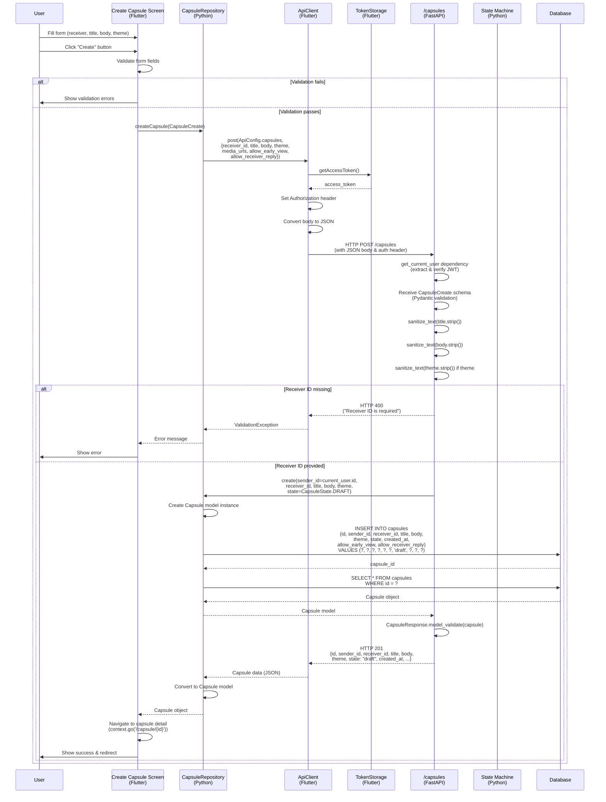
```mermaid
sequenceDiagram
    participant User
    participant CreateScreen as Create Capsule Screen<br/>(Flutter)
    participant CapsuleRepo as CapsuleRepository<br/>(Flutter)
    participant ApiClient as ApiClient<br/>(Flutter)
    participant TokenStorage as TokenStorage<br/>(Flutter)
    participant CapsuleAPI as /capsules<br/>(FastAPI)
    participant StateMachine as State Machine<br/>(Python)
    participant CapsuleRepo as CapsuleRepository<br/>(Python)
    participant DB as Database

    User->>CreateScreen: Fill form (receiver, title, body, theme)
    User->>CreateScreen: Click "Create" button
    CreateScreen->>CreateScreen: Validate form fields
    
    alt Validation fails
        CreateScreen->>User: Show validation errors
    else Validation passes
        CreateScreen->>CapsuleRepo: createCapsule(CapsuleCreate)
        CapsuleRepo->>ApiClient: post(ApiConfig.capsules,<br/>{receiver_id, title, body, theme,<br/>media_urls, allow_early_view,<br/>allow_receiver_reply})
        ApiClient->>TokenStorage: getAccessToken()
        TokenStorage-->>ApiClient: access_token
        ApiClient->>ApiClient: Set Authorization header
        ApiClient->>ApiClient: Convert body to JSON
        ApiClient->>CapsuleAPI: HTTP POST /capsules<br/>(with JSON body & auth header)
        
        CapsuleAPI->>CapsuleAPI: get_current_user dependency<br/>(extract & verify JWT)
        CapsuleAPI->>CapsuleAPI: Receive CapsuleCreate schema<br/>(Pydantic validation)
        CapsuleAPI->>CapsuleAPI: sanitize_text(title.strip())
        CapsuleAPI->>CapsuleAPI: sanitize_text(body.strip())
        CapsuleAPI->>CapsuleAPI: sanitize_text(theme.strip()) if theme
        
        alt Receiver ID missing
            CapsuleAPI-->>ApiClient: HTTP 400<br/>("Receiver ID is required")
            ApiClient-->>CapsuleRepo: ValidationException
            CapsuleRepo-->>CreateScreen: Error message
            CreateScreen->>User: Show error
        else Receiver ID provided
            CapsuleAPI->>CapsuleRepo: create(sender_id=current_user.id,<br/>receiver_id, title, body, theme,<br/>state=CapsuleState.DRAFT)
            CapsuleRepo->>CapsuleRepo: Create Capsule model instance
            CapsuleRepo->>DB: INSERT INTO capsules<br/>(id, sender_id, receiver_id, title, body,<br/>theme, state, created_at,<br/>allow_early_view, allow_receiver_reply)<br/>VALUES (?, ?, ?, ?, ?, ?, 'draft', ?, ?, ?)
            DB-->>CapsuleRepo: capsule_id
            CapsuleRepo->>DB: SELECT * FROM capsules<br/>WHERE id = ?
            DB-->>CapsuleRepo: Capsule object
            CapsuleRepo-->>CapsuleAPI: Capsule model
            
            CapsuleAPI->>CapsuleAPI: CapsuleResponse.model_validate(capsule)
            CapsuleAPI-->>ApiClient: HTTP 201<br/>{id, sender_id, receiver_id, title, body,<br/>theme, state: "draft", created_at, ...}
            
            ApiClient-->>CapsuleRepo: Capsule data (JSON)
            CapsuleRepo->>CapsuleRepo: Convert to Capsule model
            CapsuleRepo-->>CreateScreen: Capsule object
            CreateScreen->>CreateScreen: Navigate to capsule detail<br/>(context.go('/capsule/{id}'))
            CreateScreen->>User: Show success & redirect
        end
    end
```

---

### 6. Seal Capsule

**Description**: User sets unlock time and seals the capsule (moves from draft to sealed state).

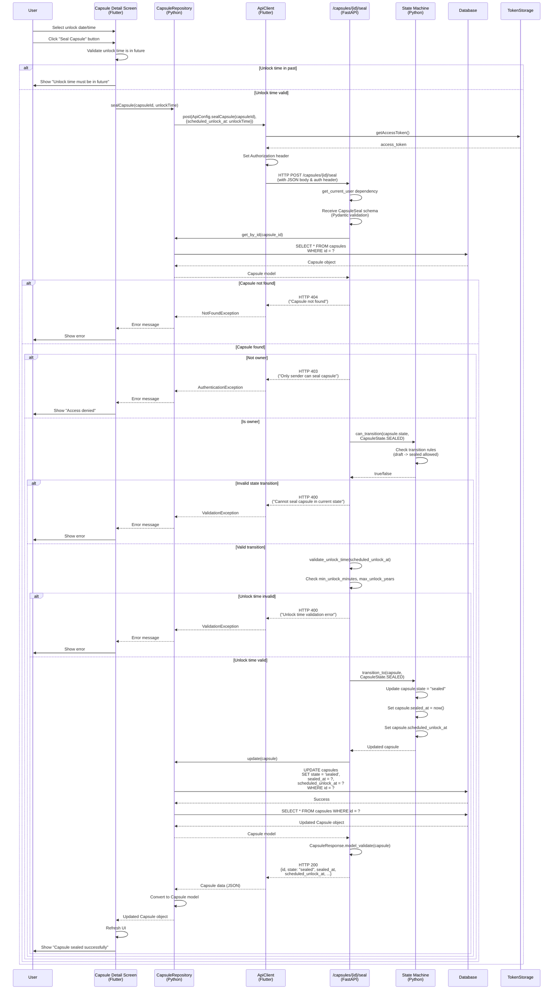
```mermaid
sequenceDiagram
    participant User
    participant CapsuleScreen as Capsule Detail Screen<br/>(Flutter)
    participant CapsuleRepo as CapsuleRepository<br/>(Flutter)
    participant ApiClient as ApiClient<br/>(Flutter)
    participant CapsuleAPI as /capsules/{id}/seal<br/>(FastAPI)
    participant StateMachine as State Machine<br/>(Python)
    participant CapsuleRepo as CapsuleRepository<br/>(Python)
    participant DB as Database

    User->>CapsuleScreen: Select unlock date/time
    User->>CapsuleScreen: Click "Seal Capsule" button
    CapsuleScreen->>CapsuleScreen: Validate unlock time is in future
    
    alt Unlock time in past
        CapsuleScreen->>User: Show "Unlock time must be in future"
    else Unlock time valid
        CapsuleScreen->>CapsuleRepo: sealCapsule(capsuleId, unlockTime)
        CapsuleRepo->>ApiClient: post(ApiConfig.sealCapsule(capsuleId),<br/>{scheduled_unlock_at: unlockTime})
        ApiClient->>TokenStorage: getAccessToken()
        TokenStorage-->>ApiClient: access_token
        ApiClient->>ApiClient: Set Authorization header
        ApiClient->>CapsuleAPI: HTTP POST /capsules/{id}/seal<br/>(with JSON body & auth header)
        
        CapsuleAPI->>CapsuleAPI: get_current_user dependency
        CapsuleAPI->>CapsuleAPI: Receive CapsuleSeal schema<br/>(Pydantic validation)
        CapsuleAPI->>CapsuleRepo: get_by_id(capsule_id)
        CapsuleRepo->>DB: SELECT * FROM capsules<br/>WHERE id = ?
        DB-->>CapsuleRepo: Capsule object
        CapsuleRepo-->>CapsuleAPI: Capsule model
        
        alt Capsule not found
            CapsuleAPI-->>ApiClient: HTTP 404<br/>("Capsule not found")
            ApiClient-->>CapsuleRepo: NotFoundException
            CapsuleRepo-->>CapsuleScreen: Error message
            CapsuleScreen->>User: Show error
        else Capsule found
            alt Not owner
                CapsuleAPI-->>ApiClient: HTTP 403<br/>("Only sender can seal capsule")
                ApiClient-->>CapsuleRepo: AuthenticationException
                CapsuleRepo-->>CapsuleScreen: Error message
                CapsuleScreen->>User: Show "Access denied"
            else Is owner
                CapsuleAPI->>StateMachine: can_transition(capsule.state,<br/>CapsuleState.SEALED)
                StateMachine->>StateMachine: Check transition rules<br/>(draft -> sealed allowed)
                StateMachine-->>CapsuleAPI: true/false
                
                alt Invalid state transition
                    CapsuleAPI-->>ApiClient: HTTP 400<br/>("Cannot seal capsule in current state")
                    ApiClient-->>CapsuleRepo: ValidationException
                    CapsuleRepo-->>CapsuleScreen: Error message
                    CapsuleScreen->>User: Show error
                else Valid transition
                    CapsuleAPI->>CapsuleAPI: validate_unlock_time(scheduled_unlock_at)
                    CapsuleAPI->>CapsuleAPI: Check min_unlock_minutes, max_unlock_years
                    
                    alt Unlock time invalid
                        CapsuleAPI-->>ApiClient: HTTP 400<br/>("Unlock time validation error")
                        ApiClient-->>CapsuleRepo: ValidationException
                        CapsuleRepo-->>CapsuleScreen: Error message
                        CapsuleScreen->>User: Show error
                    else Unlock time valid
                        CapsuleAPI->>StateMachine: transition_to(capsule,<br/>CapsuleState.SEALED)
                        StateMachine->>StateMachine: Update capsule.state = "sealed"
                        StateMachine->>StateMachine: Set capsule.sealed_at = now()
                        StateMachine->>StateMachine: Set capsule.scheduled_unlock_at
                        StateMachine-->>CapsuleAPI: Updated capsule
                        
                        CapsuleAPI->>CapsuleRepo: update(capsule)
                        CapsuleRepo->>DB: UPDATE capsules<br/>SET state = 'sealed',<br/>sealed_at = ?,<br/>scheduled_unlock_at = ?<br/>WHERE id = ?
                        DB-->>CapsuleRepo: Success
                        CapsuleRepo->>DB: SELECT * FROM capsules WHERE id = ?
                        DB-->>CapsuleRepo: Updated Capsule object
                        CapsuleRepo-->>CapsuleAPI: Capsule model
                        
                        CapsuleAPI->>CapsuleAPI: CapsuleResponse.model_validate(capsule)
                        CapsuleAPI-->>ApiClient: HTTP 200<br/>{id, state: "sealed", sealed_at,<br/>scheduled_unlock_at, ...}
                        
                        ApiClient-->>CapsuleRepo: Capsule data (JSON)
                        CapsuleRepo->>CapsuleRepo: Convert to Capsule model
                        CapsuleRepo-->>CapsuleScreen: Updated Capsule object
                        CapsuleScreen->>CapsuleScreen: Refresh UI
                        CapsuleScreen->>User: Show "Capsule sealed successfully"
                    end
                end
            end
        end
    end
```

---

### 7. List Capsules (Inbox/Outbox)

**Description**: User views their inbox (received) or outbox (sent) capsules.

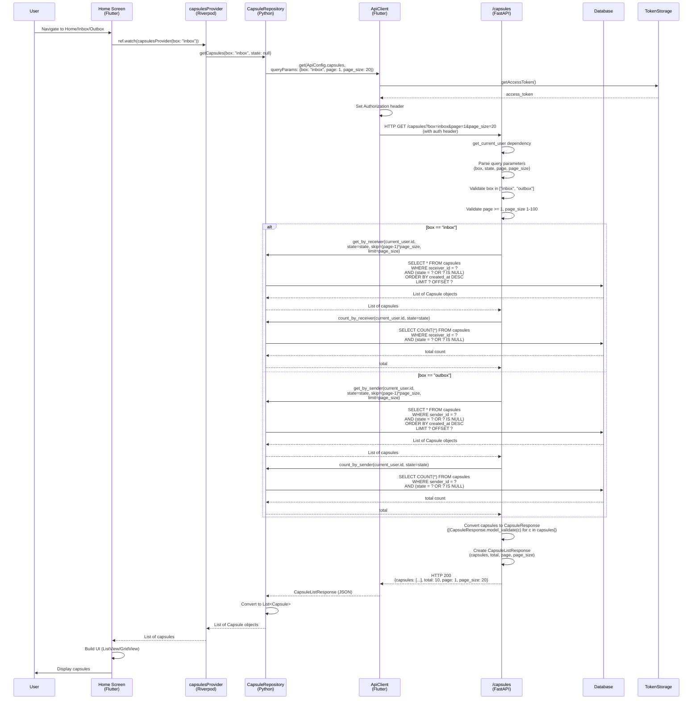
```mermaid
sequenceDiagram
    participant User
    participant HomeScreen as Home Screen<br/>(Flutter)
    participant Provider as capsulesProvider<br/>(Riverpod)
    participant CapsuleRepo as CapsuleRepository<br/>(Flutter)
    participant ApiClient as ApiClient<br/>(Flutter)
    participant CapsuleAPI as /capsules<br/>(FastAPI)
    participant CapsuleRepo as CapsuleRepository<br/>(Python)
    participant DB as Database

    User->>HomeScreen: Navigate to Home/Inbox/Outbox
    HomeScreen->>Provider: ref.watch(capsulesProvider(box: "inbox"))
    Provider->>CapsuleRepo: getCapsules(box: "inbox", state: null)
    CapsuleRepo->>ApiClient: get(ApiConfig.capsules,<br/>queryParams: {box: "inbox", page: 1, page_size: 20})
    ApiClient->>TokenStorage: getAccessToken()
    TokenStorage-->>ApiClient: access_token
    ApiClient->>ApiClient: Set Authorization header
    ApiClient->>CapsuleAPI: HTTP GET /capsules?box=inbox&page=1&page_size=20<br/>(with auth header)
    
    CapsuleAPI->>CapsuleAPI: get_current_user dependency
    CapsuleAPI->>CapsuleAPI: Parse query parameters<br/>(box, state, page, page_size)
    CapsuleAPI->>CapsuleAPI: Validate box in ["inbox", "outbox"]
    CapsuleAPI->>CapsuleAPI: Validate page >= 1, page_size 1-100
    
    alt box == "inbox"
        CapsuleAPI->>CapsuleRepo: get_by_receiver(current_user.id,<br/>state=state, skip=(page-1)*page_size,<br/>limit=page_size)
        CapsuleRepo->>DB: SELECT * FROM capsules<br/>WHERE receiver_id = ?<br/>AND (state = ? OR ? IS NULL)<br/>ORDER BY created_at DESC<br/>LIMIT ? OFFSET ?
        DB-->>CapsuleRepo: List of Capsule objects
        CapsuleRepo-->>CapsuleAPI: List of capsules
        
        CapsuleAPI->>CapsuleRepo: count_by_receiver(current_user.id, state=state)
        CapsuleRepo->>DB: SELECT COUNT(*) FROM capsules<br/>WHERE receiver_id = ?<br/>AND (state = ? OR ? IS NULL)
        DB-->>CapsuleRepo: total count
        CapsuleRepo-->>CapsuleAPI: total
    else box == "outbox"
        CapsuleAPI->>CapsuleRepo: get_by_sender(current_user.id,<br/>state=state, skip=(page-1)*page_size,<br/>limit=page_size)
        CapsuleRepo->>DB: SELECT * FROM capsules<br/>WHERE sender_id = ?<br/>AND (state = ? OR ? IS NULL)<br/>ORDER BY created_at DESC<br/>LIMIT ? OFFSET ?
        DB-->>CapsuleRepo: List of Capsule objects
        CapsuleRepo-->>CapsuleAPI: List of capsules
        
        CapsuleAPI->>CapsuleRepo: count_by_sender(current_user.id, state=state)
        CapsuleRepo->>DB: SELECT COUNT(*) FROM capsules<br/>WHERE sender_id = ?<br/>AND (state = ? OR ? IS NULL)
        DB-->>CapsuleRepo: total count
        CapsuleRepo-->>CapsuleAPI: total
    end
    
    CapsuleAPI->>CapsuleAPI: Convert capsules to CapsuleResponse<br/>([CapsuleResponse.model_validate(c) for c in capsules])
    CapsuleAPI->>CapsuleAPI: Create CapsuleListResponse<br/>(capsules, total, page, page_size)
    CapsuleAPI-->>ApiClient: HTTP 200<br/>{capsules: [...], total: 10, page: 1, page_size: 20}
    
    ApiClient-->>CapsuleRepo: CapsuleListResponse (JSON)
    CapsuleRepo->>CapsuleRepo: Convert to List<Capsule>
    CapsuleRepo-->>Provider: List of Capsule objects
    Provider-->>HomeScreen: List of capsules
    HomeScreen->>HomeScreen: Build UI (ListView/GridView)
    HomeScreen->>User: Display capsules
```

---

### 8. Open Capsule

**Description**: Receiver opens a ready capsule.

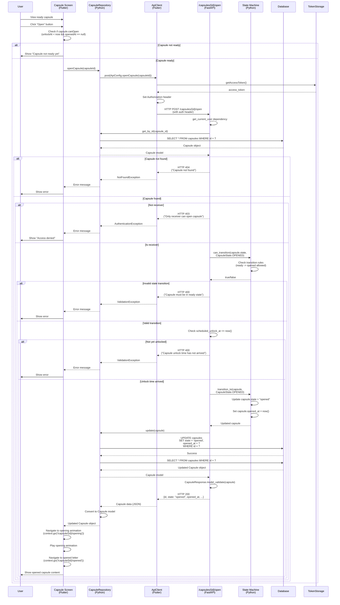
```mermaid
sequenceDiagram
    participant User
    participant CapsuleScreen as Capsule Screen<br/>(Flutter)
    participant CapsuleRepo as CapsuleRepository<br/>(Flutter)
    participant ApiClient as ApiClient<br/>(Flutter)
    participant CapsuleAPI as /capsules/{id}/open<br/>(FastAPI)
    participant StateMachine as State Machine<br/>(Python)
    participant CapsuleRepo as CapsuleRepository<br/>(Python)
    participant DB as Database

    User->>CapsuleScreen: View ready capsule
    User->>CapsuleScreen: Click "Open" button
    CapsuleScreen->>CapsuleScreen: Check if capsule.canOpen<br/>(unlockAt < now && openedAt == null)
    
    alt Capsule not ready
        CapsuleScreen->>User: Show "Capsule not ready yet"
    else Capsule ready
        CapsuleScreen->>CapsuleRepo: openCapsule(capsuleId)
        CapsuleRepo->>ApiClient: post(ApiConfig.openCapsule(capsuleId))
        ApiClient->>TokenStorage: getAccessToken()
        TokenStorage-->>ApiClient: access_token
        ApiClient->>ApiClient: Set Authorization header
        ApiClient->>CapsuleAPI: HTTP POST /capsules/{id}/open<br/>(with auth header)
        
        CapsuleAPI->>CapsuleAPI: get_current_user dependency
        CapsuleAPI->>CapsuleRepo: get_by_id(capsule_id)
        CapsuleRepo->>DB: SELECT * FROM capsules WHERE id = ?
        DB-->>CapsuleRepo: Capsule object
        CapsuleRepo-->>CapsuleAPI: Capsule model
        
        alt Capsule not found
            CapsuleAPI-->>ApiClient: HTTP 404<br/>("Capsule not found")
            ApiClient-->>CapsuleRepo: NotFoundException
            CapsuleRepo-->>CapsuleScreen: Error message
            CapsuleScreen->>User: Show error
        else Capsule found
            alt Not receiver
                CapsuleAPI-->>ApiClient: HTTP 403<br/>("Only receiver can open capsule")
                ApiClient-->>CapsuleRepo: AuthenticationException
                CapsuleRepo-->>CapsuleScreen: Error message
                CapsuleScreen->>User: Show "Access denied"
            else Is receiver
                CapsuleAPI->>StateMachine: can_transition(capsule.state,<br/>CapsuleState.OPENED)
                StateMachine->>StateMachine: Check transition rules<br/>(ready -> opened allowed)
                StateMachine-->>CapsuleAPI: true/false
                
                alt Invalid state transition
                    CapsuleAPI-->>ApiClient: HTTP 400<br/>("Capsule must be in ready state")
                    ApiClient-->>CapsuleRepo: ValidationException
                    CapsuleRepo-->>CapsuleScreen: Error message
                    CapsuleScreen->>User: Show error
                else Valid transition
                    CapsuleAPI->>CapsuleAPI: Check scheduled_unlock_at <= now()
                    
                    alt Not yet unlocked
                        CapsuleAPI-->>ApiClient: HTTP 400<br/>("Capsule unlock time has not arrived")
                        ApiClient-->>CapsuleRepo: ValidationException
                        CapsuleRepo-->>CapsuleScreen: Error message
                        CapsuleScreen->>User: Show error
                    else Unlock time arrived
                        CapsuleAPI->>StateMachine: transition_to(capsule,<br/>CapsuleState.OPENED)
                        StateMachine->>StateMachine: Update capsule.state = "opened"
                        StateMachine->>StateMachine: Set capsule.opened_at = now()
                        StateMachine-->>CapsuleAPI: Updated capsule
                        
                        CapsuleAPI->>CapsuleRepo: update(capsule)
                        CapsuleRepo->>DB: UPDATE capsules<br/>SET state = 'opened',<br/>opened_at = ?<br/>WHERE id = ?
                        DB-->>CapsuleRepo: Success
                        CapsuleRepo->>DB: SELECT * FROM capsules WHERE id = ?
                        DB-->>CapsuleRepo: Updated Capsule object
                        CapsuleRepo-->>CapsuleAPI: Capsule model
                        
                        CapsuleAPI->>CapsuleAPI: CapsuleResponse.model_validate(capsule)
                        CapsuleAPI-->>ApiClient: HTTP 200<br/>{id, state: "opened", opened_at, ...}
                        
                        ApiClient-->>CapsuleRepo: Capsule data (JSON)
                        CapsuleRepo->>CapsuleRepo: Convert to Capsule model
                        CapsuleRepo-->>CapsuleScreen: Updated Capsule object
                        CapsuleScreen->>CapsuleScreen: Navigate to opening animation<br/>(context.go('/capsule/{id}/opening'))
                        CapsuleScreen->>CapsuleScreen: Play opening animation
                        CapsuleScreen->>CapsuleScreen: Navigate to opened letter<br/>(context.go('/capsule/{id}/opened'))
                        CapsuleScreen->>User: Show opened capsule content
                    end
                end
            end
        end
    end
```

---

### 9. Update Capsule

**Description**: User updates a capsule in draft state (before sealing).

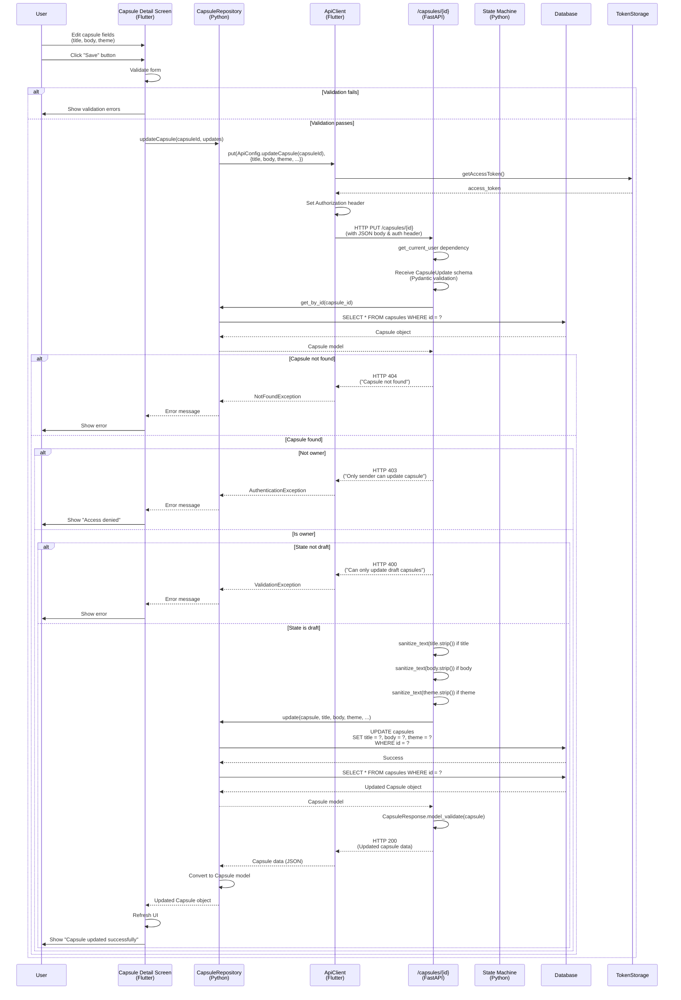
```mermaid
sequenceDiagram
    participant User
    participant CapsuleScreen as Capsule Detail Screen<br/>(Flutter)
    participant CapsuleRepo as CapsuleRepository<br/>(Flutter)
    participant ApiClient as ApiClient<br/>(Flutter)
    participant CapsuleAPI as /capsules/{id}<br/>(FastAPI)
    participant StateMachine as State Machine<br/>(Python)
    participant CapsuleRepo as CapsuleRepository<br/>(Python)
    participant DB as Database

    User->>CapsuleScreen: Edit capsule fields<br/>(title, body, theme)
    User->>CapsuleScreen: Click "Save" button
    CapsuleScreen->>CapsuleScreen: Validate form
    
    alt Validation fails
        CapsuleScreen->>User: Show validation errors
    else Validation passes
        CapsuleScreen->>CapsuleRepo: updateCapsule(capsuleId, updates)
        CapsuleRepo->>ApiClient: put(ApiConfig.updateCapsule(capsuleId),<br/>{title, body, theme, ...})
        ApiClient->>TokenStorage: getAccessToken()
        TokenStorage-->>ApiClient: access_token
        ApiClient->>ApiClient: Set Authorization header
        ApiClient->>CapsuleAPI: HTTP PUT /capsules/{id}<br/>(with JSON body & auth header)
        
        CapsuleAPI->>CapsuleAPI: get_current_user dependency
        CapsuleAPI->>CapsuleAPI: Receive CapsuleUpdate schema<br/>(Pydantic validation)
        CapsuleAPI->>CapsuleRepo: get_by_id(capsule_id)
        CapsuleRepo->>DB: SELECT * FROM capsules WHERE id = ?
        DB-->>CapsuleRepo: Capsule object
        CapsuleRepo-->>CapsuleAPI: Capsule model
        
        alt Capsule not found
            CapsuleAPI-->>ApiClient: HTTP 404<br/>("Capsule not found")
            ApiClient-->>CapsuleRepo: NotFoundException
            CapsuleRepo-->>CapsuleScreen: Error message
            CapsuleScreen->>User: Show error
        else Capsule found
            alt Not owner
                CapsuleAPI-->>ApiClient: HTTP 403<br/>("Only sender can update capsule")
                ApiClient-->>CapsuleRepo: AuthenticationException
                CapsuleRepo-->>CapsuleScreen: Error message
                CapsuleScreen->>User: Show "Access denied"
            else Is owner
                alt State not draft
                    CapsuleAPI-->>ApiClient: HTTP 400<br/>("Can only update draft capsules")
                    ApiClient-->>CapsuleRepo: ValidationException
                    CapsuleRepo-->>CapsuleScreen: Error message
                    CapsuleScreen->>User: Show error
                else State is draft
                    CapsuleAPI->>CapsuleAPI: sanitize_text(title.strip()) if title
                    CapsuleAPI->>CapsuleAPI: sanitize_text(body.strip()) if body
                    CapsuleAPI->>CapsuleAPI: sanitize_text(theme.strip()) if theme
                    
                    CapsuleAPI->>CapsuleRepo: update(capsule, title, body, theme, ...)
                    CapsuleRepo->>DB: UPDATE capsules<br/>SET title = ?, body = ?, theme = ?<br/>WHERE id = ?
                    DB-->>CapsuleRepo: Success
                    CapsuleRepo->>DB: SELECT * FROM capsules WHERE id = ?
                    DB-->>CapsuleRepo: Updated Capsule object
                    CapsuleRepo-->>CapsuleAPI: Capsule model
                    
                    CapsuleAPI->>CapsuleAPI: CapsuleResponse.model_validate(capsule)
                    CapsuleAPI-->>ApiClient: HTTP 200<br/>(Updated capsule data)
                    
                    ApiClient-->>CapsuleRepo: Capsule data (JSON)
                    CapsuleRepo->>CapsuleRepo: Convert to Capsule model
                    CapsuleRepo-->>CapsuleScreen: Updated Capsule object
                    CapsuleScreen->>CapsuleScreen: Refresh UI
                    CapsuleScreen->>User: Show "Capsule updated successfully"
                end
            end
        end
    end
```

---

### 10. Delete Capsule

**Description**: User deletes a capsule in draft state.

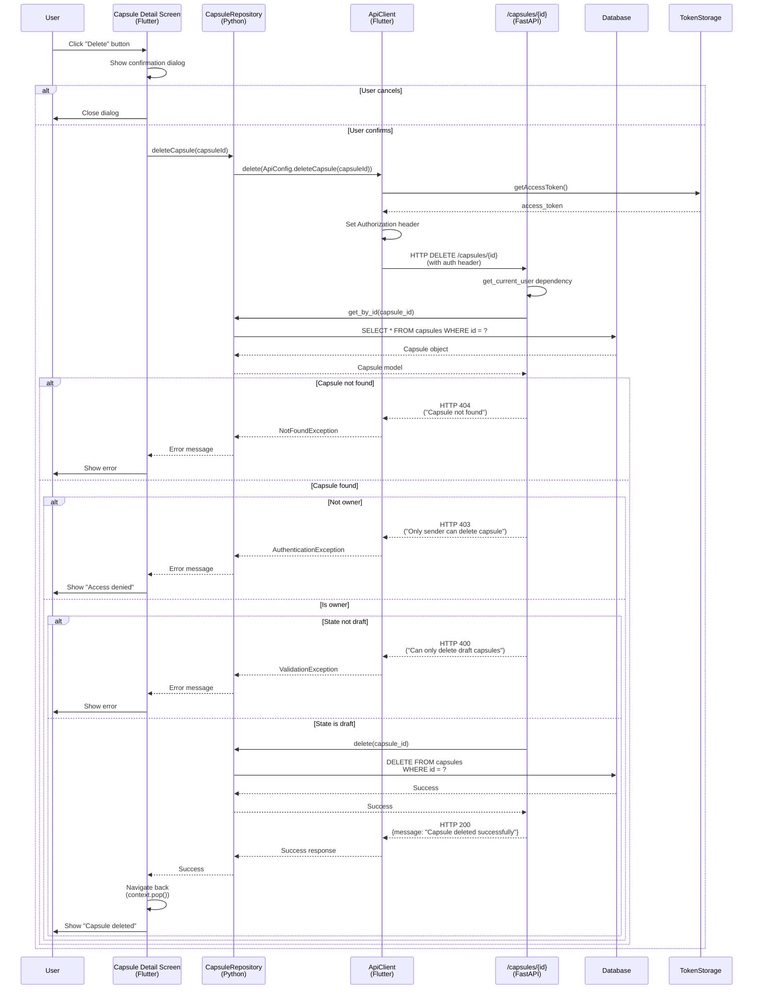
```mermaid
sequenceDiagram
    participant User
    participant CapsuleScreen as Capsule Detail Screen<br/>(Flutter)
    participant CapsuleRepo as CapsuleRepository<br/>(Flutter)
    participant ApiClient as ApiClient<br/>(Flutter)
    participant CapsuleAPI as /capsules/{id}<br/>(FastAPI)
    participant CapsuleRepo as CapsuleRepository<br/>(Python)
    participant DB as Database

    User->>CapsuleScreen: Click "Delete" button
    CapsuleScreen->>CapsuleScreen: Show confirmation dialog
    
    alt User cancels
        CapsuleScreen->>User: Close dialog
    else User confirms
        CapsuleScreen->>CapsuleRepo: deleteCapsule(capsuleId)
        CapsuleRepo->>ApiClient: delete(ApiConfig.deleteCapsule(capsuleId))
        ApiClient->>TokenStorage: getAccessToken()
        TokenStorage-->>ApiClient: access_token
        ApiClient->>ApiClient: Set Authorization header
        ApiClient->>CapsuleAPI: HTTP DELETE /capsules/{id}<br/>(with auth header)
        
        CapsuleAPI->>CapsuleAPI: get_current_user dependency
        CapsuleAPI->>CapsuleRepo: get_by_id(capsule_id)
        CapsuleRepo->>DB: SELECT * FROM capsules WHERE id = ?
        DB-->>CapsuleRepo: Capsule object
        CapsuleRepo-->>CapsuleAPI: Capsule model
        
        alt Capsule not found
            CapsuleAPI-->>ApiClient: HTTP 404<br/>("Capsule not found")
            ApiClient-->>CapsuleRepo: NotFoundException
            CapsuleRepo-->>CapsuleScreen: Error message
            CapsuleScreen->>User: Show error
        else Capsule found
            alt Not owner
                CapsuleAPI-->>ApiClient: HTTP 403<br/>("Only sender can delete capsule")
                ApiClient-->>CapsuleRepo: AuthenticationException
                CapsuleRepo-->>CapsuleScreen: Error message
                CapsuleScreen->>User: Show "Access denied"
            else Is owner
                alt State not draft
                    CapsuleAPI-->>ApiClient: HTTP 400<br/>("Can only delete draft capsules")
                    ApiClient-->>CapsuleRepo: ValidationException
                    CapsuleRepo-->>CapsuleScreen: Error message
                    CapsuleScreen->>User: Show error
                else State is draft
                    CapsuleAPI->>CapsuleRepo: delete(capsule_id)
                    CapsuleRepo->>DB: DELETE FROM capsules<br/>WHERE id = ?
                    DB-->>CapsuleRepo: Success
                    CapsuleRepo-->>CapsuleAPI: Success
                    
                    CapsuleAPI-->>ApiClient: HTTP 200<br/>{message: "Capsule deleted successfully"}
                    
                    ApiClient-->>CapsuleRepo: Success response
                    CapsuleRepo-->>CapsuleScreen: Success
                    CapsuleScreen->>CapsuleScreen: Navigate back<br/>(context.pop())
                    CapsuleScreen->>User: Show "Capsule deleted"
                end
            end
        end
    end
```

---

## Recipient Management Flows

### 11. Search Users for Recipients

**Description**: User searches for registered users to add as recipients.

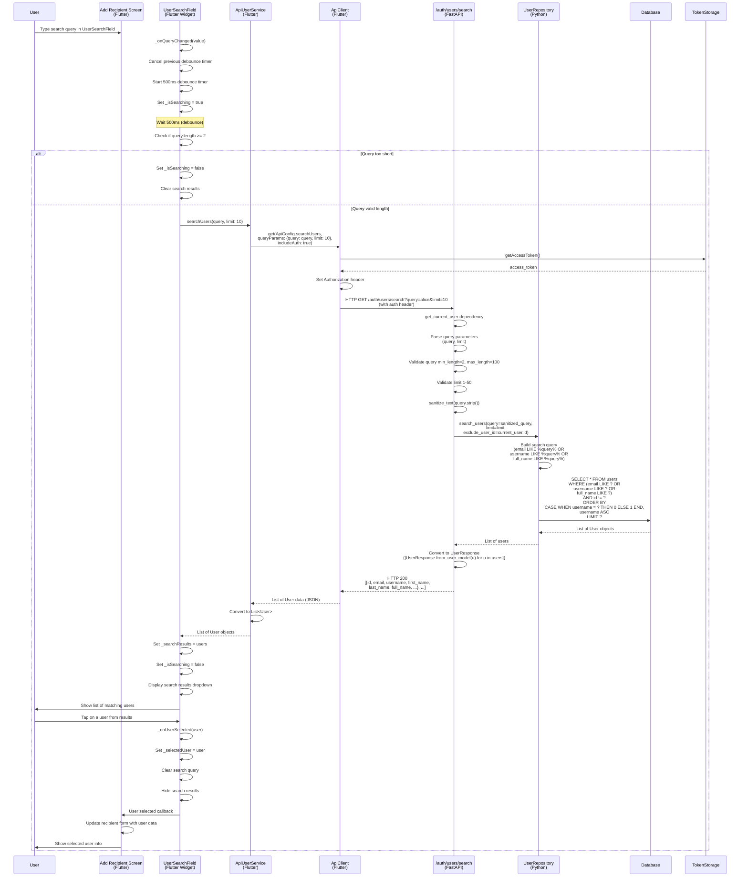
```mermaid
sequenceDiagram
    participant User
    participant AddRecipientScreen as Add Recipient Screen<br/>(Flutter)
    participant UserSearchField as UserSearchField<br/>(Flutter Widget)
    participant ApiUserService as ApiUserService<br/>(Flutter)
    participant ApiClient as ApiClient<br/>(Flutter)
    participant AuthAPI as /auth/users/search<br/>(FastAPI)
    participant UserRepo as UserRepository<br/>(Python)
    participant DB as Database

    User->>AddRecipientScreen: Type search query in UserSearchField
    UserSearchField->>UserSearchField: _onQueryChanged(value)
    UserSearchField->>UserSearchField: Cancel previous debounce timer
    UserSearchField->>UserSearchField: Start 500ms debounce timer
    UserSearchField->>UserSearchField: Set _isSearching = true
    
    Note over UserSearchField: Wait 500ms (debounce)
    
    UserSearchField->>UserSearchField: Check if query.length >= 2
    
    alt Query too short
        UserSearchField->>UserSearchField: Set _isSearching = false
        UserSearchField->>UserSearchField: Clear search results
    else Query valid length
        UserSearchField->>ApiUserService: searchUsers(query, limit: 10)
        ApiUserService->>ApiClient: get(ApiConfig.searchUsers,<br/>queryParams: {query: query, limit: 10},<br/>includeAuth: true)
        ApiClient->>TokenStorage: getAccessToken()
        TokenStorage-->>ApiClient: access_token
        ApiClient->>ApiClient: Set Authorization header
        ApiClient->>AuthAPI: HTTP GET /auth/users/search?query=alice&limit=10<br/>(with auth header)
        
        AuthAPI->>AuthAPI: get_current_user dependency
        AuthAPI->>AuthAPI: Parse query parameters<br/>(query, limit)
        AuthAPI->>AuthAPI: Validate query min_length=2, max_length=100
        AuthAPI->>AuthAPI: Validate limit 1-50
        AuthAPI->>AuthAPI: sanitize_text(query.strip())
        
        AuthAPI->>UserRepo: search_users(query=sanitized_query,<br/>limit=limit,<br/>exclude_user_id=current_user.id)
        UserRepo->>UserRepo: Build search query<br/>(email LIKE %query% OR<br/>username LIKE %query% OR<br/>full_name LIKE %query%)
        UserRepo->>DB: SELECT * FROM users<br/>WHERE (email LIKE ? OR<br/>username LIKE ? OR<br/>full_name LIKE ?)<br/>AND id != ?<br/>ORDER BY<br/>CASE WHEN username = ? THEN 0 ELSE 1 END,<br/>username ASC<br/>LIMIT ?
        DB-->>UserRepo: List of User objects
        UserRepo-->>AuthAPI: List of users
        
        AuthAPI->>AuthAPI: Convert to UserResponse<br/>([UserResponse.from_user_model(u) for u in users])
        AuthAPI-->>ApiClient: HTTP 200<br/>[{id, email, username, first_name,<br/>last_name, full_name, ...}, ...]
        
        ApiClient-->>ApiUserService: List of User data (JSON)
        ApiUserService->>ApiUserService: Convert to List<User>
        ApiUserService-->>UserSearchField: List of User objects
        UserSearchField->>UserSearchField: Set _searchResults = users
        UserSearchField->>UserSearchField: Set _isSearching = false
        UserSearchField->>UserSearchField: Display search results dropdown
        UserSearchField->>User: Show list of matching users
        
        User->>UserSearchField: Tap on a user from results
        UserSearchField->>UserSearchField: _onUserSelected(user)
        UserSearchField->>UserSearchField: Set _selectedUser = user
        UserSearchField->>UserSearchField: Clear search query
        UserSearchField->>UserSearchField: Hide search results
        UserSearchField->>AddRecipientScreen: User selected callback
        AddRecipientScreen->>AddRecipientScreen: Update recipient form with user data
        AddRecipientScreen->>User: Show selected user info
    end
```

---

### 12. Add Recipient

**Description**: User adds a recipient (either registered user or manual entry).

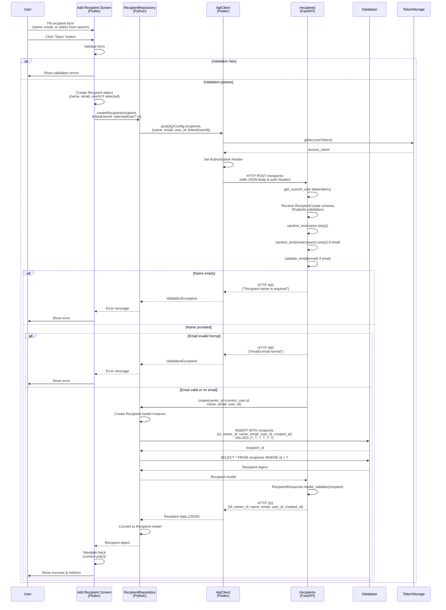
```mermaid
sequenceDiagram
    participant User
    participant AddRecipientScreen as Add Recipient Screen<br/>(Flutter)
    participant RecipientRepo as RecipientRepository<br/>(Flutter)
    participant ApiClient as ApiClient<br/>(Flutter)
    participant RecipientAPI as /recipients<br/>(FastAPI)
    participant RecipientRepo as RecipientRepository<br/>(Python)
    participant DB as Database

    User->>AddRecipientScreen: Fill recipient form<br/>(name, email, or select from search)
    User->>AddRecipientScreen: Click "Save" button
    AddRecipientScreen->>AddRecipientScreen: Validate form
    
    alt Validation fails
        AddRecipientScreen->>User: Show validation errors
    else Validation passes
        AddRecipientScreen->>AddRecipientScreen: Create Recipient object<br/>(name, email, userId if selected)
        AddRecipientScreen->>RecipientRepo: createRecipient(recipient,<br/>linkedUserId: selectedUser?.id)
        RecipientRepo->>ApiClient: post(ApiConfig.recipients,<br/>{name, email, user_id: linkedUserId})
        ApiClient->>TokenStorage: getAccessToken()
        TokenStorage-->>ApiClient: access_token
        ApiClient->>ApiClient: Set Authorization header
        ApiClient->>RecipientAPI: HTTP POST /recipients<br/>(with JSON body & auth header)
        
        RecipientAPI->>RecipientAPI: get_current_user dependency
        RecipientAPI->>RecipientAPI: Receive RecipientCreate schema<br/>(Pydantic validation)
        RecipientAPI->>RecipientAPI: sanitize_text(name.strip())
        RecipientAPI->>RecipientAPI: sanitize_text(email.lower().strip()) if email
        RecipientAPI->>RecipientAPI: validate_email(email) if email
        
        alt Name empty
            RecipientAPI-->>ApiClient: HTTP 400<br/>("Recipient name is required")
            ApiClient-->>RecipientRepo: ValidationException
            RecipientRepo-->>AddRecipientScreen: Error message
            AddRecipientScreen->>User: Show error
        else Name provided
            alt Email invalid format
                RecipientAPI-->>ApiClient: HTTP 400<br/>("Invalid email format")
                ApiClient-->>RecipientRepo: ValidationException
                RecipientRepo-->>AddRecipientScreen: Error message
                AddRecipientScreen->>User: Show error
            else Email valid or no email
                RecipientAPI->>RecipientRepo: create(owner_id=current_user.id,<br/>name, email, user_id)
                RecipientRepo->>RecipientRepo: Create Recipient model instance
                RecipientRepo->>DB: INSERT INTO recipients<br/>(id, owner_id, name, email, user_id, created_at)<br/>VALUES (?, ?, ?, ?, ?, ?)
                DB-->>RecipientRepo: recipient_id
                RecipientRepo->>DB: SELECT * FROM recipients WHERE id = ?
                DB-->>RecipientRepo: Recipient object
                RecipientRepo-->>RecipientAPI: Recipient model
                
                RecipientAPI->>RecipientAPI: RecipientResponse.model_validate(recipient)
                RecipientAPI-->>ApiClient: HTTP 201<br/>{id, owner_id, name, email, user_id, created_at}
                
                ApiClient-->>RecipientRepo: Recipient data (JSON)
                RecipientRepo->>RecipientRepo: Convert to Recipient model
                RecipientRepo-->>AddRecipientScreen: Recipient object
                AddRecipientScreen->>AddRecipientScreen: Navigate back<br/>(context.pop())
                AddRecipientScreen->>User: Show success & redirect
            end
        end
    end
```

---

### 13. List Recipients

**Description**: User views their saved recipients list.

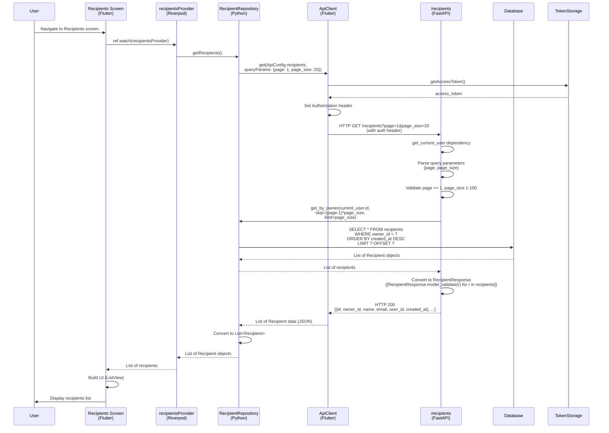
```mermaid
sequenceDiagram
    participant User
    participant RecipientsScreen as Recipients Screen<br/>(Flutter)
    participant Provider as recipientsProvider<br/>(Riverpod)
    participant RecipientRepo as RecipientRepository<br/>(Flutter)
    participant ApiClient as ApiClient<br/>(Flutter)
    participant RecipientAPI as /recipients<br/>(FastAPI)
    participant RecipientRepo as RecipientRepository<br/>(Python)
    participant DB as Database

    User->>RecipientsScreen: Navigate to Recipients screen
    RecipientsScreen->>Provider: ref.watch(recipientsProvider)
    Provider->>RecipientRepo: getRecipients()
    RecipientRepo->>ApiClient: get(ApiConfig.recipients,<br/>queryParams: {page: 1, page_size: 20})
    ApiClient->>TokenStorage: getAccessToken()
    TokenStorage-->>ApiClient: access_token
    ApiClient->>ApiClient: Set Authorization header
    ApiClient->>RecipientAPI: HTTP GET /recipients?page=1&page_size=20<br/>(with auth header)
    
    RecipientAPI->>RecipientAPI: get_current_user dependency
    RecipientAPI->>RecipientAPI: Parse query parameters<br/>(page, page_size)
    RecipientAPI->>RecipientAPI: Validate page >= 1, page_size 1-100
    RecipientAPI->>RecipientRepo: get_by_owner(current_user.id,<br/>skip=(page-1)*page_size,<br/>limit=page_size)
    RecipientRepo->>DB: SELECT * FROM recipients<br/>WHERE owner_id = ?<br/>ORDER BY created_at DESC<br/>LIMIT ? OFFSET ?
    DB-->>RecipientRepo: List of Recipient objects
    RecipientRepo-->>RecipientAPI: List of recipients
    
    RecipientAPI->>RecipientAPI: Convert to RecipientResponse<br/>([RecipientResponse.model_validate(r) for r in recipients])
    RecipientAPI-->>ApiClient: HTTP 200<br/>[{id, owner_id, name, email, user_id, created_at}, ...]
    
    ApiClient-->>RecipientRepo: List of Recipient data (JSON)
    RecipientRepo->>RecipientRepo: Convert to List<Recipient>
    RecipientRepo-->>Provider: List of Recipient objects
    Provider-->>RecipientsScreen: List of recipients
    RecipientsScreen->>RecipientsScreen: Build UI (ListView)
    RecipientsScreen->>User: Display recipients list
```

---

### 14. Delete Recipient

**Description**: User deletes a saved recipient.

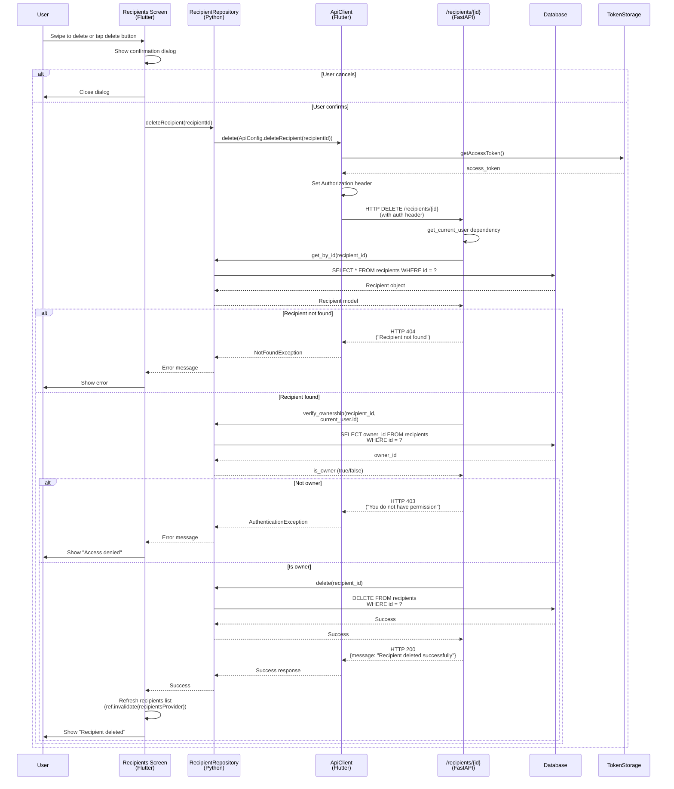
```mermaid
sequenceDiagram
    participant User
    participant RecipientsScreen as Recipients Screen<br/>(Flutter)
    participant RecipientRepo as RecipientRepository<br/>(Flutter)
    participant ApiClient as ApiClient<br/>(Flutter)
    participant RecipientAPI as /recipients/{id}<br/>(FastAPI)
    participant RecipientRepo as RecipientRepository<br/>(Python)
    participant DB as Database

    User->>RecipientsScreen: Swipe to delete or tap delete button
    RecipientsScreen->>RecipientsScreen: Show confirmation dialog
    
    alt User cancels
        RecipientsScreen->>User: Close dialog
    else User confirms
        RecipientsScreen->>RecipientRepo: deleteRecipient(recipientId)
        RecipientRepo->>ApiClient: delete(ApiConfig.deleteRecipient(recipientId))
        ApiClient->>TokenStorage: getAccessToken()
        TokenStorage-->>ApiClient: access_token
        ApiClient->>ApiClient: Set Authorization header
        ApiClient->>RecipientAPI: HTTP DELETE /recipients/{id}<br/>(with auth header)
        
        RecipientAPI->>RecipientAPI: get_current_user dependency
        RecipientAPI->>RecipientRepo: get_by_id(recipient_id)
        RecipientRepo->>DB: SELECT * FROM recipients WHERE id = ?
        DB-->>RecipientRepo: Recipient object
        RecipientRepo-->>RecipientAPI: Recipient model
        
        alt Recipient not found
            RecipientAPI-->>ApiClient: HTTP 404<br/>("Recipient not found")
            ApiClient-->>RecipientRepo: NotFoundException
            RecipientRepo-->>RecipientsScreen: Error message
            RecipientsScreen->>User: Show error
        else Recipient found
            RecipientAPI->>RecipientRepo: verify_ownership(recipient_id,<br/>current_user.id)
            RecipientRepo->>DB: SELECT owner_id FROM recipients<br/>WHERE id = ?
            DB-->>RecipientRepo: owner_id
            RecipientRepo-->>RecipientAPI: is_owner (true/false)
            
            alt Not owner
                RecipientAPI-->>ApiClient: HTTP 403<br/>("You do not have permission")
                ApiClient-->>RecipientRepo: AuthenticationException
                RecipientRepo-->>RecipientsScreen: Error message
                RecipientsScreen->>User: Show "Access denied"
            else Is owner
                RecipientAPI->>RecipientRepo: delete(recipient_id)
                RecipientRepo->>DB: DELETE FROM recipients<br/>WHERE id = ?
                DB-->>RecipientRepo: Success
                RecipientRepo-->>RecipientAPI: Success
                
                RecipientAPI-->>ApiClient: HTTP 200<br/>{message: "Recipient deleted successfully"}
                
                ApiClient-->>RecipientRepo: Success response
                RecipientRepo-->>RecipientsScreen: Success
                RecipientsScreen->>RecipientsScreen: Refresh recipients list<br/>(ref.invalidate(recipientsProvider))
                RecipientsScreen->>User: Show "Recipient deleted"
            end
        end
    end
```

---

## Draft Management Flows

### 15. Create Draft

**Description**: User creates a draft capsule for later editing.

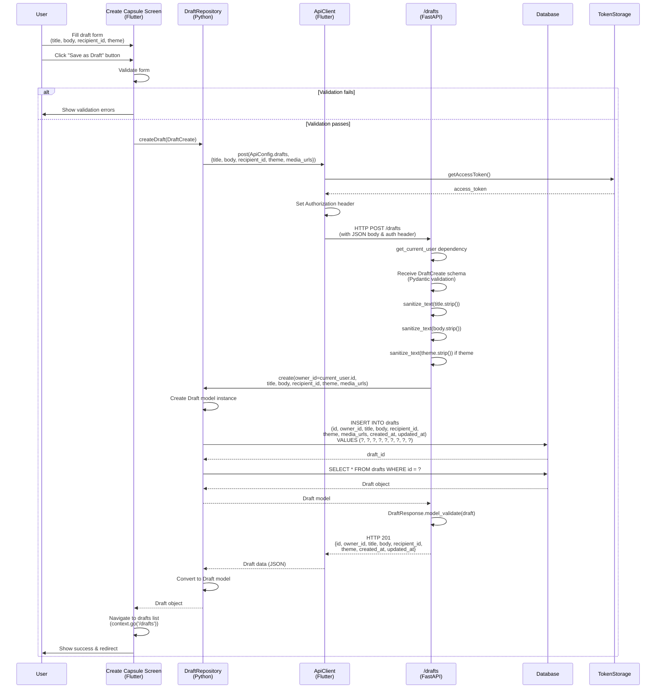
```mermaid
sequenceDiagram
    participant User
    participant CreateScreen as Create Capsule Screen<br/>(Flutter)
    participant DraftRepo as DraftRepository<br/>(Flutter)
    participant ApiClient as ApiClient<br/>(Flutter)
    participant DraftAPI as /drafts<br/>(FastAPI)
    participant DraftRepo as DraftRepository<br/>(Python)
    participant DB as Database

    User->>CreateScreen: Fill draft form<br/>(title, body, recipient_id, theme)
    User->>CreateScreen: Click "Save as Draft" button
    CreateScreen->>CreateScreen: Validate form
    
    alt Validation fails
        CreateScreen->>User: Show validation errors
    else Validation passes
        CreateScreen->>DraftRepo: createDraft(DraftCreate)
        DraftRepo->>ApiClient: post(ApiConfig.drafts,<br/>{title, body, recipient_id, theme, media_urls})
        ApiClient->>TokenStorage: getAccessToken()
        TokenStorage-->>ApiClient: access_token
        ApiClient->>ApiClient: Set Authorization header
        ApiClient->>DraftAPI: HTTP POST /drafts<br/>(with JSON body & auth header)
        
        DraftAPI->>DraftAPI: get_current_user dependency
        DraftAPI->>DraftAPI: Receive DraftCreate schema<br/>(Pydantic validation)
        DraftAPI->>DraftAPI: sanitize_text(title.strip())
        DraftAPI->>DraftAPI: sanitize_text(body.strip())
        DraftAPI->>DraftAPI: sanitize_text(theme.strip()) if theme
        
        DraftAPI->>DraftRepo: create(owner_id=current_user.id,<br/>title, body, recipient_id, theme, media_urls)
        DraftRepo->>DraftRepo: Create Draft model instance
        DraftRepo->>DB: INSERT INTO drafts<br/>(id, owner_id, title, body, recipient_id,<br/>theme, media_urls, created_at, updated_at)<br/>VALUES (?, ?, ?, ?, ?, ?, ?, ?, ?)
        DB-->>DraftRepo: draft_id
        DraftRepo->>DB: SELECT * FROM drafts WHERE id = ?
        DB-->>DraftRepo: Draft object
        DraftRepo-->>DraftAPI: Draft model
        
        DraftAPI->>DraftAPI: DraftResponse.model_validate(draft)
        DraftAPI-->>ApiClient: HTTP 201<br/>{id, owner_id, title, body, recipient_id,<br/>theme, created_at, updated_at}
        
        ApiClient-->>DraftRepo: Draft data (JSON)
        DraftRepo->>DraftRepo: Convert to Draft model
        DraftRepo-->>CreateScreen: Draft object
        CreateScreen->>CreateScreen: Navigate to drafts list<br/>(context.go('/drafts'))
        CreateScreen->>User: Show success & redirect
    end
```

---

### 16. List Drafts

**Description**: User views their saved drafts list.

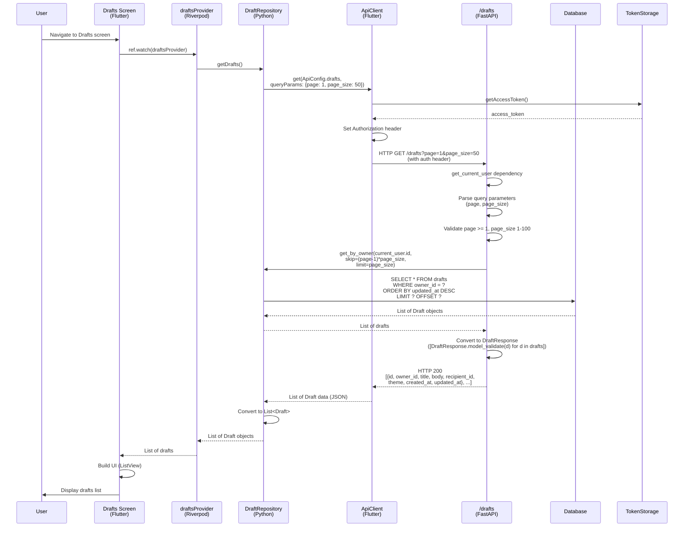
```mermaid
sequenceDiagram
    participant User
    participant DraftsScreen as Drafts Screen<br/>(Flutter)
    participant Provider as draftsProvider<br/>(Riverpod)
    participant DraftRepo as DraftRepository<br/>(Flutter)
    participant ApiClient as ApiClient<br/>(Flutter)
    participant DraftAPI as /drafts<br/>(FastAPI)
    participant DraftRepo as DraftRepository<br/>(Python)
    participant DB as Database

    User->>DraftsScreen: Navigate to Drafts screen
    DraftsScreen->>Provider: ref.watch(draftsProvider)
    Provider->>DraftRepo: getDrafts()
    DraftRepo->>ApiClient: get(ApiConfig.drafts,<br/>queryParams: {page: 1, page_size: 50})
    ApiClient->>TokenStorage: getAccessToken()
    TokenStorage-->>ApiClient: access_token
    ApiClient->>ApiClient: Set Authorization header
    ApiClient->>DraftAPI: HTTP GET /drafts?page=1&page_size=50<br/>(with auth header)
    
    DraftAPI->>DraftAPI: get_current_user dependency
    DraftAPI->>DraftAPI: Parse query parameters<br/>(page, page_size)
    DraftAPI->>DraftAPI: Validate page >= 1, page_size 1-100
    DraftAPI->>DraftRepo: get_by_owner(current_user.id,<br/>skip=(page-1)*page_size,<br/>limit=page_size)
    DraftRepo->>DB: SELECT * FROM drafts<br/>WHERE owner_id = ?<br/>ORDER BY updated_at DESC<br/>LIMIT ? OFFSET ?
    DB-->>DraftRepo: List of Draft objects
    DraftRepo-->>DraftAPI: List of drafts
    
    DraftAPI->>DraftAPI: Convert to DraftResponse<br/>([DraftResponse.model_validate(d) for d in drafts])
    DraftAPI-->>ApiClient: HTTP 200<br/>[{id, owner_id, title, body, recipient_id,<br/>theme, created_at, updated_at}, ...]
    
    ApiClient-->>DraftRepo: List of Draft data (JSON)
    DraftRepo->>DraftRepo: Convert to List<Draft>
    DraftRepo-->>Provider: List of Draft objects
    Provider-->>DraftsScreen: List of drafts
    DraftsScreen->>DraftsScreen: Build UI (ListView)
    DraftsScreen->>User: Display drafts list
```

---

### 17. Update Draft

**Description**: User updates an existing draft.

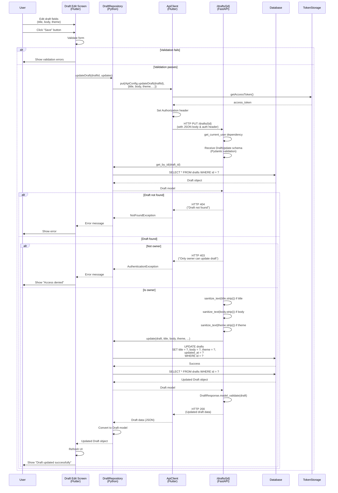
```mermaid
sequenceDiagram
    participant User
    participant DraftScreen as Draft Edit Screen<br/>(Flutter)
    participant DraftRepo as DraftRepository<br/>(Flutter)
    participant ApiClient as ApiClient<br/>(Flutter)
    participant DraftAPI as /drafts/{id}<br/>(FastAPI)
    participant DraftRepo as DraftRepository<br/>(Python)
    participant DB as Database

    User->>DraftScreen: Edit draft fields<br/>(title, body, theme)
    User->>DraftScreen: Click "Save" button
    DraftScreen->>DraftScreen: Validate form
    
    alt Validation fails
        DraftScreen->>User: Show validation errors
    else Validation passes
        DraftScreen->>DraftRepo: updateDraft(draftId, updates)
        DraftRepo->>ApiClient: put(ApiConfig.updateDraft(draftId),<br/>{title, body, theme, ...})
        ApiClient->>TokenStorage: getAccessToken()
        TokenStorage-->>ApiClient: access_token
        ApiClient->>ApiClient: Set Authorization header
        ApiClient->>DraftAPI: HTTP PUT /drafts/{id}<br/>(with JSON body & auth header)
        
        DraftAPI->>DraftAPI: get_current_user dependency
        DraftAPI->>DraftAPI: Receive DraftUpdate schema<br/>(Pydantic validation)
        DraftAPI->>DraftRepo: get_by_id(draft_id)
        DraftRepo->>DB: SELECT * FROM drafts WHERE id = ?
        DB-->>DraftRepo: Draft object
        DraftRepo-->>DraftAPI: Draft model
        
        alt Draft not found
            DraftAPI-->>ApiClient: HTTP 404<br/>("Draft not found")
            ApiClient-->>DraftRepo: NotFoundException
            DraftRepo-->>DraftScreen: Error message
            DraftScreen->>User: Show error
        else Draft found
            alt Not owner
                DraftAPI-->>ApiClient: HTTP 403<br/>("Only owner can update draft")
                ApiClient-->>DraftRepo: AuthenticationException
                DraftRepo-->>DraftScreen: Error message
                DraftScreen->>User: Show "Access denied"
            else Is owner
                DraftAPI->>DraftAPI: sanitize_text(title.strip()) if title
                DraftAPI->>DraftAPI: sanitize_text(body.strip()) if body
                DraftAPI->>DraftAPI: sanitize_text(theme.strip()) if theme
                
                DraftAPI->>DraftRepo: update(draft, title, body, theme, ...)
                DraftRepo->>DB: UPDATE drafts<br/>SET title = ?, body = ?, theme = ?,<br/>updated_at = ?<br/>WHERE id = ?
                DB-->>DraftRepo: Success
                DraftRepo->>DB: SELECT * FROM drafts WHERE id = ?
                DB-->>DraftRepo: Updated Draft object
                DraftRepo-->>DraftAPI: Draft model
                
                DraftAPI->>DraftAPI: DraftResponse.model_validate(draft)
                DraftAPI-->>ApiClient: HTTP 200<br/>(Updated draft data)
                
                ApiClient-->>DraftRepo: Draft data (JSON)
                DraftRepo->>DraftRepo: Convert to Draft model
                DraftRepo-->>DraftScreen: Updated Draft object
                DraftScreen->>DraftScreen: Refresh UI
                DraftScreen->>User: Show "Draft updated successfully"
            end
        end
    end
```

---

### 18. Delete Draft

**Description**: User deletes a saved draft.

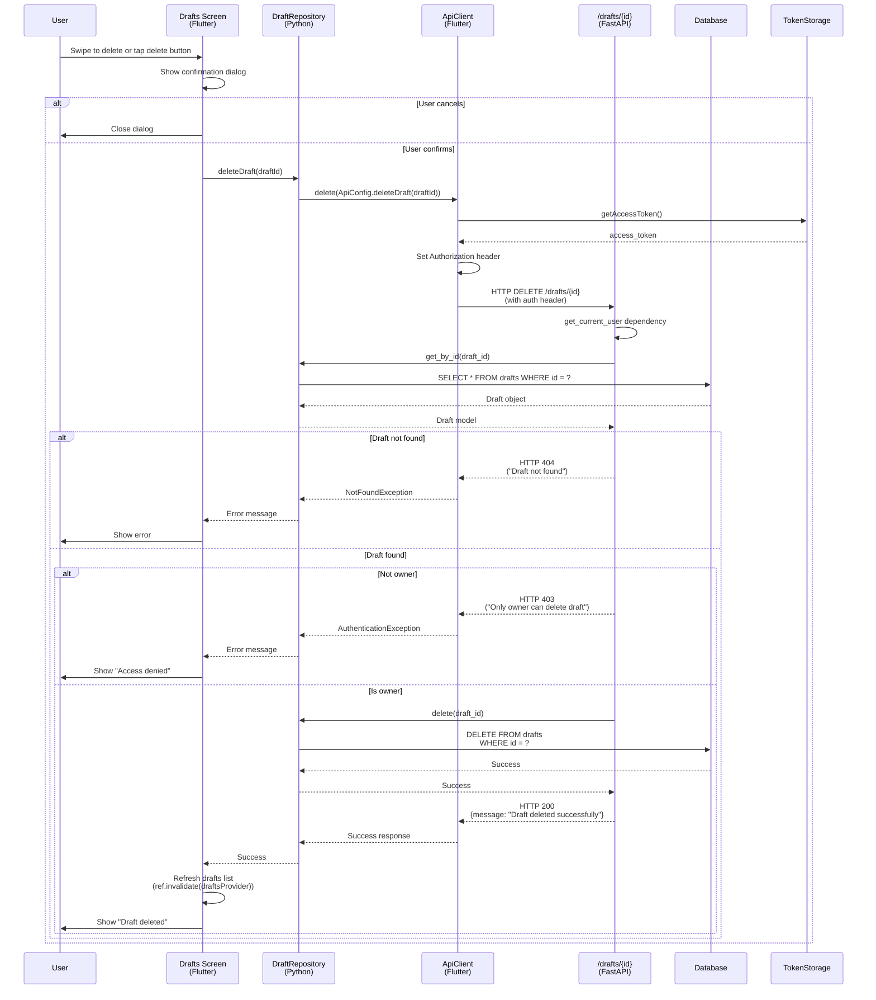
```mermaid
sequenceDiagram
    participant User
    participant DraftsScreen as Drafts Screen<br/>(Flutter)
    participant DraftRepo as DraftRepository<br/>(Flutter)
    participant ApiClient as ApiClient<br/>(Flutter)
    participant DraftAPI as /drafts/{id}<br/>(FastAPI)
    participant DraftRepo as DraftRepository<br/>(Python)
    participant DB as Database

    User->>DraftsScreen: Swipe to delete or tap delete button
    DraftsScreen->>DraftsScreen: Show confirmation dialog
    
    alt User cancels
        DraftsScreen->>User: Close dialog
    else User confirms
        DraftsScreen->>DraftRepo: deleteDraft(draftId)
        DraftRepo->>ApiClient: delete(ApiConfig.deleteDraft(draftId))
        ApiClient->>TokenStorage: getAccessToken()
        TokenStorage-->>ApiClient: access_token
        ApiClient->>ApiClient: Set Authorization header
        ApiClient->>DraftAPI: HTTP DELETE /drafts/{id}<br/>(with auth header)
        
        DraftAPI->>DraftAPI: get_current_user dependency
        DraftAPI->>DraftRepo: get_by_id(draft_id)
        DraftRepo->>DB: SELECT * FROM drafts WHERE id = ?
        DB-->>DraftRepo: Draft object
        DraftRepo-->>DraftAPI: Draft model
        
        alt Draft not found
            DraftAPI-->>ApiClient: HTTP 404<br/>("Draft not found")
            ApiClient-->>DraftRepo: NotFoundException
            DraftRepo-->>DraftsScreen: Error message
            DraftsScreen->>User: Show error
        else Draft found
            alt Not owner
                DraftAPI-->>ApiClient: HTTP 403<br/>("Only owner can delete draft")
                ApiClient-->>DraftRepo: AuthenticationException
                DraftRepo-->>DraftsScreen: Error message
                DraftsScreen->>User: Show "Access denied"
            else Is owner
                DraftAPI->>DraftRepo: delete(draft_id)
                DraftRepo->>DB: DELETE FROM drafts<br/>WHERE id = ?
                DB-->>DraftRepo: Success
                DraftRepo-->>DraftAPI: Success
                
                DraftAPI-->>ApiClient: HTTP 200<br/>{message: "Draft deleted successfully"}
                
                ApiClient-->>DraftRepo: Success response
                DraftRepo-->>DraftsScreen: Success
                DraftsScreen->>DraftsScreen: Refresh drafts list<br/>(ref.invalidate(draftsProvider))
                DraftsScreen->>User: Show "Draft deleted"
            end
        end
    end
```

---

## Background Processes

### 19. Capsule State Automation

**Description**: Background worker automatically updates capsule states based on unlock times.

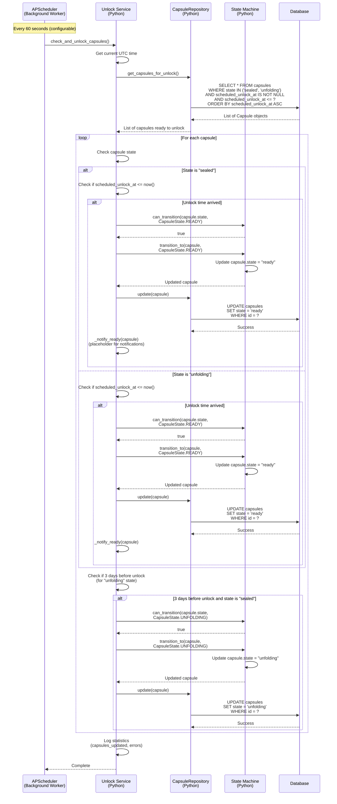
```mermaid
sequenceDiagram
    participant Scheduler as APScheduler<br/>(Background Worker)
    participant UnlockService as Unlock Service<br/>(Python)
    participant CapsuleRepo as CapsuleRepository<br/>(Python)
    participant StateMachine as State Machine<br/>(Python)
    participant DB as Database

    Note over Scheduler: Every 60 seconds (configurable)
    
    Scheduler->>UnlockService: check_and_unlock_capsules()
    UnlockService->>UnlockService: Get current UTC time
    UnlockService->>CapsuleRepo: get_capsules_for_unlock()
    CapsuleRepo->>DB: SELECT * FROM capsules<br/>WHERE state IN ('sealed', 'unfolding')<br/>AND scheduled_unlock_at IS NOT NULL<br/>AND scheduled_unlock_at <= ?<br/>ORDER BY scheduled_unlock_at ASC
    DB-->>CapsuleRepo: List of Capsule objects
    CapsuleRepo-->>UnlockService: List of capsules ready to unlock
    
    loop For each capsule
        UnlockService->>UnlockService: Check capsule state
        
        alt State is "sealed"
            UnlockService->>UnlockService: Check if scheduled_unlock_at <= now()
            
            alt Unlock time arrived
                UnlockService->>StateMachine: can_transition(capsule.state,<br/>CapsuleState.READY)
                StateMachine-->>UnlockService: true
                UnlockService->>StateMachine: transition_to(capsule,<br/>CapsuleState.READY)
                StateMachine->>StateMachine: Update capsule.state = "ready"
                StateMachine-->>UnlockService: Updated capsule
                UnlockService->>CapsuleRepo: update(capsule)
                CapsuleRepo->>DB: UPDATE capsules<br/>SET state = 'ready'<br/>WHERE id = ?
                DB-->>CapsuleRepo: Success
                UnlockService->>UnlockService: _notify_ready(capsule)<br/>(placeholder for notifications)
            end
        else State is "unfolding"
            UnlockService->>UnlockService: Check if scheduled_unlock_at <= now()
            
            alt Unlock time arrived
                UnlockService->>StateMachine: can_transition(capsule.state,<br/>CapsuleState.READY)
                StateMachine-->>UnlockService: true
                UnlockService->>StateMachine: transition_to(capsule,<br/>CapsuleState.READY)
                StateMachine->>StateMachine: Update capsule.state = "ready"
                StateMachine-->>UnlockService: Updated capsule
                UnlockService->>CapsuleRepo: update(capsule)
                CapsuleRepo->>DB: UPDATE capsules<br/>SET state = 'ready'<br/>WHERE id = ?
                DB-->>CapsuleRepo: Success
                UnlockService->>UnlockService: _notify_ready(capsule)
            end
        end
        
        UnlockService->>UnlockService: Check if 3 days before unlock<br/>(for "unfolding" state)
        
        alt 3 days before unlock and state is "sealed"
            UnlockService->>StateMachine: can_transition(capsule.state,<br/>CapsuleState.UNFOLDING)
            StateMachine-->>UnlockService: true
            UnlockService->>StateMachine: transition_to(capsule,<br/>CapsuleState.UNFOLDING)
            StateMachine->>StateMachine: Update capsule.state = "unfolding"
            StateMachine-->>UnlockService: Updated capsule
            UnlockService->>CapsuleRepo: update(capsule)
            CapsuleRepo->>DB: UPDATE capsules<br/>SET state = 'unfolding'<br/>WHERE id = ?
            DB-->>CapsuleRepo: Success
        end
    end
    
    UnlockService->>UnlockService: Log statistics<br/>(capsules_updated, errors)
    UnlockService-->>Scheduler: Complete
```

---

## Notes

### Key Concepts Explained

1. **JWT Tokens**: 
   - Access tokens are short-lived (30 minutes) and used for API authentication
   - Refresh tokens are long-lived (7 days) and used to get new access tokens
   - Tokens contain user ID and are signed with a secret key

2. **State Machine**:
   - Capsules follow strict state transitions: draft → sealed → unfolding → ready → opened
   - States cannot be reversed
   - Background worker automatically transitions states based on time

3. **Debouncing**:
   - Used in search and username check to avoid excessive API calls
   - Waits 500ms after user stops typing before making request

4. **Repository Pattern**:
   - Separates data access logic from business logic
   - Frontend and backend both use repository pattern for consistency

5. **Pydantic Validation**:
   - Backend uses Pydantic schemas to automatically validate all incoming data
   - Invalid data is rejected before reaching business logic

6. **Input Sanitization**:
   - All user inputs are sanitized to remove harmful characters
   - Prevents injection attacks and data corruption

---

**Last Updated**: 2025

