# OpenOn Application Sequence Diagrams

**Complete user flow diagrams with method-level detail for every action in the OpenOn application.**

This document shows the complete flow from user interaction to database operations, including all internal method calls, JWT handling, Supabase Auth integration, and state management.

**Target Audience**: Designed to be understandable by both technical and non-technical stakeholders.

---

## Table of Contents

1. [User Authentication Flows](#user-authentication-flows)
   - [User Signup](#1-user-signup)
   - [User Login](#2-user-login)
   - [Username Availability Check](#3-username-availability-check)
   - [Get Current User Info](#4-get-current-user-info)

2. [Capsule Management Flows](#capsule-management-flows)
   - [Create Capsule](#5-create-capsule)
   - [List Capsules (Inbox/Outbox)](#6-list-capsules-inboxoutbox)
   - [Open Capsule](#7-open-capsule)
   - [Update Capsule](#8-update-capsule)
   - [Delete Capsule](#9-delete-capsule)

3. [Recipient Management Flows](#recipient-management-flows)
   - [Search Users for Recipients](#10-search-users-for-recipients)
   - [Add Recipient](#11-add-recipient)
   - [List Recipients](#12-list-recipients)
   - [Update Recipient](#13-update-recipient)
   - [Delete Recipient](#14-delete-recipient)

4. [Draft Management Flows](#draft-management-flows)
   - [Create Draft (Auto-Save)](#21-create-draft-auto-save)
   - [Update Draft (Auto-Save)](#22-update-draft-auto-save)
   - [Open Draft](#23-open-draft)
   - [List Drafts](#24-list-drafts)
   - [Delete Draft](#25-delete-draft)

5. [Background Processes](#background-processes)
   - [Capsule State Automation](#15-capsule-state-automation)

---

## User Authentication Flows

### 1. User Signup

**Description**: A new user creates an account. The backend uses Supabase Auth Admin API to create the user, then creates a user profile in the database.

**Key Steps**:
1. User fills signup form (email, username, first_name, last_name, password)
2. Frontend validates input
3. Frontend calls backend `/auth/signup` endpoint
4. Backend creates user in Supabase Auth via Admin API
5. Backend creates user profile in database
6. Backend signs in user to get JWT tokens
7. Frontend saves tokens and fetches user info

```mermaid
sequenceDiagram
    participant User
    participant SignupScreen as SignupScreen<br/>(Flutter)
    participant Validation as Validation<br/>(Flutter)
    participant ApiAuthRepo as ApiAuthRepository<br/>(Flutter)
    participant ApiClient as ApiClient<br/>(Flutter)
    participant TokenStorage as TokenStorage<br/>(Flutter)
    participant AuthAPI as POST /auth/signup<br/>(FastAPI)
    participant SupabaseAuth as Supabase Auth<br/>(Admin API)
    participant UserProfileRepo as UserProfileRepository<br/>(Python)
    participant DB as Supabase PostgreSQL

    User->>SignupScreen: Enter email, username,<br/>first_name, last_name, password
    User->>SignupScreen: Click "Sign Up" button
    
    SignupScreen->>SignupScreen: _formKey.currentState.validate()
    SignupScreen->>Validation: validateEmail(email)
    Validation-->>SignupScreen: true/false
    SignupScreen->>Validation: validatePassword(password)
    Validation-->>SignupScreen: true/false
    SignupScreen->>Validation: validateName(firstName)
    Validation-->>SignupScreen: true/false
    SignupScreen->>Validation: validateName(lastName)
    Validation-->>SignupScreen: true/false
    
    alt Validation fails
        SignupScreen->>User: Show validation errors
    else Validation passes
        SignupScreen->>ApiAuthRepo: signUp(email, username,<br/>firstName, lastName, password)
        
        ApiAuthRepo->>Validation: sanitizeEmail(email)
        Validation-->>ApiAuthRepo: sanitized_email
        ApiAuthRepo->>Validation: validateEmail(sanitized_email)
        Validation-->>ApiAuthRepo: true/false
        ApiAuthRepo->>Validation: validatePassword(password)
        Validation-->>ApiAuthRepo: true/false
        ApiAuthRepo->>Validation: validateName(firstName)
        Validation-->>ApiAuthRepo: true/false
        ApiAuthRepo->>Validation: validateName(lastName)
        Validation-->>ApiAuthRepo: true/false
        
        ApiAuthRepo->>ApiClient: post(ApiConfig.authSignup,<br/>{email, username, first_name,<br/>last_name, password})
        ApiClient->>ApiClient: Build URL: baseUrl + "/auth/signup"
        ApiClient->>ApiClient: Set headers:<br/>Content-Type: application/json
        ApiClient->>ApiClient: Convert body to JSON
        ApiClient->>AuthAPI: HTTP POST /auth/signup<br/>(no auth header needed)
        
        AuthAPI->>AuthAPI: Receive UserCreate schema<br/>(Pydantic validation)
        AuthAPI->>AuthAPI: validate_username(username)
        
        alt Username invalid
            AuthAPI-->>ApiClient: HTTP 400<br/>("Invalid username format")
            ApiClient-->>ApiAuthRepo: ValidationException
            ApiAuthRepo-->>SignupScreen: Error message
            SignupScreen->>User: Show "Invalid username"
        else Username valid
            AuthAPI->>AuthAPI: Check SUPABASE_SERVICE_KEY configured
            
            alt Service key not configured
                AuthAPI-->>ApiClient: HTTP 500<br/>("SUPABASE_SERVICE_KEY not configured")
                ApiClient-->>ApiAuthRepo: HTTPException
                ApiAuthRepo-->>SignupScreen: Error message
                SignupScreen->>User: Show "Server configuration error"
            else Service key configured
                AuthAPI->>SupabaseAuth: POST /auth/v1/admin/users<br/>(with service_role key)<br/>{email, password, email_confirm: true,<br/>user_metadata: {username, first_name,<br/>last_name, full_name}}
                
                alt Email already exists
                    SupabaseAuth-->>AuthAPI: HTTP 400/409<br/>("Email already registered")
                    AuthAPI-->>ApiClient: HTTP 400<br/>("Email already registered")
                    ApiClient-->>ApiAuthRepo: HTTPException
                    ApiAuthRepo-->>SignupScreen: Error message
                    SignupScreen->>User: Show "Email already registered"
                else User created successfully
                    SupabaseAuth-->>AuthAPI: HTTP 201<br/>{id: user_id, email, ...}
                    
                    AuthAPI->>AuthAPI: Extract user_id from response
                    AuthAPI->>UserProfileRepo: create(user_id, full_name)
                    UserProfileRepo->>DB: INSERT INTO user_profiles<br/>(user_id, full_name, created_at, updated_at)<br/>VALUES (?, ?, NOW(), NOW())
                    DB-->>UserProfileRepo: Success
                    UserProfileRepo->>DB: SELECT * FROM user_profiles<br/>WHERE user_id = ?
                    DB-->>UserProfileRepo: UserProfile object
                    UserProfileRepo-->>AuthAPI: UserProfile model
                    
                    AuthAPI->>SupabaseAuth: POST /auth/v1/token?grant_type=password<br/>(sign in to get tokens)<br/>{email, password}
                    
                    alt Sign in fails
                        SupabaseAuth-->>AuthAPI: HTTP 401
                        AuthAPI-->>ApiClient: HTTP 200<br/>{message: "User created. Please sign in."}
                        ApiClient-->>ApiAuthRepo: {message: "..."}
                        ApiAuthRepo-->>SignupScreen: AuthenticationException
                        SignupScreen->>User: Show "User created. Please sign in."
                    else Sign in succeeds
                        SupabaseAuth-->>AuthAPI: HTTP 200<br/>{access_token, refresh_token, user}
                        
                        AuthAPI->>AuthAPI: UserProfileResponse.from_user_profile(profile)
                        AuthAPI-->>ApiClient: HTTP 200<br/>{access_token, refresh_token,<br/>token_type: "bearer", user}
                        
                        ApiClient-->>ApiAuthRepo: {access_token, refresh_token, user}
                    ApiAuthRepo->>TokenStorage: saveTokens(access_token, refresh_token)
                    TokenStorage->>TokenStorage: SharedPreferences.getInstance()
                        TokenStorage->>TokenStorage: prefs.setString('access_token', ...)
                        TokenStorage->>TokenStorage: prefs.setString('refresh_token', ...)
                    TokenStorage-->>ApiAuthRepo: Success
                    
                    ApiAuthRepo->>ApiClient: get(ApiConfig.authMe, includeAuth: true)
                    ApiClient->>TokenStorage: getAccessToken()
                    TokenStorage-->>ApiClient: access_token
                    ApiClient->>ApiClient: Set Authorization header<br/>("Bearer " + access_token)
                    ApiClient->>AuthAPI: HTTP GET /auth/me<br/>(with Authorization header)
                    
                        AuthAPI->>AuthAPI: get_current_user dependency
                        AuthAPI->>AuthAPI: Extract token from Authorization header
                        AuthAPI->>AuthAPI: verify_supabase_token(token)
                        AuthAPI->>AuthAPI: jwt.decode(token, supabase_jwt_secret,<br/>algorithms=["HS256"], audience="authenticated")
                        AuthAPI->>AuthAPI: Extract user_id from payload["sub"]
                        AuthAPI->>UserProfileRepo: get_by_id(user_id)
                        UserProfileRepo->>DB: SELECT * FROM user_profiles<br/>WHERE user_id = ?
                        DB-->>UserProfileRepo: UserProfile object
                        UserProfileRepo-->>AuthAPI: UserProfile model
                        AuthAPI->>AuthAPI: UserProfileResponse.from_user_profile(profile)
                        AuthAPI-->>ApiClient: HTTP 200<br/>{user_id, full_name, ...}
                        
                        ApiClient-->>ApiAuthRepo: User data (JSON)
                        ApiAuthRepo->>ApiAuthRepo: UserMapper.fromJson(userResponse)
                    ApiAuthRepo-->>SignupScreen: User object
                        SignupScreen->>SignupScreen: context.go(Routes.receiverHome)
                        SignupScreen->>User: Navigate to inbox screen
                    end
                end
            end
        end
    end
```

---

### 2. User Login

**Description**: An existing user logs in with email and password. Backend authenticates via Supabase Auth and returns JWT tokens.

**Key Steps**:
1. User enters email and password
2. Frontend validates input
3. Frontend calls backend `/auth/login` endpoint
4. Backend authenticates with Supabase Auth
5. Backend gets or creates user profile
6. Backend returns JWT tokens
7. Frontend saves tokens and fetches user info

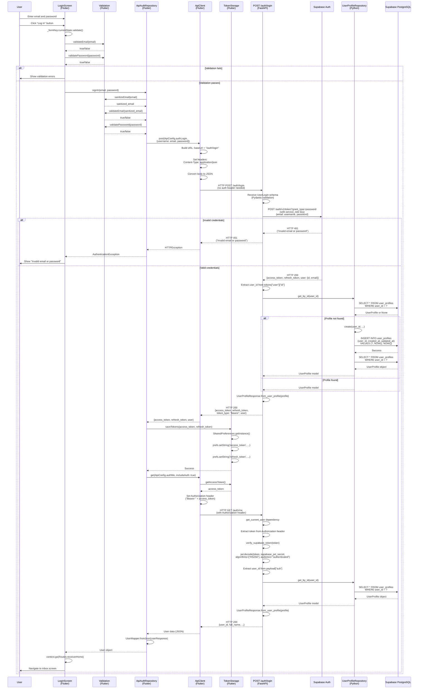
```mermaid
sequenceDiagram
    participant User
    participant LoginScreen as LoginScreen<br/>(Flutter)
    participant Validation as Validation<br/>(Flutter)
    participant ApiAuthRepo as ApiAuthRepository<br/>(Flutter)
    participant ApiClient as ApiClient<br/>(Flutter)
    participant TokenStorage as TokenStorage<br/>(Flutter)
    participant AuthAPI as POST /auth/login<br/>(FastAPI)
    participant SupabaseAuth as Supabase Auth
    participant UserProfileRepo as UserProfileRepository<br/>(Python)
    participant DB as Supabase PostgreSQL

    User->>LoginScreen: Enter email and password
    User->>LoginScreen: Click "Log In" button
    
    LoginScreen->>LoginScreen: _formKey.currentState.validate()
    LoginScreen->>Validation: validateEmail(email)
    Validation-->>LoginScreen: true/false
    LoginScreen->>Validation: validatePassword(password)
    Validation-->>LoginScreen: true/false
    
    alt Validation fails
        LoginScreen->>User: Show validation errors
    else Validation passes
        LoginScreen->>ApiAuthRepo: signIn(email, password)
        
        ApiAuthRepo->>Validation: sanitizeEmail(email)
        Validation-->>ApiAuthRepo: sanitized_email
        ApiAuthRepo->>Validation: validateEmail(sanitized_email)
        Validation-->>ApiAuthRepo: true/false
        ApiAuthRepo->>Validation: validatePassword(password)
        Validation-->>ApiAuthRepo: true/false
        
        ApiAuthRepo->>ApiClient: post(ApiConfig.authLogin,<br/>{username: email, password})
        ApiClient->>ApiClient: Build URL: baseUrl + "/auth/login"
        ApiClient->>ApiClient: Set headers:<br/>Content-Type: application/json
        ApiClient->>ApiClient: Convert body to JSON
        ApiClient->>AuthAPI: HTTP POST /auth/login<br/>(no auth header needed)
        
        AuthAPI->>AuthAPI: Receive UserLogin schema<br/>(Pydantic validation)
        AuthAPI->>SupabaseAuth: POST /auth/v1/token?grant_type=password<br/>(with service_role key)<br/>{email: username, password}
        
        alt Invalid credentials
            SupabaseAuth-->>AuthAPI: HTTP 401<br/>("Invalid email or password")
            AuthAPI-->>ApiClient: HTTP 401<br/>("Invalid email or password")
            ApiClient-->>ApiAuthRepo: HTTPException
            ApiAuthRepo-->>LoginScreen: AuthenticationException
            LoginScreen->>User: Show "Invalid email or password"
        else Valid credentials
            SupabaseAuth-->>AuthAPI: HTTP 200<br/>{access_token, refresh_token, user: {id, email}}
            
            AuthAPI->>AuthAPI: Extract user_id from tokens["user"]["id"]
            AuthAPI->>UserProfileRepo: get_by_id(user_id)
            UserProfileRepo->>DB: SELECT * FROM user_profiles<br/>WHERE user_id = ?
            DB-->>UserProfileRepo: UserProfile or None
            
            alt Profile not found
                UserProfileRepo->>UserProfileRepo: create(user_id, ...)
                UserProfileRepo->>DB: INSERT INTO user_profiles<br/>(user_id, created_at, updated_at)<br/>VALUES (?, NOW(), NOW())
                DB-->>UserProfileRepo: Success
                UserProfileRepo->>DB: SELECT * FROM user_profiles<br/>WHERE user_id = ?
                DB-->>UserProfileRepo: UserProfile object
                UserProfileRepo-->>AuthAPI: UserProfile model
            else Profile found
                UserProfileRepo-->>AuthAPI: UserProfile model
            end
            
            AuthAPI->>AuthAPI: UserProfileResponse.from_user_profile(profile)
            AuthAPI-->>ApiClient: HTTP 200<br/>{access_token, refresh_token,<br/>token_type: "bearer", user}
            
            ApiClient-->>ApiAuthRepo: {access_token, refresh_token, user}
                    ApiAuthRepo->>TokenStorage: saveTokens(access_token, refresh_token)
            TokenStorage->>TokenStorage: SharedPreferences.getInstance()
            TokenStorage->>TokenStorage: prefs.setString('access_token', ...)
            TokenStorage->>TokenStorage: prefs.setString('refresh_token', ...)
                    TokenStorage-->>ApiAuthRepo: Success
                    
                    ApiAuthRepo->>ApiClient: get(ApiConfig.authMe, includeAuth: true)
                    ApiClient->>TokenStorage: getAccessToken()
                    TokenStorage-->>ApiClient: access_token
            ApiClient->>ApiClient: Set Authorization header<br/>("Bearer " + access_token)
            ApiClient->>AuthAPI: HTTP GET /auth/me<br/>(with Authorization header)
                    
                    AuthAPI->>AuthAPI: get_current_user dependency
            AuthAPI->>AuthAPI: Extract token from Authorization header
            AuthAPI->>AuthAPI: verify_supabase_token(token)
            AuthAPI->>AuthAPI: jwt.decode(token, supabase_jwt_secret,<br/>algorithms=["HS256"], audience="authenticated")
            AuthAPI->>AuthAPI: Extract user_id from payload["sub"]
            AuthAPI->>UserProfileRepo: get_by_id(user_id)
            UserProfileRepo->>DB: SELECT * FROM user_profiles<br/>WHERE user_id = ?
            DB-->>UserProfileRepo: UserProfile object
            UserProfileRepo-->>AuthAPI: UserProfile model
            AuthAPI->>AuthAPI: UserProfileResponse.from_user_profile(profile)
            AuthAPI-->>ApiClient: HTTP 200<br/>{user_id, full_name, ...}
            
            ApiClient-->>ApiAuthRepo: User data (JSON)
            ApiAuthRepo->>ApiAuthRepo: UserMapper.fromJson(userResponse)
                    ApiAuthRepo-->>LoginScreen: User object
            LoginScreen->>LoginScreen: context.go(Routes.receiverHome)
            LoginScreen->>User: Navigate to inbox screen
        end
    end
```

---

### 3. Username Availability Check

**Description**: Real-time username availability check during signup. Validates format and checks if username is available.

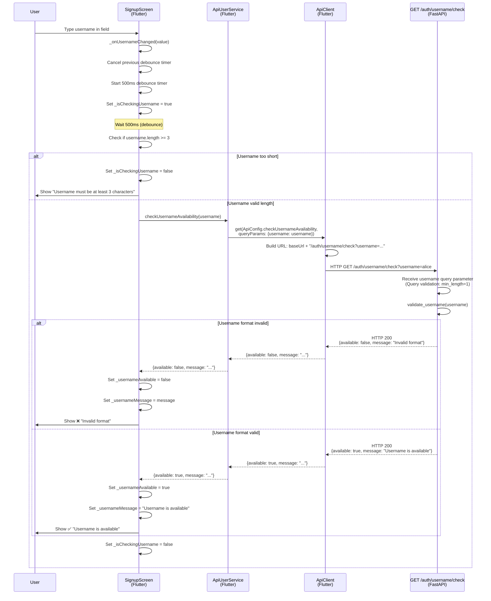
```mermaid
sequenceDiagram
    participant User
    participant SignupScreen as SignupScreen<br/>(Flutter)
    participant ApiUserService as ApiUserService<br/>(Flutter)
    participant ApiClient as ApiClient<br/>(Flutter)
    participant AuthAPI as GET /auth/username/check<br/>(FastAPI)

    User->>SignupScreen: Type username in field
    SignupScreen->>SignupScreen: _onUsernameChanged(value)
    SignupScreen->>SignupScreen: Cancel previous debounce timer
    SignupScreen->>SignupScreen: Start 500ms debounce timer
    SignupScreen->>SignupScreen: Set _isCheckingUsername = true
    
    Note over SignupScreen: Wait 500ms (debounce)
    
    SignupScreen->>SignupScreen: Check if username.length >= 3
    
    alt Username too short
        SignupScreen->>SignupScreen: Set _isCheckingUsername = false
        SignupScreen->>User: Show "Username must be at least 3 characters"
    else Username valid length
        SignupScreen->>ApiUserService: checkUsernameAvailability(username)
        ApiUserService->>ApiClient: get(ApiConfig.checkUsernameAvailability,<br/>queryParams: {username: username})
        ApiClient->>ApiClient: Build URL: baseUrl + "/auth/username/check?username=..."
        ApiClient->>AuthAPI: HTTP GET /auth/username/check?username=alice
        
        AuthAPI->>AuthAPI: Receive username query parameter<br/>(Query validation: min_length=1)
        AuthAPI->>AuthAPI: validate_username(username)
        
        alt Username format invalid
            AuthAPI-->>ApiClient: HTTP 200<br/>{available: false, message: "Invalid format"}
            ApiClient-->>ApiUserService: {available: false, message: "..."}
            ApiUserService-->>SignupScreen: {available: false, message: "..."}
            SignupScreen->>SignupScreen: Set _usernameAvailable = false
            SignupScreen->>SignupScreen: Set _usernameMessage = message
            SignupScreen->>User: Show ❌ "Invalid format"
        else Username format valid
                AuthAPI-->>ApiClient: HTTP 200<br/>{available: true, message: "Username is available"}
                ApiClient-->>ApiUserService: {available: true, message: "..."}
                ApiUserService-->>SignupScreen: {available: true, message: "..."}
                SignupScreen->>SignupScreen: Set _usernameAvailable = true
                SignupScreen->>SignupScreen: Set _usernameMessage = "Username is available"
                SignupScreen->>User: Show ✅ "Username is available"
        end
        
        SignupScreen->>SignupScreen: Set _isCheckingUsername = false
    end
```

---

### 4. Get Current User Info

**Description**: Fetch current authenticated user information using stored JWT token.

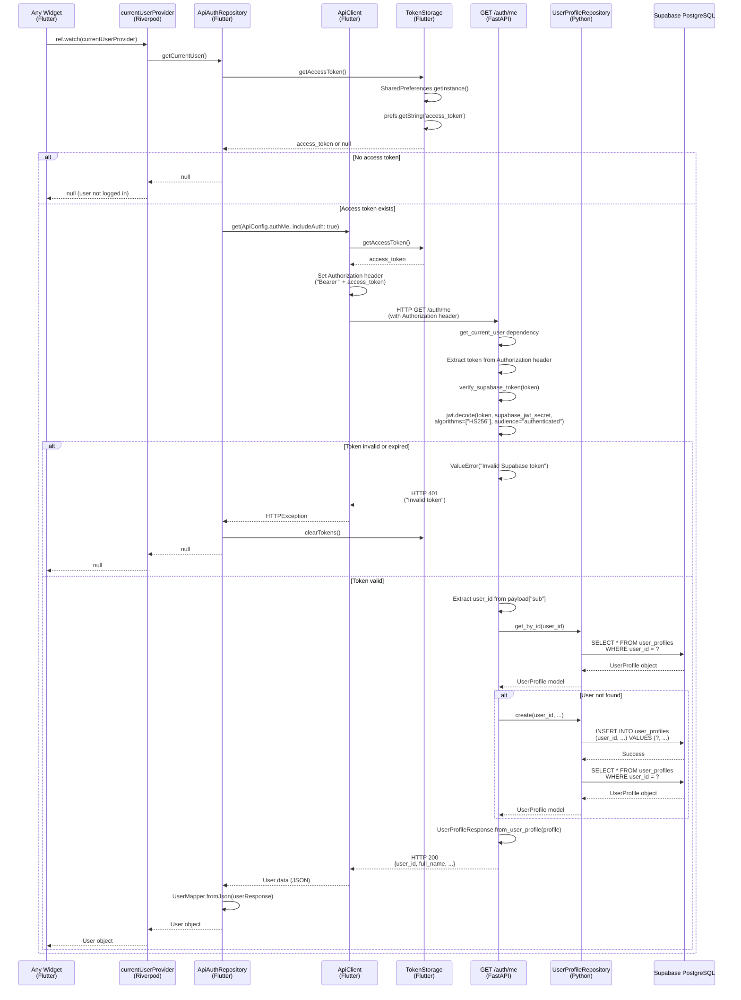
```mermaid
sequenceDiagram
    participant Widget as Any Widget<br/>(Flutter)
    participant Provider as currentUserProvider<br/>(Riverpod)
    participant ApiAuthRepo as ApiAuthRepository<br/>(Flutter)
    participant ApiClient as ApiClient<br/>(Flutter)
    participant TokenStorage as TokenStorage<br/>(Flutter)
    participant AuthAPI as GET /auth/me<br/>(FastAPI)
    participant UserProfileRepo as UserProfileRepository<br/>(Python)
    participant DB as Supabase PostgreSQL

    Widget->>Provider: ref.watch(currentUserProvider)
    Provider->>ApiAuthRepo: getCurrentUser()
    ApiAuthRepo->>TokenStorage: getAccessToken()
    TokenStorage->>TokenStorage: SharedPreferences.getInstance()
    TokenStorage->>TokenStorage: prefs.getString('access_token')
    TokenStorage-->>ApiAuthRepo: access_token or null
    
    alt No access token
        ApiAuthRepo-->>Provider: null
        Provider-->>Widget: null (user not logged in)
    else Access token exists
        ApiAuthRepo->>ApiClient: get(ApiConfig.authMe, includeAuth: true)
        ApiClient->>TokenStorage: getAccessToken()
        TokenStorage-->>ApiClient: access_token
        ApiClient->>ApiClient: Set Authorization header<br/>("Bearer " + access_token)
        ApiClient->>AuthAPI: HTTP GET /auth/me<br/>(with Authorization header)
        
        AuthAPI->>AuthAPI: get_current_user dependency
        AuthAPI->>AuthAPI: Extract token from Authorization header
        AuthAPI->>AuthAPI: verify_supabase_token(token)
        AuthAPI->>AuthAPI: jwt.decode(token, supabase_jwt_secret,<br/>algorithms=["HS256"], audience="authenticated")
        
        alt Token invalid or expired
            AuthAPI->>AuthAPI: ValueError("Invalid Supabase token")
            AuthAPI-->>ApiClient: HTTP 401<br/>("Invalid token")
            ApiClient-->>ApiAuthRepo: HTTPException
            ApiAuthRepo->>TokenStorage: clearTokens()
            ApiAuthRepo-->>Provider: null
            Provider-->>Widget: null
        else Token valid
            AuthAPI->>AuthAPI: Extract user_id from payload["sub"]
            AuthAPI->>UserProfileRepo: get_by_id(user_id)
            UserProfileRepo->>DB: SELECT * FROM user_profiles<br/>WHERE user_id = ?
            DB-->>UserProfileRepo: UserProfile object
            UserProfileRepo-->>AuthAPI: UserProfile model
                
                alt User not found
                AuthAPI->>UserProfileRepo: create(user_id, ...)
                UserProfileRepo->>DB: INSERT INTO user_profiles<br/>(user_id, ...) VALUES (?, ...)
                DB-->>UserProfileRepo: Success
                UserProfileRepo->>DB: SELECT * FROM user_profiles<br/>WHERE user_id = ?
                DB-->>UserProfileRepo: UserProfile object
                UserProfileRepo-->>AuthAPI: UserProfile model
            end
            
            AuthAPI->>AuthAPI: UserProfileResponse.from_user_profile(profile)
            AuthAPI-->>ApiClient: HTTP 200<br/>{user_id, full_name, ...}
                    
                    ApiClient-->>ApiAuthRepo: User data (JSON)
            ApiAuthRepo->>ApiAuthRepo: UserMapper.fromJson(userResponse)
                    ApiAuthRepo-->>Provider: User object
                    Provider-->>Widget: User object
        end
    end
```

---

## Capsule Management Flows

### 5. Create Capsule

**Description**: User creates a new time-locked capsule. The capsule is created in 'sealed' status with an unlock time.

**Key Steps**:
1. User fills form (recipient, title, body, unlock time)
2. Frontend validates input
3. Frontend calls backend `/capsules` POST endpoint
4. Backend validates recipient ownership
5. Backend creates capsule in 'sealed' status
6. Frontend receives created capsule

```mermaid
sequenceDiagram
    participant User
    participant CreateScreen as CreateCapsuleScreen<br/>(Flutter)
    participant Validation as Validation<br/>(Flutter)
    participant CapsuleRepo as ApiCapsuleRepository<br/>(Flutter)
    participant ApiClient as ApiClient<br/>(Flutter)
    participant TokenStorage as TokenStorage<br/>(Flutter)
    participant CapsuleAPI as POST /capsules<br/>(FastAPI)
    participant CapsuleRepo as CapsuleRepository<br/>(Python)
    participant RecipientRepo as RecipientRepository<br/>(Python)
    participant DB as Supabase PostgreSQL

    User->>CreateScreen: Fill form (recipient, title, body, unlock time)
    User->>CreateScreen: Click "Send Letter" button
    
    CreateScreen->>CreateScreen: Validate form fields
    CreateScreen->>Validation: validateContent(body)
    Validation-->>CreateScreen: true/false
    CreateScreen->>Validation: validateUnlockDate(unlockAt)
    Validation-->>CreateScreen: true/false
    
    alt Validation fails
        CreateScreen->>User: Show validation errors
    else Validation passes
        CreateScreen->>CapsuleRepo: createCapsule(Capsule)
        
        CapsuleRepo->>Validation: validateContent(capsule.content)
        Validation-->>CapsuleRepo: true/false
        CapsuleRepo->>Validation: validateUnlockDate(capsule.unlockAt)
        Validation-->>CapsuleRepo: true/false
        
        CapsuleRepo->>ApiClient: post(ApiConfig.capsules,<br/>{recipient_id, title, body_text,<br/>unlocks_at, is_anonymous})
        ApiClient->>TokenStorage: getAccessToken()
        TokenStorage-->>ApiClient: access_token
        ApiClient->>ApiClient: Set Authorization header<br/>("Bearer " + access_token)
        ApiClient->>ApiClient: Convert body to JSON
        ApiClient->>CapsuleAPI: HTTP POST /capsules<br/>(with JSON body & auth header)
        
        CapsuleAPI->>CapsuleAPI: get_current_user dependency
        CapsuleAPI->>CapsuleAPI: Extract token from Authorization header
        CapsuleAPI->>CapsuleAPI: verify_supabase_token(token)
        CapsuleAPI->>CapsuleAPI: Extract user_id from payload["sub"]
        CapsuleAPI->>CapsuleAPI: Get UserProfile from database
        CapsuleAPI->>CapsuleAPI: Receive CapsuleCreate schema<br/>(Pydantic validation)
        
        CapsuleAPI->>RecipientRepo: get_by_id(recipient_id)
        RecipientRepo->>DB: SELECT * FROM recipients<br/>WHERE id = ?
        DB-->>RecipientRepo: Recipient object or None
        
        alt Recipient not found
            CapsuleAPI-->>ApiClient: HTTP 404<br/>("Recipient not found")
            ApiClient-->>CapsuleRepo: NotFoundException
            CapsuleRepo-->>CreateScreen: Error message
            CreateScreen->>User: Show "Recipient not found"
        else Recipient found
            CapsuleAPI->>CapsuleAPI: Check recipient.owner_id == current_user.user_id
            
            alt Not owner
                CapsuleAPI-->>ApiClient: HTTP 403<br/>("You can only create capsules for your own recipients")
                ApiClient-->>CapsuleRepo: HTTPException
                CapsuleRepo-->>CreateScreen: Error message
                CreateScreen->>User: Show "Access denied"
            else Is owner
                CapsuleAPI->>CapsuleAPI: Check body_text or body_rich_text provided
                
                alt No body content
                    CapsuleAPI-->>ApiClient: HTTP 400<br/>("Either body_text or body_rich_text is required")
                    ApiClient-->>CapsuleRepo: ValidationException
                    CapsuleRepo-->>CreateScreen: Error message
                    CreateScreen->>User: Show "Content is required"
                else Body content provided
                    CapsuleAPI->>CapsuleAPI: sanitize_text(title.strip())
                    CapsuleAPI->>CapsuleAPI: sanitize_text(body_text.strip())
                    CapsuleAPI->>CapsuleAPI: Validate unlocks_at is in future
                    
                    alt Unlock time in past
                        CapsuleAPI-->>ApiClient: HTTP 400<br/>("Unlock time must be in the future")
                        ApiClient-->>CapsuleRepo: ValidationException
                        CapsuleRepo-->>CreateScreen: Error message
                        CreateScreen->>User: Show "Unlock time must be in the future"
                    else Unlock time valid
                        CapsuleAPI->>CapsuleRepo: create(sender_id, recipient_id,<br/>title, body_text, unlocks_at,<br/>status=CapsuleStatus.SEALED)
                        CapsuleRepo->>DB: INSERT INTO capsules<br/>(id, sender_id, recipient_id, title,<br/>body_text, unlocks_at, status,<br/>created_at, updated_at)<br/>VALUES (gen_random_uuid(), ?, ?, ?, ?, ?, 'sealed', NOW(), NOW())
                        DB-->>CapsuleRepo: capsule_id
                        CapsuleRepo->>DB: SELECT * FROM capsules<br/>WHERE id = ?
                        DB-->>CapsuleRepo: Capsule object
                        CapsuleRepo-->>CapsuleAPI: Capsule model
                        
                        CapsuleAPI->>CapsuleAPI: CapsuleResponse.model_validate(capsule)
                        CapsuleAPI-->>ApiClient: HTTP 201<br/>{id, sender_id, recipient_id, title,<br/>body_text, unlocks_at, status: "sealed", ...}
                        
                        ApiClient-->>CapsuleRepo: Capsule data (JSON)
                        CapsuleRepo->>CapsuleRepo: CapsuleMapper.fromJson(response)
                        CapsuleRepo-->>CreateScreen: Capsule object
                        CreateScreen->>CreateScreen: Navigate back or show success
                        CreateScreen->>User: Show "Capsule created successfully"
                    end
                end
            end
        end
    end
```

---

### 6. List Capsules (Inbox/Outbox)

**Description**: User views their inbox (received) or outbox (sent) capsules with pagination.

**Key Steps**:
1. User navigates to inbox or outbox
2. Frontend calls backend `/capsules` GET endpoint with `box` parameter
3. Backend queries capsules based on box type
4. For inbox: Gets all recipients owned by user, then gets capsules for those recipients
5. For outbox: Gets capsules where user is sender
6. Frontend displays capsules

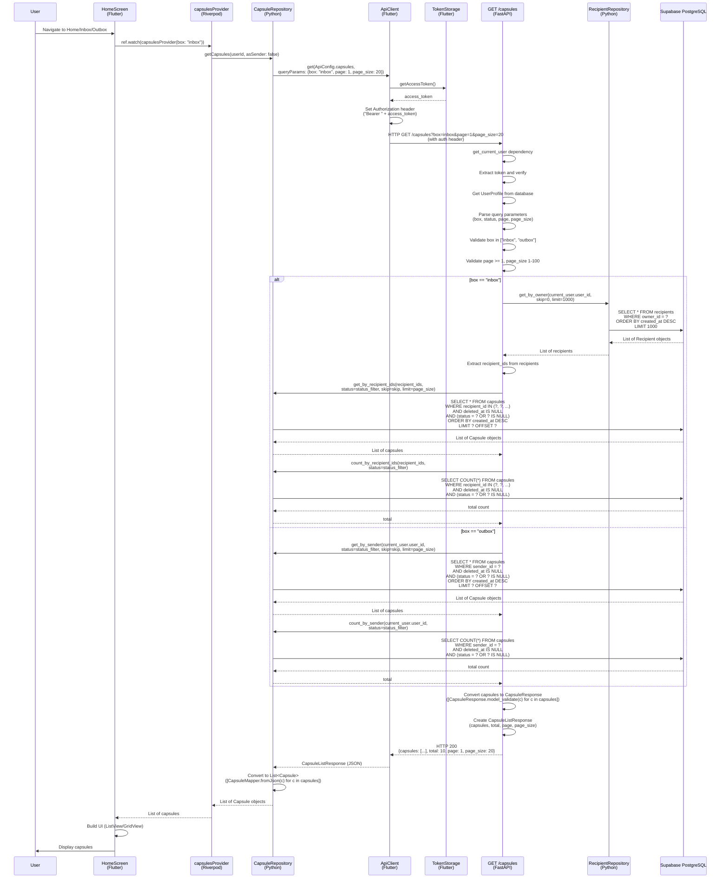
```mermaid
sequenceDiagram
    participant User
    participant HomeScreen as HomeScreen<br/>(Flutter)
    participant Provider as capsulesProvider<br/>(Riverpod)
    participant CapsuleRepo as ApiCapsuleRepository<br/>(Flutter)
    participant ApiClient as ApiClient<br/>(Flutter)
    participant TokenStorage as TokenStorage<br/>(Flutter)
    participant CapsuleAPI as GET /capsules<br/>(FastAPI)
    participant CapsuleRepo as CapsuleRepository<br/>(Python)
    participant RecipientRepo as RecipientRepository<br/>(Python)
    participant DB as Supabase PostgreSQL

    User->>HomeScreen: Navigate to Home/Inbox/Outbox
    HomeScreen->>Provider: ref.watch(capsulesProvider(box: "inbox"))
    Provider->>CapsuleRepo: getCapsules(userId, asSender: false)
    CapsuleRepo->>ApiClient: get(ApiConfig.capsules,<br/>queryParams: {box: "inbox", page: 1, page_size: 20})
    ApiClient->>TokenStorage: getAccessToken()
    TokenStorage-->>ApiClient: access_token
    ApiClient->>ApiClient: Set Authorization header<br/>("Bearer " + access_token)
    ApiClient->>CapsuleAPI: HTTP GET /capsules?box=inbox&page=1&page_size=20<br/>(with auth header)
    
    CapsuleAPI->>CapsuleAPI: get_current_user dependency
    CapsuleAPI->>CapsuleAPI: Extract token and verify
    CapsuleAPI->>CapsuleAPI: Get UserProfile from database
    CapsuleAPI->>CapsuleAPI: Parse query parameters<br/>(box, status, page, page_size)
    CapsuleAPI->>CapsuleAPI: Validate box in ["inbox", "outbox"]
    CapsuleAPI->>CapsuleAPI: Validate page >= 1, page_size 1-100
    
    alt box == "inbox"
        CapsuleAPI->>RecipientRepo: get_by_owner(current_user.user_id,<br/>skip=0, limit=1000)
        RecipientRepo->>DB: SELECT * FROM recipients<br/>WHERE owner_id = ?<br/>ORDER BY created_at DESC<br/>LIMIT 1000
        DB-->>RecipientRepo: List of Recipient objects
        RecipientRepo-->>CapsuleAPI: List of recipients
        
        CapsuleAPI->>CapsuleAPI: Extract recipient_ids from recipients
        CapsuleAPI->>CapsuleRepo: get_by_recipient_ids(recipient_ids,<br/>status=status_filter, skip=skip, limit=page_size)
        CapsuleRepo->>DB: SELECT * FROM capsules<br/>WHERE recipient_id IN (?, ?, ...)<br/>AND deleted_at IS NULL<br/>AND (status = ? OR ? IS NULL)<br/>ORDER BY created_at DESC<br/>LIMIT ? OFFSET ?
        DB-->>CapsuleRepo: List of Capsule objects
        CapsuleRepo-->>CapsuleAPI: List of capsules
        
        CapsuleAPI->>CapsuleRepo: count_by_recipient_ids(recipient_ids,<br/>status=status_filter)
        CapsuleRepo->>DB: SELECT COUNT(*) FROM capsules<br/>WHERE recipient_id IN (?, ?, ...)<br/>AND deleted_at IS NULL<br/>AND (status = ? OR ? IS NULL)
        DB-->>CapsuleRepo: total count
        CapsuleRepo-->>CapsuleAPI: total
    else box == "outbox"
        CapsuleAPI->>CapsuleRepo: get_by_sender(current_user.user_id,<br/>status=status_filter, skip=skip, limit=page_size)
        CapsuleRepo->>DB: SELECT * FROM capsules<br/>WHERE sender_id = ?<br/>AND deleted_at IS NULL<br/>AND (status = ? OR ? IS NULL)<br/>ORDER BY created_at DESC<br/>LIMIT ? OFFSET ?
        DB-->>CapsuleRepo: List of Capsule objects
        CapsuleRepo-->>CapsuleAPI: List of capsules
        
        CapsuleAPI->>CapsuleRepo: count_by_sender(current_user.user_id,<br/>status=status_filter)
        CapsuleRepo->>DB: SELECT COUNT(*) FROM capsules<br/>WHERE sender_id = ?<br/>AND deleted_at IS NULL<br/>AND (status = ? OR ? IS NULL)
        DB-->>CapsuleRepo: total count
        CapsuleRepo-->>CapsuleAPI: total
    end
    
    CapsuleAPI->>CapsuleAPI: Convert capsules to CapsuleResponse<br/>([CapsuleResponse.model_validate(c) for c in capsules])
    CapsuleAPI->>CapsuleAPI: Create CapsuleListResponse<br/>(capsules, total, page, page_size)
    CapsuleAPI-->>ApiClient: HTTP 200<br/>{capsules: [...], total: 10, page: 1, page_size: 20}
    
    ApiClient-->>CapsuleRepo: CapsuleListResponse (JSON)
    CapsuleRepo->>CapsuleRepo: Convert to List<Capsule><br/>([CapsuleMapper.fromJson(c) for c in capsules])
    CapsuleRepo-->>Provider: List of Capsule objects
    Provider-->>HomeScreen: List of capsules
    HomeScreen->>HomeScreen: Build UI (ListView/GridView)
    HomeScreen->>User: Display capsules
```

---

### 7. Open Capsule

**Description**: Recipient opens a ready capsule. Backend updates status to 'opened' and sets opened_at timestamp.

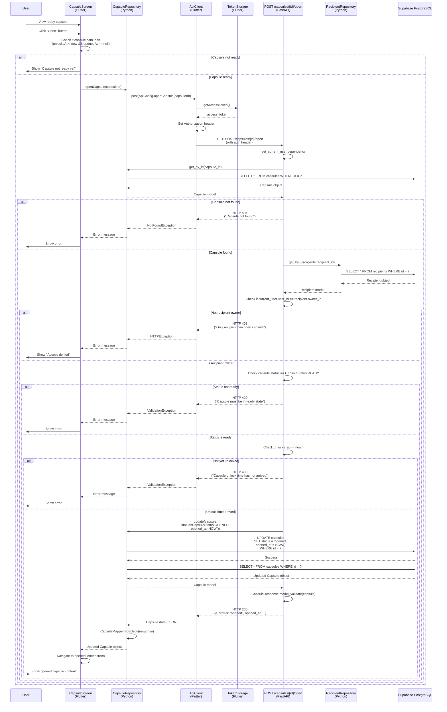
```mermaid
sequenceDiagram
    participant User
    participant CapsuleScreen as CapsuleScreen<br/>(Flutter)
    participant CapsuleRepo as ApiCapsuleRepository<br/>(Flutter)
    participant ApiClient as ApiClient<br/>(Flutter)
    participant TokenStorage as TokenStorage<br/>(Flutter)
    participant CapsuleAPI as POST /capsules/{id}/open<br/>(FastAPI)
    participant CapsuleRepo as CapsuleRepository<br/>(Python)
    participant RecipientRepo as RecipientRepository<br/>(Python)
    participant DB as Supabase PostgreSQL

    User->>CapsuleScreen: View ready capsule
    User->>CapsuleScreen: Click "Open" button
    CapsuleScreen->>CapsuleScreen: Check if capsule.canOpen<br/>(unlocksAt < now && openedAt == null)
    
    alt Capsule not ready
        CapsuleScreen->>User: Show "Capsule not ready yet"
    else Capsule ready
        CapsuleScreen->>CapsuleRepo: openCapsule(capsuleId)
        CapsuleRepo->>ApiClient: post(ApiConfig.openCapsule(capsuleId))
        ApiClient->>TokenStorage: getAccessToken()
        TokenStorage-->>ApiClient: access_token
        ApiClient->>ApiClient: Set Authorization header
        ApiClient->>CapsuleAPI: HTTP POST /capsules/{id}/open<br/>(with auth header)
        
        CapsuleAPI->>CapsuleAPI: get_current_user dependency
        CapsuleAPI->>CapsuleRepo: get_by_id(capsule_id)
        CapsuleRepo->>DB: SELECT * FROM capsules WHERE id = ?
        DB-->>CapsuleRepo: Capsule object
        CapsuleRepo-->>CapsuleAPI: Capsule model
        
        alt Capsule not found
            CapsuleAPI-->>ApiClient: HTTP 404<br/>("Capsule not found")
            ApiClient-->>CapsuleRepo: NotFoundException
            CapsuleRepo-->>CapsuleScreen: Error message
            CapsuleScreen->>User: Show error
        else Capsule found
            CapsuleAPI->>RecipientRepo: get_by_id(capsule.recipient_id)
            RecipientRepo->>DB: SELECT * FROM recipients WHERE id = ?
            DB-->>RecipientRepo: Recipient object
            RecipientRepo-->>CapsuleAPI: Recipient model
            
            CapsuleAPI->>CapsuleAPI: Check if current_user.user_id == recipient.owner_id
            
            alt Not recipient owner
                CapsuleAPI-->>ApiClient: HTTP 403<br/>("Only recipient can open capsule")
                ApiClient-->>CapsuleRepo: HTTPException
                CapsuleRepo-->>CapsuleScreen: Error message
                CapsuleScreen->>User: Show "Access denied"
            else Is recipient owner
                CapsuleAPI->>CapsuleAPI: Check capsule.status == CapsuleStatus.READY
                
                alt Status not ready
                    CapsuleAPI-->>ApiClient: HTTP 400<br/>("Capsule must be in ready state")
                    ApiClient-->>CapsuleRepo: ValidationException
                    CapsuleRepo-->>CapsuleScreen: Error message
                    CapsuleScreen->>User: Show error
                else Status is ready
                    CapsuleAPI->>CapsuleAPI: Check unlocks_at <= now()
                    
                    alt Not yet unlocked
                        CapsuleAPI-->>ApiClient: HTTP 400<br/>("Capsule unlock time has not arrived")
                        ApiClient-->>CapsuleRepo: ValidationException
                        CapsuleRepo-->>CapsuleScreen: Error message
                        CapsuleScreen->>User: Show error
                    else Unlock time arrived
                        CapsuleAPI->>CapsuleRepo: update(capsule,<br/>status=CapsuleStatus.OPENED,<br/>opened_at=NOW())
                        CapsuleRepo->>DB: UPDATE capsules<br/>SET status = 'opened',<br/>opened_at = NOW()<br/>WHERE id = ?
                        DB-->>CapsuleRepo: Success
                        CapsuleRepo->>DB: SELECT * FROM capsules WHERE id = ?
                        DB-->>CapsuleRepo: Updated Capsule object
                        CapsuleRepo-->>CapsuleAPI: Capsule model
                        
                        CapsuleAPI->>CapsuleAPI: CapsuleResponse.model_validate(capsule)
                        CapsuleAPI-->>ApiClient: HTTP 200<br/>{id, status: "opened", opened_at, ...}
                        
                        ApiClient-->>CapsuleRepo: Capsule data (JSON)
                        CapsuleRepo->>CapsuleRepo: CapsuleMapper.fromJson(response)
                        CapsuleRepo-->>CapsuleScreen: Updated Capsule object
                        CapsuleScreen->>CapsuleScreen: Navigate to opened letter screen
                        CapsuleScreen->>User: Show opened capsule content
                    end
                end
            end
        end
    end
```

---

### 8. Update Capsule

**Description**: User updates a capsule before it's opened (only if status is 'sealed').

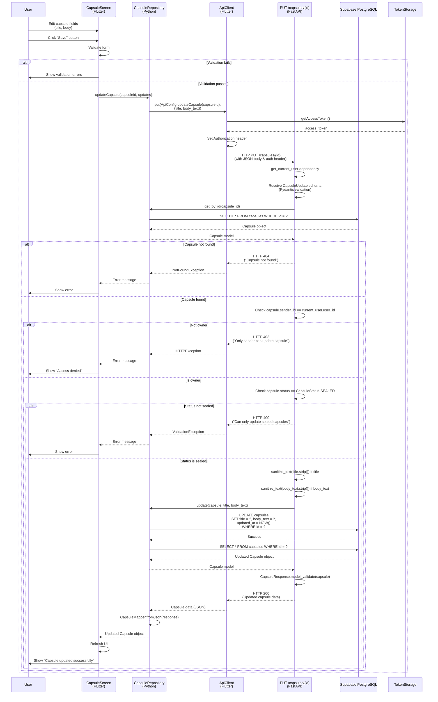
```mermaid
sequenceDiagram
    participant User
    participant CapsuleScreen as CapsuleScreen<br/>(Flutter)
    participant CapsuleRepo as ApiCapsuleRepository<br/>(Flutter)
    participant ApiClient as ApiClient<br/>(Flutter)
    participant CapsuleAPI as PUT /capsules/{id}<br/>(FastAPI)
    participant CapsuleRepo as CapsuleRepository<br/>(Python)
    participant DB as Supabase PostgreSQL

    User->>CapsuleScreen: Edit capsule fields<br/>(title, body)
    User->>CapsuleScreen: Click "Save" button
    CapsuleScreen->>CapsuleScreen: Validate form
    
    alt Validation fails
        CapsuleScreen->>User: Show validation errors
    else Validation passes
        CapsuleScreen->>CapsuleRepo: updateCapsule(capsuleId, updates)
        CapsuleRepo->>ApiClient: put(ApiConfig.updateCapsule(capsuleId),<br/>{title, body_text})
        ApiClient->>TokenStorage: getAccessToken()
        TokenStorage-->>ApiClient: access_token
        ApiClient->>ApiClient: Set Authorization header
        ApiClient->>CapsuleAPI: HTTP PUT /capsules/{id}<br/>(with JSON body & auth header)
        
        CapsuleAPI->>CapsuleAPI: get_current_user dependency
        CapsuleAPI->>CapsuleAPI: Receive CapsuleUpdate schema<br/>(Pydantic validation)
        CapsuleAPI->>CapsuleRepo: get_by_id(capsule_id)
        CapsuleRepo->>DB: SELECT * FROM capsules WHERE id = ?
        DB-->>CapsuleRepo: Capsule object
        CapsuleRepo-->>CapsuleAPI: Capsule model
        
        alt Capsule not found
            CapsuleAPI-->>ApiClient: HTTP 404<br/>("Capsule not found")
            ApiClient-->>CapsuleRepo: NotFoundException
            CapsuleRepo-->>CapsuleScreen: Error message
            CapsuleScreen->>User: Show error
        else Capsule found
            CapsuleAPI->>CapsuleAPI: Check capsule.sender_id == current_user.user_id
            
            alt Not owner
                CapsuleAPI-->>ApiClient: HTTP 403<br/>("Only sender can update capsule")
                ApiClient-->>CapsuleRepo: HTTPException
                CapsuleRepo-->>CapsuleScreen: Error message
                CapsuleScreen->>User: Show "Access denied"
            else Is owner
                CapsuleAPI->>CapsuleAPI: Check capsule.status == CapsuleStatus.SEALED
                
                alt Status not sealed
                    CapsuleAPI-->>ApiClient: HTTP 400<br/>("Can only update sealed capsules")
                    ApiClient-->>CapsuleRepo: ValidationException
                    CapsuleRepo-->>CapsuleScreen: Error message
                    CapsuleScreen->>User: Show error
                else Status is sealed
                    CapsuleAPI->>CapsuleAPI: sanitize_text(title.strip()) if title
                    CapsuleAPI->>CapsuleAPI: sanitize_text(body_text.strip()) if body_text
                    
                    CapsuleAPI->>CapsuleRepo: update(capsule, title, body_text)
                    CapsuleRepo->>DB: UPDATE capsules<br/>SET title = ?, body_text = ?,<br/>updated_at = NOW()<br/>WHERE id = ?
                    DB-->>CapsuleRepo: Success
                    CapsuleRepo->>DB: SELECT * FROM capsules WHERE id = ?
                    DB-->>CapsuleRepo: Updated Capsule object
                    CapsuleRepo-->>CapsuleAPI: Capsule model
                    
                    CapsuleAPI->>CapsuleAPI: CapsuleResponse.model_validate(capsule)
                    CapsuleAPI-->>ApiClient: HTTP 200<br/>(Updated capsule data)
                    
                    ApiClient-->>CapsuleRepo: Capsule data (JSON)
                    CapsuleRepo->>CapsuleRepo: CapsuleMapper.fromJson(response)
                    CapsuleRepo-->>CapsuleScreen: Updated Capsule object
                    CapsuleScreen->>CapsuleScreen: Refresh UI
                    CapsuleScreen->>User: Show "Capsule updated successfully"
                end
            end
        end
    end
```

---

### 9. Delete Capsule

**Description**: User deletes a capsule (only if status is 'sealed'). Performs soft delete.

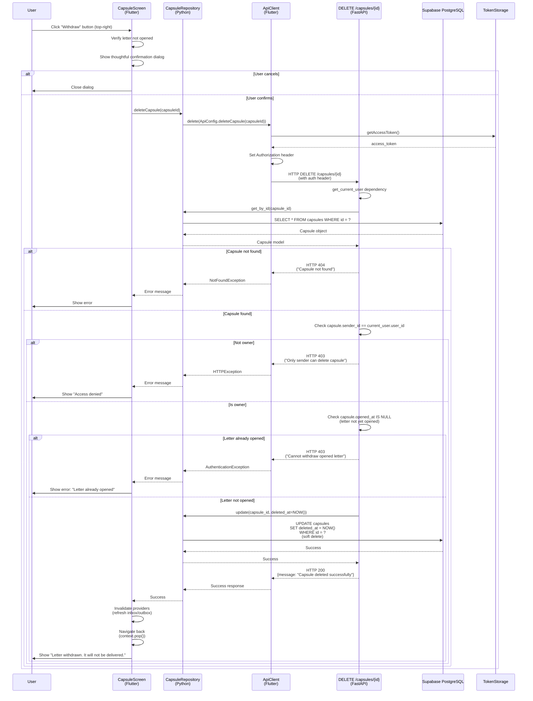
```mermaid
sequenceDiagram
    participant User
    participant CapsuleScreen as CapsuleScreen<br/>(Flutter)
    participant CapsuleRepo as ApiCapsuleRepository<br/>(Flutter)
    participant ApiClient as ApiClient<br/>(Flutter)
    participant CapsuleAPI as DELETE /capsules/{id}<br/>(FastAPI)
    participant CapsuleRepo as CapsuleRepository<br/>(Python)
    participant DB as Supabase PostgreSQL

    User->>CapsuleScreen: Click "Withdraw" button (top-right)
    CapsuleScreen->>CapsuleScreen: Verify letter not opened
    CapsuleScreen->>CapsuleScreen: Show thoughtful confirmation dialog
    
    alt User cancels
        CapsuleScreen->>User: Close dialog
    else User confirms
        CapsuleScreen->>CapsuleRepo: deleteCapsule(capsuleId)
        CapsuleRepo->>ApiClient: delete(ApiConfig.deleteCapsule(capsuleId))
        ApiClient->>TokenStorage: getAccessToken()
        TokenStorage-->>ApiClient: access_token
        ApiClient->>ApiClient: Set Authorization header
        ApiClient->>CapsuleAPI: HTTP DELETE /capsules/{id}<br/>(with auth header)
        
        CapsuleAPI->>CapsuleAPI: get_current_user dependency
        CapsuleAPI->>CapsuleRepo: get_by_id(capsule_id)
        CapsuleRepo->>DB: SELECT * FROM capsules WHERE id = ?
        DB-->>CapsuleRepo: Capsule object
        CapsuleRepo-->>CapsuleAPI: Capsule model
        
        alt Capsule not found
            CapsuleAPI-->>ApiClient: HTTP 404<br/>("Capsule not found")
            ApiClient-->>CapsuleRepo: NotFoundException
            CapsuleRepo-->>CapsuleScreen: Error message
            CapsuleScreen->>User: Show error
        else Capsule found
            CapsuleAPI->>CapsuleAPI: Check capsule.sender_id == current_user.user_id
            
            alt Not owner
                CapsuleAPI-->>ApiClient: HTTP 403<br/>("Only sender can delete capsule")
                ApiClient-->>CapsuleRepo: HTTPException
                CapsuleRepo-->>CapsuleScreen: Error message
                CapsuleScreen->>User: Show "Access denied"
            else Is owner
                CapsuleAPI->>CapsuleAPI: Check capsule.opened_at IS NULL<br/>(letter not yet opened)
                
                alt Letter already opened
                    CapsuleAPI-->>ApiClient: HTTP 403<br/>("Cannot withdraw opened letter")
                    ApiClient-->>CapsuleRepo: AuthenticationException
                    CapsuleRepo-->>CapsuleScreen: Error message
                    CapsuleScreen->>User: Show error: "Letter already opened"
                else Letter not opened
                    CapsuleAPI->>CapsuleRepo: update(capsule_id, deleted_at=NOW())
                    CapsuleRepo->>DB: UPDATE capsules<br/>SET deleted_at = NOW()<br/>WHERE id = ?<br/>(soft delete)
                    DB-->>CapsuleRepo: Success
                    CapsuleRepo-->>CapsuleAPI: Success
                    
                    CapsuleAPI-->>ApiClient: HTTP 200<br/>{message: "Capsule deleted successfully"}
                    
                    ApiClient-->>CapsuleRepo: Success response
                    CapsuleRepo-->>CapsuleScreen: Success
                    CapsuleScreen->>CapsuleScreen: Invalidate providers<br/>(refresh inbox/outbox)
                    CapsuleScreen->>CapsuleScreen: Navigate back<br/>(context.pop())
                    CapsuleScreen->>User: Show "Letter withdrawn. It will not be delivered."
                end
            end
        end
    end
```

---

## Recipient Management Flows

### 10. Search Users for Recipients

**Description**: User searches for registered users to add as recipients.

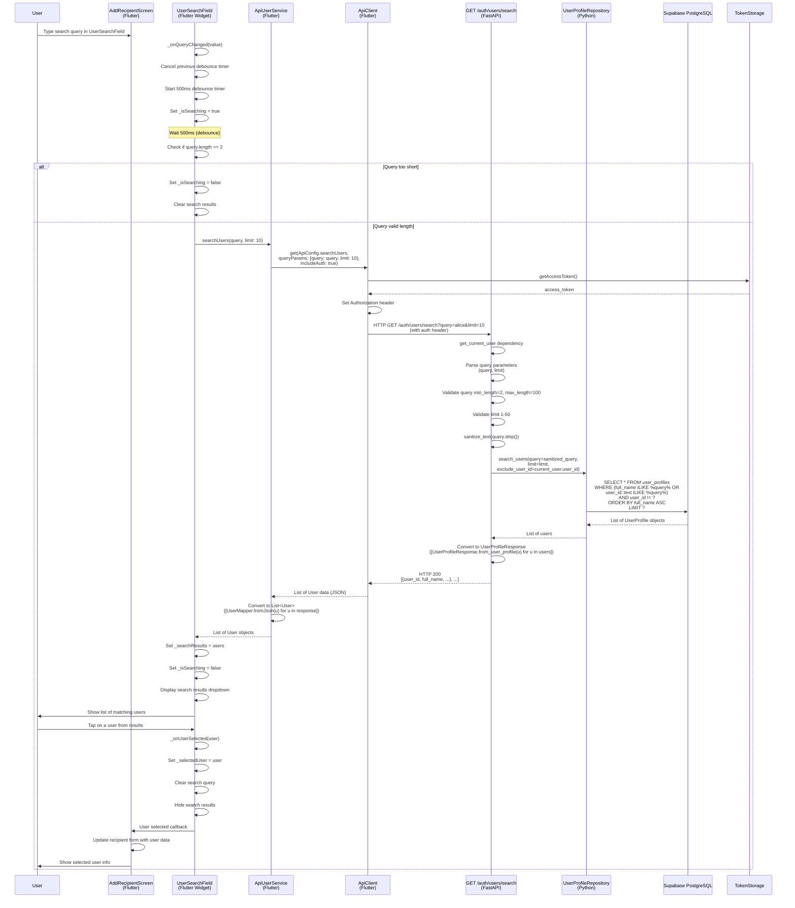
```mermaid
sequenceDiagram
    participant User
    participant AddRecipientScreen as AddRecipientScreen<br/>(Flutter)
    participant UserSearchField as UserSearchField<br/>(Flutter Widget)
    participant ApiUserService as ApiUserService<br/>(Flutter)
    participant ApiClient as ApiClient<br/>(Flutter)
    participant AuthAPI as GET /auth/users/search<br/>(FastAPI)
    participant UserProfileRepo as UserProfileRepository<br/>(Python)
    participant DB as Supabase PostgreSQL

    User->>AddRecipientScreen: Type search query in UserSearchField
    UserSearchField->>UserSearchField: _onQueryChanged(value)
    UserSearchField->>UserSearchField: Cancel previous debounce timer
    UserSearchField->>UserSearchField: Start 500ms debounce timer
    UserSearchField->>UserSearchField: Set _isSearching = true
    
    Note over UserSearchField: Wait 500ms (debounce)
    
    UserSearchField->>UserSearchField: Check if query.length >= 2
    
    alt Query too short
        UserSearchField->>UserSearchField: Set _isSearching = false
        UserSearchField->>UserSearchField: Clear search results
    else Query valid length
        UserSearchField->>ApiUserService: searchUsers(query, limit: 10)
        ApiUserService->>ApiClient: get(ApiConfig.searchUsers,<br/>queryParams: {query: query, limit: 10},<br/>includeAuth: true)
        ApiClient->>TokenStorage: getAccessToken()
        TokenStorage-->>ApiClient: access_token
        ApiClient->>ApiClient: Set Authorization header
        ApiClient->>AuthAPI: HTTP GET /auth/users/search?query=alice&limit=10<br/>(with auth header)
        
        AuthAPI->>AuthAPI: get_current_user dependency
        AuthAPI->>AuthAPI: Parse query parameters<br/>(query, limit)
        AuthAPI->>AuthAPI: Validate query min_length=2, max_length=100
        AuthAPI->>AuthAPI: Validate limit 1-50
        AuthAPI->>AuthAPI: sanitize_text(query.strip())
        
        AuthAPI->>UserProfileRepo: search_users(query=sanitized_query,<br/>limit=limit,<br/>exclude_user_id=current_user.user_id)
        UserProfileRepo->>DB: SELECT * FROM user_profiles<br/>WHERE (full_name ILIKE %query% OR<br/>user_id::text ILIKE %query%)<br/>AND user_id != ?<br/>ORDER BY full_name ASC<br/>LIMIT ?
        DB-->>UserProfileRepo: List of UserProfile objects
        UserProfileRepo-->>AuthAPI: List of users
        
        AuthAPI->>AuthAPI: Convert to UserProfileResponse<br/>([UserProfileResponse.from_user_profile(u) for u in users])
        AuthAPI-->>ApiClient: HTTP 200<br/>[{user_id, full_name, ...}, ...]
        
        ApiClient-->>ApiUserService: List of User data (JSON)
        ApiUserService->>ApiUserService: Convert to List<User><br/>([UserMapper.fromJson(u) for u in response])
        ApiUserService-->>UserSearchField: List of User objects
        UserSearchField->>UserSearchField: Set _searchResults = users
        UserSearchField->>UserSearchField: Set _isSearching = false
        UserSearchField->>UserSearchField: Display search results dropdown
        UserSearchField->>User: Show list of matching users
        
        User->>UserSearchField: Tap on a user from results
        UserSearchField->>UserSearchField: _onUserSelected(user)
        UserSearchField->>UserSearchField: Set _selectedUser = user
        UserSearchField->>UserSearchField: Clear search query
        UserSearchField->>UserSearchField: Hide search results
        UserSearchField->>AddRecipientScreen: User selected callback
        AddRecipientScreen->>AddRecipientScreen: Update recipient form with user data
        AddRecipientScreen->>User: Show selected user info
    end
```

---

### 11. Add Recipient

**Description**: User adds a recipient (either registered user or manual entry) with optional relationship and avatar.

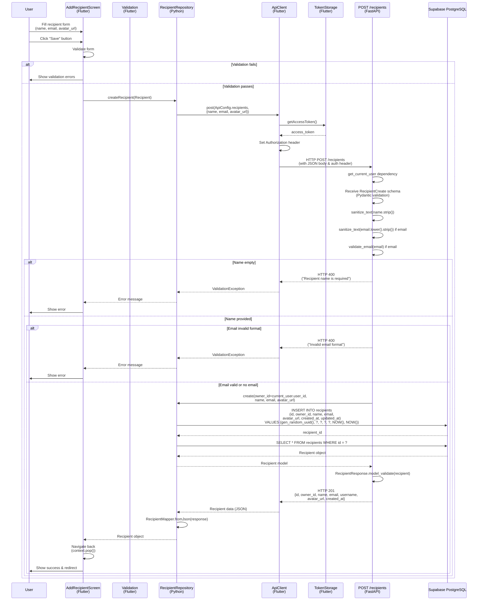
```mermaid
sequenceDiagram
    participant User
    participant AddRecipientScreen as AddRecipientScreen<br/>(Flutter)
    participant Validation as Validation<br/>(Flutter)
    participant RecipientRepo as ApiRecipientRepository<br/>(Flutter)
    participant ApiClient as ApiClient<br/>(Flutter)
    participant TokenStorage as TokenStorage<br/>(Flutter)
    participant RecipientAPI as POST /recipients<br/>(FastAPI)
    participant RecipientRepo as RecipientRepository<br/>(Python)
    participant DB as Supabase PostgreSQL

    User->>AddRecipientScreen: Fill recipient form<br/>(name, email, avatar_url)
    User->>AddRecipientScreen: Click "Save" button
    AddRecipientScreen->>AddRecipientScreen: Validate form
    
    alt Validation fails
        AddRecipientScreen->>User: Show validation errors
    else Validation passes
        AddRecipientScreen->>RecipientRepo: createRecipient(Recipient)
        RecipientRepo->>ApiClient: post(ApiConfig.recipients,<br/>{name, email, avatar_url})
        ApiClient->>TokenStorage: getAccessToken()
        TokenStorage-->>ApiClient: access_token
        ApiClient->>ApiClient: Set Authorization header
        ApiClient->>RecipientAPI: HTTP POST /recipients<br/>(with JSON body & auth header)
        
        RecipientAPI->>RecipientAPI: get_current_user dependency
        RecipientAPI->>RecipientAPI: Receive RecipientCreate schema<br/>(Pydantic validation)
        RecipientAPI->>RecipientAPI: sanitize_text(name.strip())
        RecipientAPI->>RecipientAPI: sanitize_text(email.lower().strip()) if email
        RecipientAPI->>RecipientAPI: validate_email(email) if email
        
        alt Name empty
            RecipientAPI-->>ApiClient: HTTP 400<br/>("Recipient name is required")
            ApiClient-->>RecipientRepo: ValidationException
            RecipientRepo-->>AddRecipientScreen: Error message
            AddRecipientScreen->>User: Show error
        else Name provided
            alt Email invalid format
                RecipientAPI-->>ApiClient: HTTP 400<br/>("Invalid email format")
                ApiClient-->>RecipientRepo: ValidationException
                RecipientRepo-->>AddRecipientScreen: Error message
                AddRecipientScreen->>User: Show error
            else Email valid or no email
                RecipientAPI->>RecipientRepo: create(owner_id=current_user.user_id,<br/>name, email, avatar_url)
                RecipientRepo->>DB: INSERT INTO recipients<br/>(id, owner_id, name, email,<br/>avatar_url, created_at, updated_at)<br/>VALUES (gen_random_uuid(), ?, ?, ?, ?, NOW(), NOW())
                DB-->>RecipientRepo: recipient_id
                RecipientRepo->>DB: SELECT * FROM recipients WHERE id = ?
                DB-->>RecipientRepo: Recipient object
                RecipientRepo-->>RecipientAPI: Recipient model
                
                RecipientAPI->>RecipientAPI: RecipientResponse.model_validate(recipient)
                RecipientAPI-->>ApiClient: HTTP 201<br/>{id, owner_id, name, email, username,<br/>avatar_url, created_at}
                
                ApiClient-->>RecipientRepo: Recipient data (JSON)
                RecipientRepo->>RecipientRepo: RecipientMapper.fromJson(response)
                RecipientRepo-->>AddRecipientScreen: Recipient object
                AddRecipientScreen->>AddRecipientScreen: Navigate back<br/>(context.pop())
                AddRecipientScreen->>User: Show success & redirect
            end
        end
    end
```

---

### 12. List Recipients

**Description**: User views their saved recipients list with pagination.

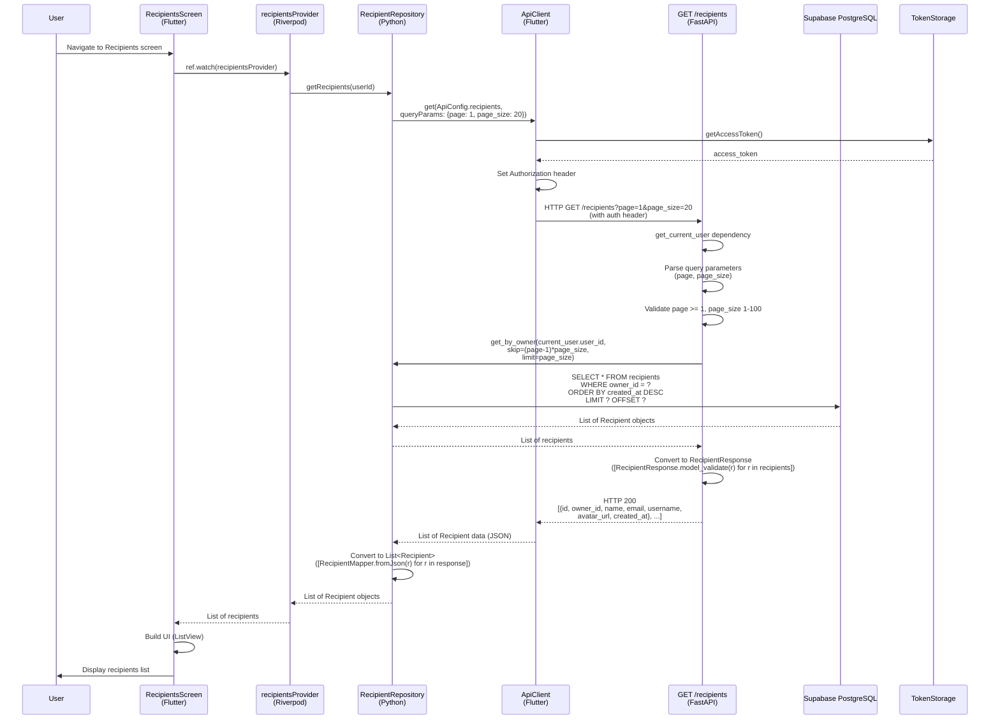
```mermaid
sequenceDiagram
    participant User
    participant RecipientsScreen as RecipientsScreen<br/>(Flutter)
    participant Provider as recipientsProvider<br/>(Riverpod)
    participant RecipientRepo as ApiRecipientRepository<br/>(Flutter)
    participant ApiClient as ApiClient<br/>(Flutter)
    participant RecipientAPI as GET /recipients<br/>(FastAPI)
    participant RecipientRepo as RecipientRepository<br/>(Python)
    participant DB as Supabase PostgreSQL

    User->>RecipientsScreen: Navigate to Recipients screen
    RecipientsScreen->>Provider: ref.watch(recipientsProvider)
    Provider->>RecipientRepo: getRecipients(userId)
    RecipientRepo->>ApiClient: get(ApiConfig.recipients,<br/>queryParams: {page: 1, page_size: 20})
    ApiClient->>TokenStorage: getAccessToken()
    TokenStorage-->>ApiClient: access_token
    ApiClient->>ApiClient: Set Authorization header
    ApiClient->>RecipientAPI: HTTP GET /recipients?page=1&page_size=20<br/>(with auth header)
    
    RecipientAPI->>RecipientAPI: get_current_user dependency
    RecipientAPI->>RecipientAPI: Parse query parameters<br/>(page, page_size)
    RecipientAPI->>RecipientAPI: Validate page >= 1, page_size 1-100
    RecipientAPI->>RecipientRepo: get_by_owner(current_user.user_id,<br/>skip=(page-1)*page_size,<br/>limit=page_size)
    RecipientRepo->>DB: SELECT * FROM recipients<br/>WHERE owner_id = ?<br/>ORDER BY created_at DESC<br/>LIMIT ? OFFSET ?
    DB-->>RecipientRepo: List of Recipient objects
    RecipientRepo-->>RecipientAPI: List of recipients
    
    RecipientAPI->>RecipientAPI: Convert to RecipientResponse<br/>([RecipientResponse.model_validate(r) for r in recipients])
    RecipientAPI-->>ApiClient: HTTP 200<br/>[{id, owner_id, name, email, username,<br/>avatar_url, created_at}, ...]
    
    ApiClient-->>RecipientRepo: List of Recipient data (JSON)
    RecipientRepo->>RecipientRepo: Convert to List<Recipient><br/>([RecipientMapper.fromJson(r) for r in response])
    RecipientRepo-->>Provider: List of Recipient objects
    Provider-->>RecipientsScreen: List of recipients
    RecipientsScreen->>RecipientsScreen: Build UI (ListView)
    RecipientsScreen->>User: Display recipients list
```

---

### 13. Update Recipient

**Description**: User updates recipient details (name, email, relationship, avatar_url).

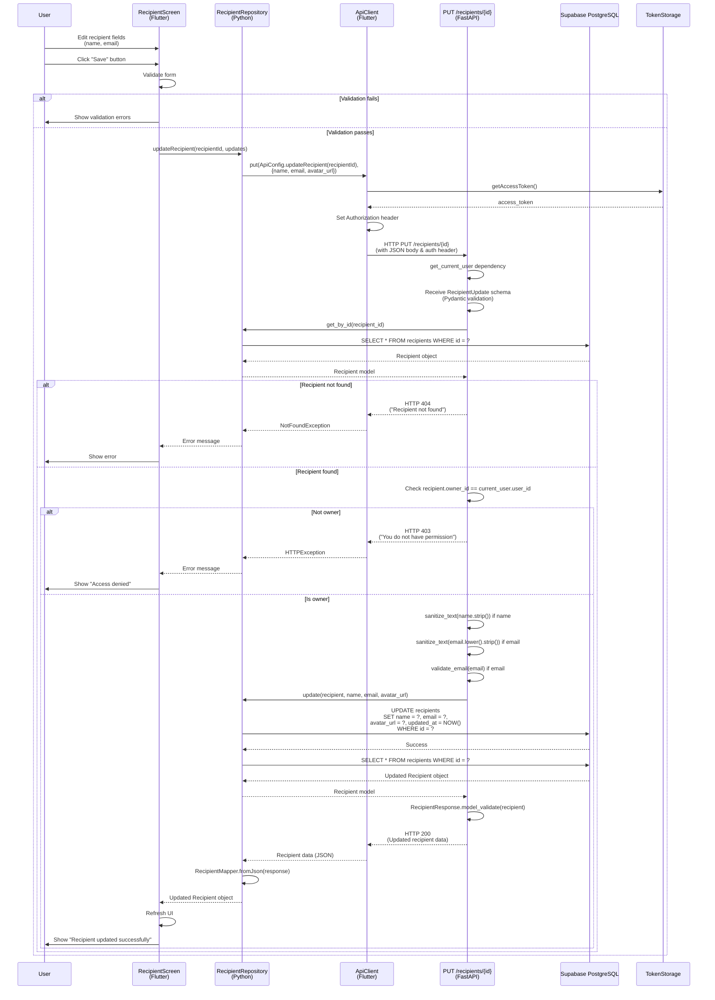
```mermaid
sequenceDiagram
    participant User
    participant RecipientScreen as RecipientScreen<br/>(Flutter)
    participant RecipientRepo as ApiRecipientRepository<br/>(Flutter)
    participant ApiClient as ApiClient<br/>(Flutter)
    participant RecipientAPI as PUT /recipients/{id}<br/>(FastAPI)
    participant RecipientRepo as RecipientRepository<br/>(Python)
    participant DB as Supabase PostgreSQL

    User->>RecipientScreen: Edit recipient fields<br/>(name, email)
    User->>RecipientScreen: Click "Save" button
    RecipientScreen->>RecipientScreen: Validate form
    
    alt Validation fails
        RecipientScreen->>User: Show validation errors
    else Validation passes
        RecipientScreen->>RecipientRepo: updateRecipient(recipientId, updates)
        RecipientRepo->>ApiClient: put(ApiConfig.updateRecipient(recipientId),<br/>{name, email, avatar_url})
        ApiClient->>TokenStorage: getAccessToken()
        TokenStorage-->>ApiClient: access_token
        ApiClient->>ApiClient: Set Authorization header
        ApiClient->>RecipientAPI: HTTP PUT /recipients/{id}<br/>(with JSON body & auth header)
        
        RecipientAPI->>RecipientAPI: get_current_user dependency
        RecipientAPI->>RecipientAPI: Receive RecipientUpdate schema<br/>(Pydantic validation)
        RecipientAPI->>RecipientRepo: get_by_id(recipient_id)
        RecipientRepo->>DB: SELECT * FROM recipients WHERE id = ?
        DB-->>RecipientRepo: Recipient object
        RecipientRepo-->>RecipientAPI: Recipient model
        
        alt Recipient not found
            RecipientAPI-->>ApiClient: HTTP 404<br/>("Recipient not found")
            ApiClient-->>RecipientRepo: NotFoundException
            RecipientRepo-->>RecipientScreen: Error message
            RecipientScreen->>User: Show error
        else Recipient found
            RecipientAPI->>RecipientAPI: Check recipient.owner_id == current_user.user_id
            
            alt Not owner
                RecipientAPI-->>ApiClient: HTTP 403<br/>("You do not have permission")
                ApiClient-->>RecipientRepo: HTTPException
                RecipientRepo-->>RecipientScreen: Error message
                RecipientScreen->>User: Show "Access denied"
            else Is owner
                RecipientAPI->>RecipientAPI: sanitize_text(name.strip()) if name
                RecipientAPI->>RecipientAPI: sanitize_text(email.lower().strip()) if email
                RecipientAPI->>RecipientAPI: validate_email(email) if email
                
                RecipientAPI->>RecipientRepo: update(recipient, name, email, avatar_url)
                RecipientRepo->>DB: UPDATE recipients<br/>SET name = ?, email = ?,<br/>avatar_url = ?, updated_at = NOW()<br/>WHERE id = ?
                DB-->>RecipientRepo: Success
                RecipientRepo->>DB: SELECT * FROM recipients WHERE id = ?
                DB-->>RecipientRepo: Updated Recipient object
                RecipientRepo-->>RecipientAPI: Recipient model
                
                RecipientAPI->>RecipientAPI: RecipientResponse.model_validate(recipient)
                RecipientAPI-->>ApiClient: HTTP 200<br/>(Updated recipient data)
                
                ApiClient-->>RecipientRepo: Recipient data (JSON)
                RecipientRepo->>RecipientRepo: RecipientMapper.fromJson(response)
                RecipientRepo-->>RecipientScreen: Updated Recipient object
                RecipientScreen->>RecipientScreen: Refresh UI
                RecipientScreen->>User: Show "Recipient updated successfully"
            end
        end
    end
```

---

### 14. Delete Recipient

**Description**: User deletes a saved recipient.

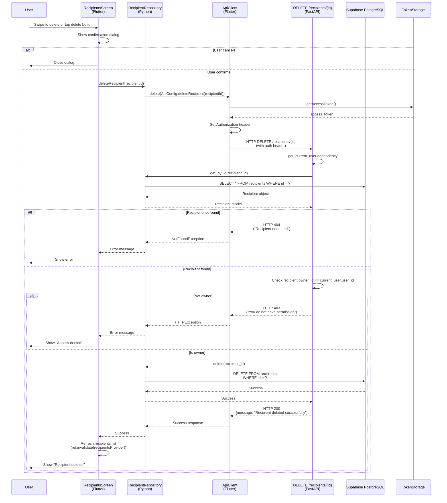
```mermaid
sequenceDiagram
    participant User
    participant RecipientsScreen as RecipientsScreen<br/>(Flutter)
    participant RecipientRepo as ApiRecipientRepository<br/>(Flutter)
    participant ApiClient as ApiClient<br/>(Flutter)
    participant RecipientAPI as DELETE /recipients/{id}<br/>(FastAPI)
    participant RecipientRepo as RecipientRepository<br/>(Python)
    participant DB as Supabase PostgreSQL

    User->>RecipientsScreen: Swipe to delete or tap delete button
    RecipientsScreen->>RecipientsScreen: Show confirmation dialog
    
    alt User cancels
        RecipientsScreen->>User: Close dialog
    else User confirms
        RecipientsScreen->>RecipientRepo: deleteRecipient(recipientId)
        RecipientRepo->>ApiClient: delete(ApiConfig.deleteRecipient(recipientId))
        ApiClient->>TokenStorage: getAccessToken()
        TokenStorage-->>ApiClient: access_token
        ApiClient->>ApiClient: Set Authorization header
        ApiClient->>RecipientAPI: HTTP DELETE /recipients/{id}<br/>(with auth header)
        
        RecipientAPI->>RecipientAPI: get_current_user dependency
        RecipientAPI->>RecipientRepo: get_by_id(recipient_id)
        RecipientRepo->>DB: SELECT * FROM recipients WHERE id = ?
        DB-->>RecipientRepo: Recipient object
        RecipientRepo-->>RecipientAPI: Recipient model
        
        alt Recipient not found
            RecipientAPI-->>ApiClient: HTTP 404<br/>("Recipient not found")
            ApiClient-->>RecipientRepo: NotFoundException
            RecipientRepo-->>RecipientsScreen: Error message
            RecipientsScreen->>User: Show error
        else Recipient found
            RecipientAPI->>RecipientAPI: Check recipient.owner_id == current_user.user_id
            
            alt Not owner
                RecipientAPI-->>ApiClient: HTTP 403<br/>("You do not have permission")
                ApiClient-->>RecipientRepo: HTTPException
                RecipientRepo-->>RecipientsScreen: Error message
                RecipientsScreen->>User: Show "Access denied"
            else Is owner
                RecipientAPI->>RecipientRepo: delete(recipient_id)
                RecipientRepo->>DB: DELETE FROM recipients<br/>WHERE id = ?
                DB-->>RecipientRepo: Success
                RecipientRepo-->>RecipientAPI: Success
                
                RecipientAPI-->>ApiClient: HTTP 200<br/>{message: "Recipient deleted successfully"}
                
                ApiClient-->>RecipientRepo: Success response
                RecipientRepo-->>RecipientsScreen: Success
                RecipientsScreen->>RecipientsScreen: Refresh recipients list<br/>(ref.invalidate(recipientsProvider))
                RecipientsScreen->>User: Show "Recipient deleted"
            end
        end
    end
```

---

## Background Processes

### 15. Capsule State Automation

**Description**: Background worker automatically updates capsule states based on unlock times. Runs every 60 seconds.

**Key Steps**:
1. Scheduler triggers unlock check every 60 seconds
2. UnlockService queries for sealed capsules with unlocks_at <= now()
3. Updates status from 'sealed' to 'ready'
4. Triggers notifications if configured

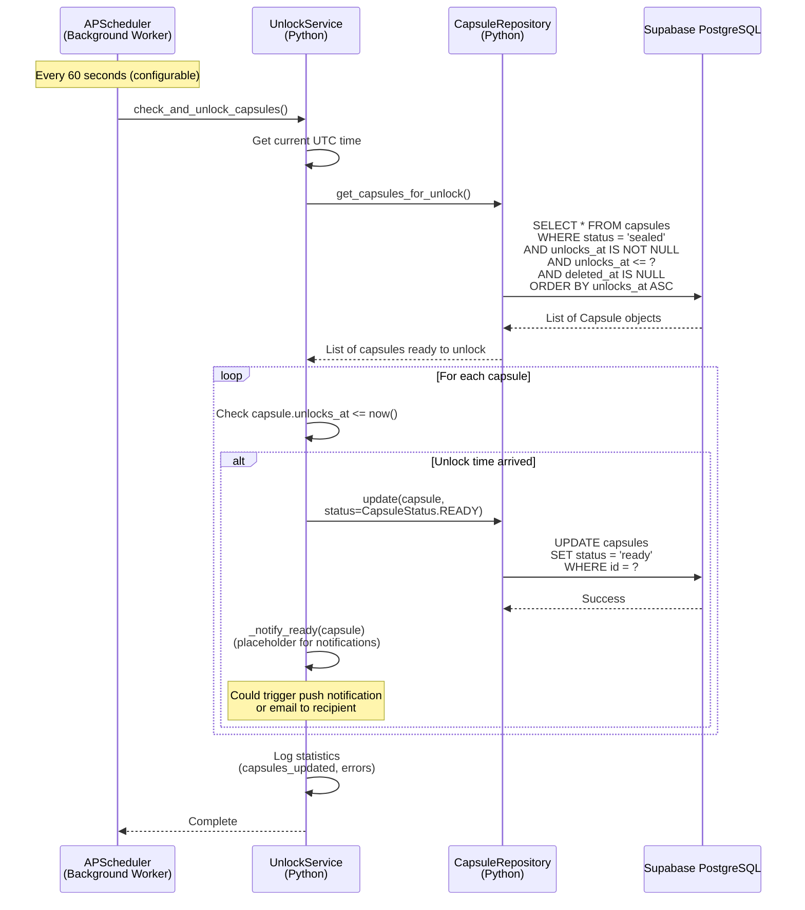
```mermaid
sequenceDiagram
    participant Scheduler as APScheduler<br/>(Background Worker)
    participant UnlockService as UnlockService<br/>(Python)
    participant CapsuleRepo as CapsuleRepository<br/>(Python)
    participant DB as Supabase PostgreSQL

    Note over Scheduler: Every 60 seconds (configurable)
    
    Scheduler->>UnlockService: check_and_unlock_capsules()
    UnlockService->>UnlockService: Get current UTC time
    UnlockService->>CapsuleRepo: get_capsules_for_unlock()
    CapsuleRepo->>DB: SELECT * FROM capsules<br/>WHERE status = 'sealed'<br/>AND unlocks_at IS NOT NULL<br/>AND unlocks_at <= ?<br/>AND deleted_at IS NULL<br/>ORDER BY unlocks_at ASC
    DB-->>CapsuleRepo: List of Capsule objects
    CapsuleRepo-->>UnlockService: List of capsules ready to unlock
    
    loop For each capsule
        UnlockService->>UnlockService: Check capsule.unlocks_at <= now()
            
            alt Unlock time arrived
            UnlockService->>CapsuleRepo: update(capsule,<br/>status=CapsuleStatus.READY)
            CapsuleRepo->>DB: UPDATE capsules<br/>SET status = 'ready'<br/>WHERE id = ?
                DB-->>CapsuleRepo: Success
            
                UnlockService->>UnlockService: _notify_ready(capsule)<br/>(placeholder for notifications)
            Note over UnlockService: Could trigger push notification<br/>or email to recipient
        end
    end
    
    UnlockService->>UnlockService: Log statistics<br/>(capsules_updated, errors)
    UnlockService-->>Scheduler: Complete
```

---

## Key Concepts Explained

### JWT Tokens (Supabase)
- **Access tokens**: Short-lived tokens issued by Supabase Auth, used for API authentication
- **Refresh tokens**: Long-lived tokens used to get new access tokens
- **Token verification**: Backend verifies Supabase JWT signature using `supabase_jwt_secret`
- **Token payload**: Contains `sub` (user ID), `aud` (audience), `role`, `exp` (expiration)

### Capsule Status Flow
- **sealed**: Capsule is created but not yet ready to open (unlocks_at is in the future)
- **ready**: Capsule's unlock time has passed, ready for recipient to open
- **opened**: Recipient has opened the capsule
- **expired**: Capsule has passed expiration date or been soft-deleted

### Repository Pattern
   - Separates data access logic from business logic
   - Frontend and backend both use repository pattern for consistency
- Repositories handle API calls, data mapping, and error handling

### Input Validation & Sanitization
- **Frontend**: Validates input format and length before sending to backend
- **Backend**: Validates with Pydantic schemas and sanitizes all text inputs
- **Sanitization**: Removes control characters and enforces length limits

### Database Queries
- **Inbox query**: Gets all recipients owned by user, then gets capsules for those recipients (uses IN clause to avoid N+1)
- **Outbox query**: Gets capsules where user is sender
- **Soft deletes**: Capsules are marked as deleted (deleted_at set) rather than physically deleted

---

## Additional User Flows

### 16. Select Color Theme

**Description**: User changes the app's color theme from the profile settings.

**Key Steps**:
1. User navigates to profile screen
2. User taps "Color Theme" option
3. Frontend displays list of available themes
4. User selects a theme
5. Frontend updates theme provider
6. UI updates with new theme colors

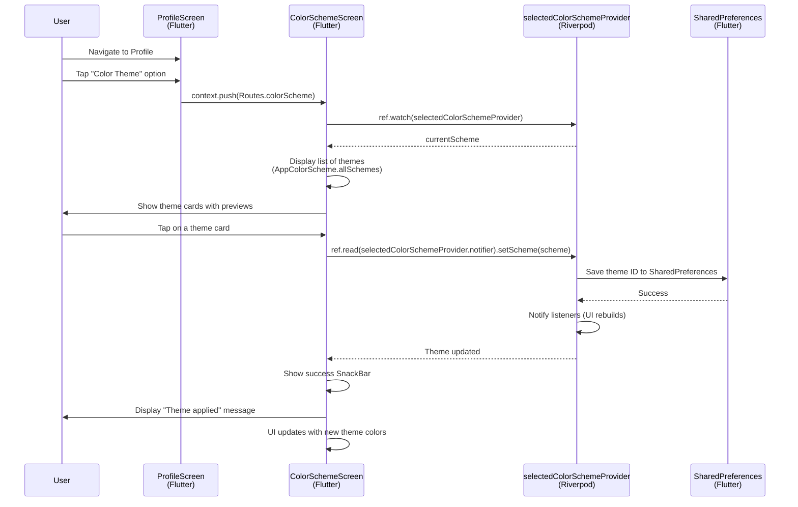
```mermaid
sequenceDiagram
    participant User
    participant ProfileScreen as ProfileScreen<br/>(Flutter)
    participant ColorSchemeScreen as ColorSchemeScreen<br/>(Flutter)
    participant ThemeProvider as selectedColorSchemeProvider<br/>(Riverpod)
    participant SharedPrefs as SharedPreferences<br/>(Flutter)

    User->>ProfileScreen: Navigate to Profile
    User->>ProfileScreen: Tap "Color Theme" option
    ProfileScreen->>ColorSchemeScreen: context.push(Routes.colorScheme)
    
    ColorSchemeScreen->>ThemeProvider: ref.watch(selectedColorSchemeProvider)
    ThemeProvider-->>ColorSchemeScreen: currentScheme
    ColorSchemeScreen->>ColorSchemeScreen: Display list of themes<br/>(AppColorScheme.allSchemes)
    ColorSchemeScreen->>User: Show theme cards with previews
    
    User->>ColorSchemeScreen: Tap on a theme card
    ColorSchemeScreen->>ThemeProvider: ref.read(selectedColorSchemeProvider.notifier).setScheme(scheme)
    ThemeProvider->>SharedPrefs: Save theme ID to SharedPreferences
    SharedPrefs-->>ThemeProvider: Success
    ThemeProvider->>ThemeProvider: Notify listeners (UI rebuilds)
    ThemeProvider-->>ColorSchemeScreen: Theme updated
    ColorSchemeScreen->>ColorSchemeScreen: Show success SnackBar
    ColorSchemeScreen->>User: Display "Theme applied" message
    ColorSchemeScreen->>ColorSchemeScreen: UI updates with new theme colors
```

---

### 17. View Opened Letter

**Description**: User views a letter that has been opened, with ability to add reactions.

**Key Steps**:
1. User navigates to opened letter screen
2. Frontend displays letter content
3. User can add emoji reaction
4. Frontend sends reaction to backend
5. Backend updates capsule with reaction

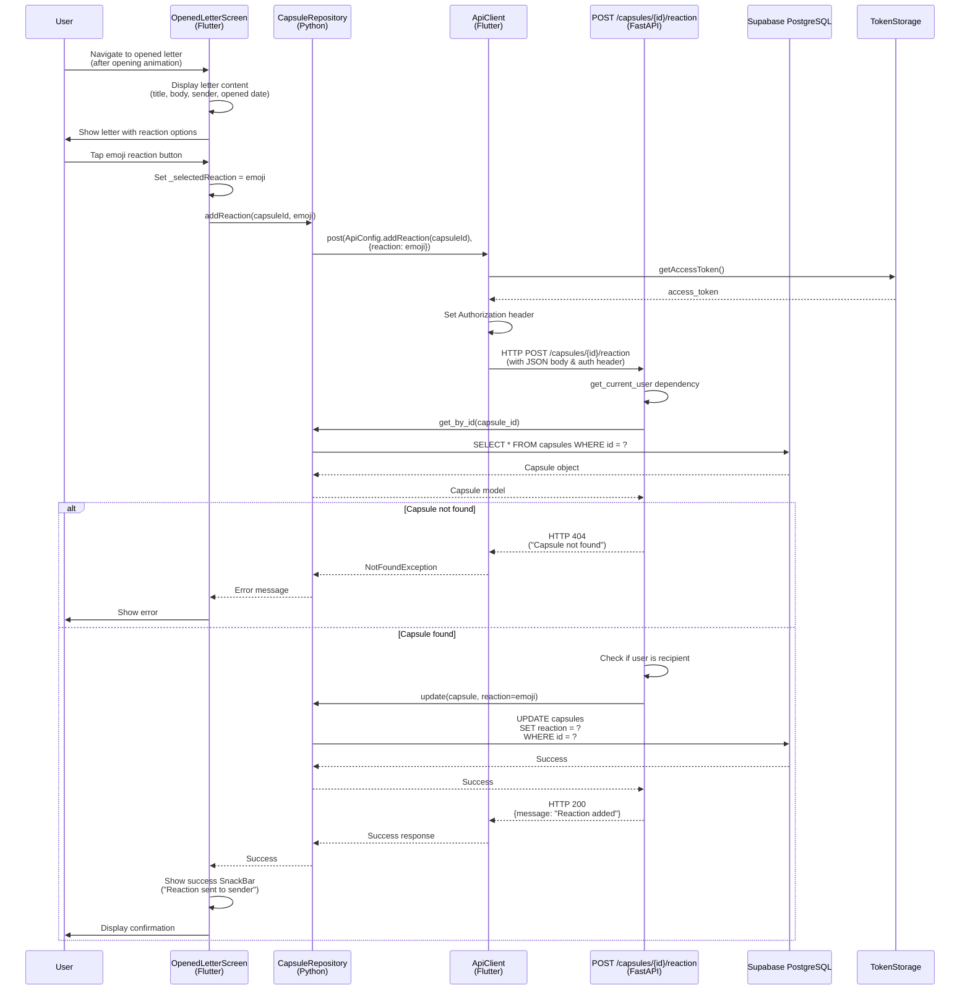
```mermaid
sequenceDiagram
    participant User
    participant OpenedLetterScreen as OpenedLetterScreen<br/>(Flutter)
    participant CapsuleRepo as ApiCapsuleRepository<br/>(Flutter)
    participant ApiClient as ApiClient<br/>(Flutter)
    participant CapsuleAPI as POST /capsules/{id}/reaction<br/>(FastAPI)
    participant CapsuleRepo as CapsuleRepository<br/>(Python)
    participant DB as Supabase PostgreSQL

    User->>OpenedLetterScreen: Navigate to opened letter<br/>(after opening animation)
    OpenedLetterScreen->>OpenedLetterScreen: Display letter content<br/>(title, body, sender, opened date)
    OpenedLetterScreen->>User: Show letter with reaction options
    
    User->>OpenedLetterScreen: Tap emoji reaction button
    OpenedLetterScreen->>OpenedLetterScreen: Set _selectedReaction = emoji
    OpenedLetterScreen->>CapsuleRepo: addReaction(capsuleId, emoji)
    
    CapsuleRepo->>ApiClient: post(ApiConfig.addReaction(capsuleId),<br/>{reaction: emoji})
    ApiClient->>TokenStorage: getAccessToken()
    TokenStorage-->>ApiClient: access_token
    ApiClient->>ApiClient: Set Authorization header
    ApiClient->>CapsuleAPI: HTTP POST /capsules/{id}/reaction<br/>(with JSON body & auth header)
    
    CapsuleAPI->>CapsuleAPI: get_current_user dependency
    CapsuleAPI->>CapsuleRepo: get_by_id(capsule_id)
    CapsuleRepo->>DB: SELECT * FROM capsules WHERE id = ?
    DB-->>CapsuleRepo: Capsule object
    CapsuleRepo-->>CapsuleAPI: Capsule model
    
    alt Capsule not found
        CapsuleAPI-->>ApiClient: HTTP 404<br/>("Capsule not found")
        ApiClient-->>CapsuleRepo: NotFoundException
        CapsuleRepo-->>OpenedLetterScreen: Error message
        OpenedLetterScreen->>User: Show error
    else Capsule found
        CapsuleAPI->>CapsuleAPI: Check if user is recipient
        CapsuleAPI->>CapsuleRepo: update(capsule, reaction=emoji)
        CapsuleRepo->>DB: UPDATE capsules<br/>SET reaction = ?<br/>WHERE id = ?
        DB-->>CapsuleRepo: Success
        CapsuleRepo-->>CapsuleAPI: Success
        
        CapsuleAPI-->>ApiClient: HTTP 200<br/>{message: "Reaction added"}
        ApiClient-->>CapsuleRepo: Success response
        CapsuleRepo-->>OpenedLetterScreen: Success
        OpenedLetterScreen->>OpenedLetterScreen: Show success SnackBar<br/>("Reaction sent to sender")
        OpenedLetterScreen->>User: Display confirmation
    end
```

---

### 18. Opening Animation Flow

**Description**: When a capsule is opened, an animation plays before showing the letter content.

**Key Steps**:
1. User taps "Open" on ready capsule
2. Backend updates capsule status to 'opened'
3. Frontend navigates to opening animation screen
4. Animation plays (fade in, scale, etc.)
5. After animation, navigate to opened letter screen

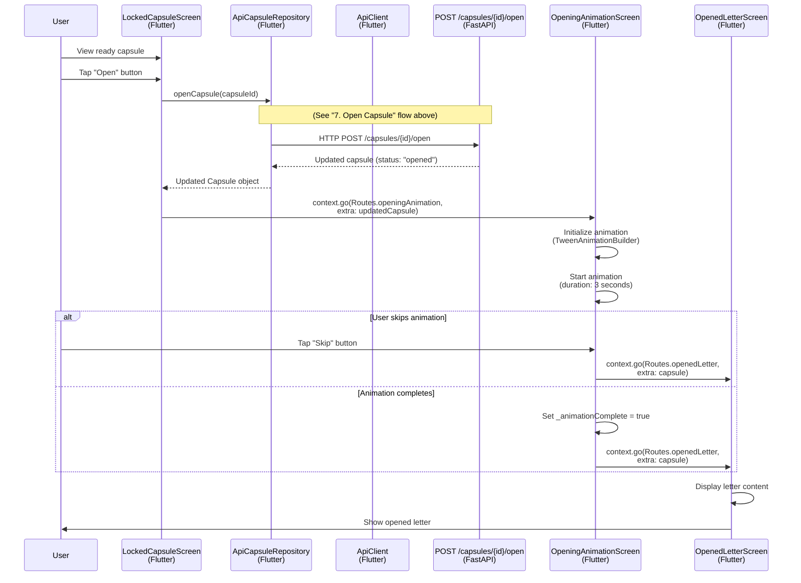
```mermaid
sequenceDiagram
    participant User
    participant LockedCapsuleScreen as LockedCapsuleScreen<br/>(Flutter)
    participant CapsuleRepo as ApiCapsuleRepository<br/>(Flutter)
    participant ApiClient as ApiClient<br/>(Flutter)
    participant CapsuleAPI as POST /capsules/{id}/open<br/>(FastAPI)
    participant OpeningAnimationScreen as OpeningAnimationScreen<br/>(Flutter)
    participant OpenedLetterScreen as OpenedLetterScreen<br/>(Flutter)

    User->>LockedCapsuleScreen: View ready capsule
    User->>LockedCapsuleScreen: Tap "Open" button
    LockedCapsuleScreen->>CapsuleRepo: openCapsule(capsuleId)
    
    Note over CapsuleRepo,CapsuleAPI: (See "7. Open Capsule" flow above)
    CapsuleRepo->>CapsuleAPI: HTTP POST /capsules/{id}/open
    CapsuleAPI-->>CapsuleRepo: Updated capsule (status: "opened")
    CapsuleRepo-->>LockedCapsuleScreen: Updated Capsule object
    
    LockedCapsuleScreen->>OpeningAnimationScreen: context.go(Routes.openingAnimation,<br/>extra: updatedCapsule)
    
    OpeningAnimationScreen->>OpeningAnimationScreen: Initialize animation<br/>(TweenAnimationBuilder)
    OpeningAnimationScreen->>OpeningAnimationScreen: Start animation<br/>(duration: 3 seconds)
    
    alt User skips animation
        User->>OpeningAnimationScreen: Tap "Skip" button
        OpeningAnimationScreen->>OpenedLetterScreen: context.go(Routes.openedLetter,<br/>extra: capsule)
    else Animation completes
        OpeningAnimationScreen->>OpeningAnimationScreen: Set _animationComplete = true
        OpeningAnimationScreen->>OpenedLetterScreen: context.go(Routes.openedLetter,<br/>extra: capsule)
    end
    
    OpenedLetterScreen->>OpenedLetterScreen: Display letter content
    OpenedLetterScreen->>User: Show opened letter
```

---

### 19. Share Countdown (Locked Capsule)

**Description**: User shares a locked capsule's countdown with others.

**Key Steps**:
1. User views locked capsule
2. User taps "Share Countdown" button
3. Frontend uses platform share functionality
4. Share dialog appears with capsule details

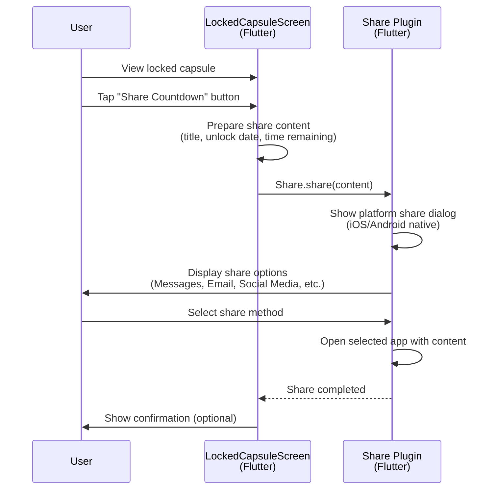
```mermaid
sequenceDiagram
    participant User
    participant LockedCapsuleScreen as LockedCapsuleScreen<br/>(Flutter)
    participant SharePlugin as Share Plugin<br/>(Flutter)

    User->>LockedCapsuleScreen: View locked capsule
    User->>LockedCapsuleScreen: Tap "Share Countdown" button
    LockedCapsuleScreen->>LockedCapsuleScreen: Prepare share content<br/>(title, unlock date, time remaining)
    LockedCapsuleScreen->>SharePlugin: Share.share(content)
    SharePlugin->>SharePlugin: Show platform share dialog<br/>(iOS/Android native)
    SharePlugin->>User: Display share options<br/>(Messages, Email, Social Media, etc.)
    
    User->>SharePlugin: Select share method
    SharePlugin->>SharePlugin: Open selected app with content
    SharePlugin-->>LockedCapsuleScreen: Share completed
    LockedCapsuleScreen->>User: Show confirmation (optional)
```

---

### 20. Navigate Between Tabs (Inbox/Outbox)

**Description**: User switches between inbox and outbox tabs in the home screen.

**Key Steps**:
1. User is on home screen
2. User taps different tab (Inbox/Outbox)
3. Frontend updates selected tab index
4. Frontend fetches capsules for selected tab
5. UI updates with new capsule list

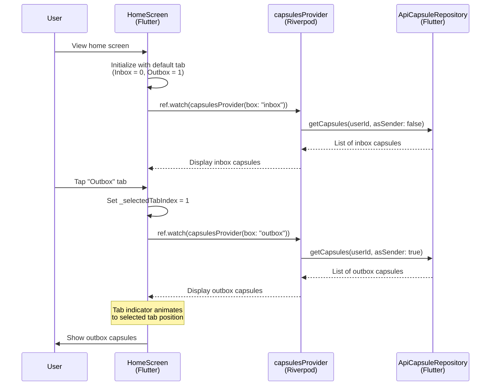
```mermaid
sequenceDiagram
    participant User
    participant HomeScreen as HomeScreen<br/>(Flutter)
    participant Provider as capsulesProvider<br/>(Riverpod)
    participant CapsuleRepo as ApiCapsuleRepository<br/>(Flutter)

    User->>HomeScreen: View home screen
    HomeScreen->>HomeScreen: Initialize with default tab<br/>(Inbox = 0, Outbox = 1)
    HomeScreen->>Provider: ref.watch(capsulesProvider(box: "inbox"))
    Provider->>CapsuleRepo: getCapsules(userId, asSender: false)
    CapsuleRepo-->>Provider: List of inbox capsules
    Provider-->>HomeScreen: Display inbox capsules
    
    User->>HomeScreen: Tap "Outbox" tab
    HomeScreen->>HomeScreen: Set _selectedTabIndex = 1
    HomeScreen->>Provider: ref.watch(capsulesProvider(box: "outbox"))
    Provider->>CapsuleRepo: getCapsules(userId, asSender: true)
    CapsuleRepo-->>Provider: List of outbox capsules
    Provider-->>HomeScreen: Display outbox capsules
    
    Note over HomeScreen: Tab indicator animates<br/>to selected tab position
    HomeScreen->>User: Show outbox capsules
```

---

## Draft Management Flows

### 21. Create Draft (Auto-Save)

**Description**: User types content in the letter creation screen, and after a debounce period (800ms), a draft is automatically created and saved locally.

**Key Steps**:
1. User types content in StepWriteLetter
2. Debounce timer starts (800ms)
3. If user continues typing, timer resets
4. After 800ms of no typing, auto-save triggers
5. Check if draftId exists (none for new draft)
6. Create new draft via repository
7. Store draftId in state
8. Save to local storage (SharedPreferences)

```mermaid
sequenceDiagram
    participant User
    participant StepWriteLetter as StepWriteLetter<br/>(Flutter)
    participant DraftCapsuleProvider as draftCapsuleProvider<br/>(Riverpod)
    participant DraftRepo as DraftRepository<br/>(Flutter)
    participant DraftStorage as DraftStorage<br/>(SharedPreferences)
    participant LocalStorage as SharedPreferences<br/>(Local)

    User->>StepWriteLetter: Type content
    StepWriteLetter->>StepWriteLetter: _onContentChanged()<br/>Cancel previous debounce timer
    StepWriteLetter->>StepWriteLetter: Start new debounce timer<br/>(800ms)
    
    User->>StepWriteLetter: Continue typing
    StepWriteLetter->>StepWriteLetter: Cancel timer, start new one
    
    Note over StepWriteLetter: 800ms of no typing
    StepWriteLetter->>StepWriteLetter: _saveDraft() called
    
    StepWriteLetter->>StepWriteLetter: Check _isSaving flag
    alt Already saving
        StepWriteLetter->>StepWriteLetter: Skip (prevent concurrent saves)
    else Not saving
        StepWriteLetter->>StepWriteLetter: Set _isSaving = true
        StepWriteLetter->>DraftCapsuleProvider: ref.read(draftCapsuleProvider)
        DraftCapsuleProvider-->>StepWriteLetter: draftCapsule (draftId: null)
        
        StepWriteLetter->>StepWriteLetter: Check _currentDraftId<br/>(null for new draft)
        StepWriteLetter->>StepWriteLetter: Check draftCapsule.draftId<br/>(also null)
        
        Note over StepWriteLetter: No draftId exists → Create new draft
        StepWriteLetter->>DraftRepo: createDraft(userId, title, content,<br/>recipientName, recipientAvatar)
        DraftRepo->>DraftRepo: Create Draft object<br/>(generate UUID, set timestamps)
        DraftRepo->>DraftStorage: saveDraft(userId, draft, isNewDraft: true)
        
        DraftStorage->>LocalStorage: setString("draft_<draftId>", draftJson)
        LocalStorage-->>DraftStorage: Success
        DraftStorage->>LocalStorage: Verify save
        LocalStorage-->>DraftStorage: Verified
        DraftStorage->>DraftStorage: _updateDraftList(userId, draftId)
        DraftStorage->>LocalStorage: getString("drafts_<userId>")
        LocalStorage-->>DraftStorage: Existing draft IDs (or null)
        DraftStorage->>DraftStorage: Add draftId to list (if not exists)
        DraftStorage->>LocalStorage: setString("drafts_<userId>", updatedListJson)
        LocalStorage-->>DraftStorage: Success
        DraftStorage-->>DraftRepo: Draft saved
        DraftRepo-->>StepWriteLetter: Draft object (with ID)
        
        StepWriteLetter->>StepWriteLetter: Set _currentDraftId = draft.id
        StepWriteLetter->>DraftCapsuleProvider: setDraftId(draft.id)
        DraftCapsuleProvider->>DraftCapsuleProvider: Update state with draftId
        
        StepWriteLetter->>StepWriteLetter: Set _isSaving = false
        StepWriteLetter->>StepWriteLetter: Invalidate draftsProvider<br/>(only on creation)
    end
```

---

### 22. Update Draft (Auto-Save)

**Description**: User opens an existing draft and continues editing. Auto-save updates the existing draft instead of creating a new one.

**Key Steps**:
1. User opens draft from drafts screen
2. CreateCapsuleScreen initializes with draftId
3. StepWriteLetter initializes _currentDraftId from draftCapsuleProvider
4. User edits content
5. Auto-save triggers after debounce
6. Check draftId (exists for existing draft)
7. Update existing draft via repository
8. Save to local storage

```mermaid
sequenceDiagram
    participant User
    participant DraftsScreen as DraftsScreen<br/>(Flutter)
    participant CreateCapsuleScreen as CreateCapsuleScreen<br/>(Flutter)
    participant DraftCapsuleProvider as draftCapsuleProvider<br/>(Riverpod)
    participant StepWriteLetter as StepWriteLetter<br/>(Flutter)
    participant DraftRepo as DraftRepository<br/>(Flutter)
    participant DraftStorage as DraftStorage<br/>(SharedPreferences)
    participant LocalStorage as SharedPreferences<br/>(Local)

    User->>DraftsScreen: Tap on draft card
    DraftsScreen->>DraftsScreen: Create DraftNavigationData<br/>(draftId, content, title, etc.)
    DraftsScreen->>CreateCapsuleScreen: context.push(Routes.createCapsule,<br/>extra: draftData)
    
    CreateCapsuleScreen->>CreateCapsuleScreen: initState()
    CreateCapsuleScreen->>DraftCapsuleProvider: reset()
    CreateCapsuleScreen->>DraftCapsuleProvider: setContent(draftData.content)
    CreateCapsuleScreen->>DraftCapsuleProvider: setLabel(draftData.title)
    CreateCapsuleScreen->>DraftCapsuleProvider: setDraftId(draftData.draftId)
    DraftCapsuleProvider->>DraftCapsuleProvider: Update state with draftId
    
    CreateCapsuleScreen->>StepWriteLetter: Navigate to step 1 (Write Letter)
    StepWriteLetter->>StepWriteLetter: initState()
    StepWriteLetter->>DraftCapsuleProvider: ref.read(draftCapsuleProvider)
    DraftCapsuleProvider-->>StepWriteLetter: draftCapsule (draftId: "abc123")
    StepWriteLetter->>StepWriteLetter: Initialize _currentDraftId = draft.draftId<br/>CRITICAL: Must initialize from provider
    
    User->>StepWriteLetter: Edit content
    StepWriteLetter->>StepWriteLetter: _onContentChanged()<br/>Start debounce timer (800ms)
    
    Note over StepWriteLetter: 800ms of no typing
    StepWriteLetter->>StepWriteLetter: _saveDraft() called
    StepWriteLetter->>StepWriteLetter: Check _isSaving flag
    StepWriteLetter->>DraftCapsuleProvider: ref.read(draftCapsuleProvider)
    DraftCapsuleProvider-->>StepWriteLetter: draftCapsule (draftId: "abc123")
    
    StepWriteLetter->>StepWriteLetter: Check _currentDraftId<br/>("abc123" exists)
    StepWriteLetter->>StepWriteLetter: Check draftCapsule.draftId<br/>("abc123" exists)
    StepWriteLetter->>StepWriteLetter: draftId = _currentDraftId ?? draftCapsule.draftId<br/>Result: "abc123"
    
    Note over StepWriteLetter: draftId exists → Update existing draft
    StepWriteLetter->>DraftRepo: updateDraft("abc123", content,<br/>title, recipientName, recipientAvatar)
    DraftRepo->>DraftStorage: getDraft("abc123")
    DraftStorage->>LocalStorage: getString("draft_abc123")
    LocalStorage-->>DraftStorage: Draft JSON
    DraftStorage-->>DraftRepo: Existing Draft object
    DraftRepo->>DraftRepo: Create updated Draft<br/>(copyWith with new content,<br/>update lastEdited timestamp)
    DraftRepo->>DraftStorage: saveDraft(userId, updatedDraft,<br/>isNewDraft: false)
    
    DraftStorage->>LocalStorage: setString("draft_abc123", updatedDraftJson)
    LocalStorage-->>DraftStorage: Success
    DraftStorage->>LocalStorage: Verify save
    LocalStorage-->>DraftStorage: Verified
    DraftStorage->>DraftStorage: Verify draft in list<br/>(safety check, don't add if exists)
    DraftStorage-->>DraftRepo: Draft updated
    DraftRepo-->>StepWriteLetter: Updated Draft object
    
    StepWriteLetter->>StepWriteLetter: Ensure _currentDraftId = draftId
    StepWriteLetter->>DraftCapsuleProvider: setDraftId("abc123")
    StepWriteLetter->>StepWriteLetter: Set _isSaving = false
    Note over StepWriteLetter: No provider invalidation<br/>(only on creation, not update)
```

---

### 23. Open Draft

**Description**: User opens a draft from the drafts list to continue editing.

**Key Steps**:
1. User views drafts list
2. User taps on a draft card
3. Draft data is passed to CreateCapsuleScreen
4. CreateCapsuleScreen initializes with draft data
5. StepWriteLetter initializes with draftId
6. User can continue editing

```mermaid
sequenceDiagram
    participant User
    participant DraftsScreen as DraftsScreen<br/>(Flutter)
    participant DraftsProvider as draftsProvider<br/>(Riverpod)
    participant CreateCapsuleScreen as CreateCapsuleScreen<br/>(Flutter)
    participant DraftCapsuleProvider as draftCapsuleProvider<br/>(Riverpod)
    participant StepWriteLetter as StepWriteLetter<br/>(Flutter)

    User->>DraftsScreen: View drafts list
    DraftsScreen->>DraftsProvider: ref.watch(draftsProvider(userId))
    DraftsProvider-->>DraftsScreen: List of Draft objects
    
    DraftsScreen->>User: Display draft cards<br/>(recipient name, title, last edited)
    
    User->>DraftsScreen: Tap on draft card
    DraftsScreen->>DraftsScreen: Create DraftNavigationData<br/>(draftId: "abc123",<br/>content: "Hello...",<br/>title: "My Letter",<br/>recipientName: "John",<br/>recipientAvatar: "url")
    
    DraftsScreen->>CreateCapsuleScreen: context.push(Routes.createCapsule,<br/>extra: draftData)
    
    CreateCapsuleScreen->>CreateCapsuleScreen: initState()
    CreateCapsuleScreen->>DraftCapsuleProvider: reset()
    CreateCapsuleScreen->>DraftCapsuleProvider: setContent(draftData.content)
    CreateCapsuleScreen->>DraftCapsuleProvider: setLabel(draftData.title)
    CreateCapsuleScreen->>DraftCapsuleProvider: setDraftId(draftData.draftId)
    DraftCapsuleProvider->>DraftCapsuleProvider: Update state<br/>(content, label, draftId)
    
    alt Recipient info available
        CreateCapsuleScreen->>CreateCapsuleScreen: Create temporary Recipient
        CreateCapsuleScreen->>DraftCapsuleProvider: setRecipient(tempRecipient)
        CreateCapsuleScreen->>CreateCapsuleScreen: Try to find matching recipient<br/>(async, non-blocking)
    end
    
    CreateCapsuleScreen->>CreateCapsuleScreen: Navigate to step 1 (Write Letter)
    CreateCapsuleScreen->>StepWriteLetter: Display step
    StepWriteLetter->>StepWriteLetter: initState()
    StepWriteLetter->>DraftCapsuleProvider: ref.read(draftCapsuleProvider)
    DraftCapsuleProvider-->>StepWriteLetter: draftCapsule<br/>(draftId: "abc123",<br/>content: "Hello...",<br/>label: "My Letter")
    StepWriteLetter->>StepWriteLetter: Initialize text controllers<br/>_contentController.text = draft.content
    StepWriteLetter->>StepWriteLetter: Initialize _currentDraftId = draft.draftId<br/>CRITICAL: Must set from provider
    StepWriteLetter->>User: Display draft content in editor
```

---

### 24. List Drafts

**Description**: User views all their saved drafts in the drafts screen.

**Key Steps**:
1. User navigates to drafts screen
2. Frontend fetches drafts via provider
3. Drafts are loaded in parallel from local storage
4. Drafts are sorted by last edited (most recent first)
5. UI displays draft cards

```mermaid
sequenceDiagram
    participant User
    participant DraftsScreen as DraftsScreen<br/>(Flutter)
    participant DraftsProvider as draftsProvider<br/>(Riverpod)
    participant DraftRepo as DraftRepository<br/>(Flutter)
    participant DraftStorage as DraftStorage<br/>(SharedPreferences)
    participant LocalStorage as SharedPreferences<br/>(Local)

    User->>DraftsScreen: Navigate to drafts screen
    DraftsScreen->>DraftsProvider: ref.watch(draftsProvider(userId))
    DraftsProvider->>DraftRepo: getDrafts(userId)
    DraftRepo->>DraftStorage: getAllDrafts(userId)
    
    DraftStorage->>LocalStorage: getString("drafts_<userId>")
    LocalStorage-->>DraftStorage: Draft IDs JSON array<br/>["id1", "id2", "id3"]
    DraftStorage->>DraftStorage: Parse draft IDs list
    
    Note over DraftStorage: Parallel loading for performance
    DraftStorage->>DraftStorage: Create Future list for each draftId
    loop For each draftId
        DraftStorage->>LocalStorage: getString("draft_<draftId>")
        LocalStorage-->>DraftStorage: Draft JSON
    end
    DraftStorage->>DraftStorage: await Future.wait(allFutures)
    DraftStorage->>DraftStorage: Parse all drafts from JSON
    DraftStorage->>DraftStorage: Deduplicate drafts by ID
    DraftStorage-->>DraftRepo: List of Draft objects
    DraftRepo-->>DraftsProvider: List of Draft objects
    DraftsProvider-->>DraftsScreen: List of Draft objects
    
    DraftsScreen->>DraftsScreen: Sort drafts by lastEdited<br/>(most recent first)
    DraftsScreen->>DraftsScreen: Deduplicate drafts<br/>(final safety check)
    DraftsScreen->>User: Display draft cards<br/>(avatar, recipient name, title, timestamp)
```

---

### 25. Delete Draft

**Description**: User deletes a draft from the drafts list.

**Key Steps**:
1. User taps delete button on draft card
2. Confirmation dialog appears
3. User confirms deletion
4. Draft is deleted from local storage
5. Draft ID is removed from draft list
6. UI updates to remove draft card

```mermaid
sequenceDiagram
    participant User
    participant DraftsScreen as DraftsScreen<br/>(Flutter)
    participant DraftsNotifier as draftsNotifierProvider<br/>(Riverpod)
    participant DraftRepo as DraftRepository<br/>(Flutter)
    participant DraftStorage as DraftStorage<br/>(SharedPreferences)
    participant LocalStorage as SharedPreferences<br/>(Local)

    User->>DraftsScreen: Tap delete button on draft card
    DraftsScreen->>DraftsScreen: Show delete confirmation dialog
    
    alt User cancels
        User->>DraftsScreen: Tap "Cancel"
        DraftsScreen->>DraftsScreen: Close dialog
    else User confirms
        User->>DraftsScreen: Tap "Delete"
        DraftsScreen->>DraftsScreen: Close dialog
        DraftsScreen->>DraftsNotifier: ref.read(draftsNotifierProvider(userId).notifier)
        DraftsNotifier->>DraftRepo: deleteDraft(draftId, userId)
        DraftRepo->>DraftStorage: deleteDraft(userId, draftId)
        
        DraftStorage->>LocalStorage: remove("draft_<draftId>")
        LocalStorage-->>DraftStorage: Success
        DraftStorage->>LocalStorage: getString("drafts_<userId>")
        LocalStorage-->>DraftStorage: Draft IDs JSON array
        DraftStorage->>DraftStorage: Parse and remove draftId from list
        DraftStorage->>LocalStorage: setString("drafts_<userId>", updatedListJson)
        LocalStorage-->>DraftStorage: Success
        DraftStorage-->>DraftRepo: Draft deleted
        DraftRepo-->>DraftsNotifier: Success
        DraftsNotifier->>DraftsNotifier: Invalidate draftsProvider
        DraftsNotifier-->>DraftsScreen: Success
        
        DraftsScreen->>DraftsScreen: Show success SnackBar<br/>("Draft deleted")
        DraftsScreen->>User: Draft card removed from list
    end
```

---

**Last Updated**: January 2025  
**Version**: 2.2 (Complete User Flows + Draft Management)
